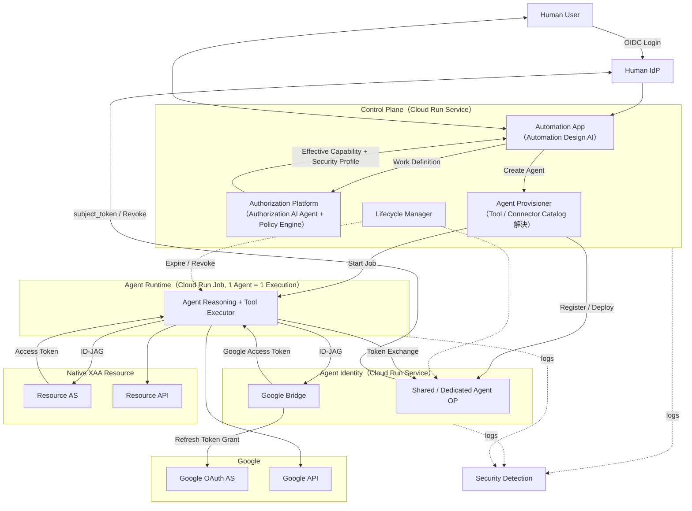

# 01. 概要と用語

## 1. 目的

本システムは、日報、業務記録、メール、カレンダー、チャット、タスクなどをAIが分析して自動化できる業務を見つけ、その業務を代行する**AIエージェント（Agent）**を安全に動かす基盤である。

自動化対象はAIが一方的に確定するのではなく、ユーザーが画面上でAIと対話しながら共同で定義する。

Agentは人間ユーザー本人ではなく、**人間ユーザーの代理として動作する独立したIdentity**として扱う。
監査上も「User Aが操作した」ではなく「Agent AがUser Aの代理として操作した」と識別できるようにする。

Agent作成から破棄までの流れは次のとおり。

| # | 段階 | 担当 | 詳細 |
|---|---|---|---|
| 1 | 作業内容の定義 | ユーザー + Automation Design AI | [02](./02-automation-design.md) |
| 2 | 必要権限の推論と決定 | Authorization Platform（Authorization AI Agent + Policy Engine） | [03](./03-authorization.md) |
| 3 | 権限を実行手段へ対応付け | Tool / Connector Catalog | [04](./04-tool-catalog.md) |
| 4 | Agent Identityの生成 | Agent Provisioner + Agent OP | [05](./05-identity.md)、[07](./07-lifecycle.md) |
| 5 | Resourceへのアクセス | Cross App Access（XAA）。必要に応じてOAuth Bridge | [05](./05-identity.md)、[06](./06-oauth-bridge.md) |

| 6 | 最大24時間の自律実行 | Agent Runtime | [07](./07-lifecycle.md) |
| 7 | 監視 | Security Detection | [09](./09-security-monitoring.md) |
| 8 | 期限到達または異常検知で破棄 | Lifecycle Manager | [07](./07-lifecycle.md) |

GCP上の配置は [08](./08-gcp-infrastructure.md)、各文書で決めた原則の一覧は [10](./10-design-rules.md) にある。

## 2. 基本思想

本システムでは以下を分離する。

| 分離するもの | 意味 |
|---|---|
| Human Identity ≠ Agent Identity | 人間とAgentは別の身元。Agentは人間の代理だが本人ではない |
| Human Permission ≠ Delegated Agent Permission | Agentへ委譲される権限は人間の権限の部分集合 |
| Work Definition ≠ Capability ≠ Tool | 「何をするか」「何が許されるか」「どう実行するか」は別の層で決める |
| AI Inference ≠ Policy Decision | AIは権限を提案するだけで、最終決定は決定論的なPolicy Engineが行う |
| Agent Runtime ≠ Human Session | ユーザーの対話セッションが終わっても、Agentは最大24時間の範囲で独立して存在し実行する |
| Application ≠ Function | 「デプロイされるアプリ」と「アプリの中で動く機能」を区別する（§3.1） |

## 3. 用語

### 3.1 アプリと機能の区別

本書では、**アプリ**（デプロイ単位）と**機能**（アプリ内部のモジュールやデータ）を区別する。

| アプリ（Cloud Runにデプロイされる単位） | その中で動く機能 |
|---|---|
| **Automation App** | Web UI、日報管理、**Automation Design AI**（Vertex AI呼び出しモジュール）、Agent操作（状況確認、停止、追加指示）、アクティビティタイムライン（[11](./11-activity-timeline.md)） |
| **Authorization Platform** | Work Definition構造化、**Authorization AI Agent**（Vertex AI呼び出しモジュール）、**Policy Engine**、Capability Taxonomy |
| **Agent Provisioner** | Provisioning Transaction、**Tool / Connector Catalog**の解決、XAA静的設定の生成、Agent登録またはDedicated OP作成、Agent Runtime起動 |
| **Lifecycle Manager** | 期限監視、Revoke / Destroy、Re-Provisioning起動 |
| **Shared Agent OP** | 通常AgentのOpenID Provider。Agent認証、ID-JAG発行、KMS署名、期限確認 |
| **Dedicated Agent OP**（FULL_ISOLATIONのAgentごとに1つ） | 上と同じ機能を1 Agent専用で提供 |
| **Google Bridge** | ID-JAG検証、Google Consent処理、Refresh Token管理、Google Access Token払い出し |
| **Native Resource AS / API**（社内Resource側） | ID-JAG検証とAccess Token発行 / 業務API |
| **Agent Runtime**（Cloud Run Job。1 Agent = 1 Execution） | Agent Reasoning（Vertex AI呼び出し）、**Tool Executor**、Checkpoint、Telemetry |
| **Security Detection** | Protocol Validation、Rule Detection、Correlation、Risk Scoring、Security AI呼び出し、Response |

- Automation Design AI、Authorization AI Agent、Policy Engine、Tool Executorは独立したアプリではなく、上記アプリ内部の機能である。
- Tool / Connector Catalogはアプリではなく、Firestoreの定義データ（`catalog_tools` と `catalog_connectors`）と、それを読むProvisioner内のロジックである。
- LLM推論そのものはVertex AI（GCPマネージドサービス）で行い、各アプリからAPI呼び出しする。

アプリと機能の対応図、およびアプリ間の呼び出し関係は [08. §2](./08-gcp-infrastructure.md#2-デプロイ単位と内部機能) と [08. §3](./08-gcp-infrastructure.md#3-アプリ間の呼び出し関係) を参照。

### 3.2 3種類のIdentity

本システムには「誰であるか」を示すものが3種類ある。
混同しやすいので並べて示す。

| 種類 | 誰が | 誰に対して名乗るか | 発行者 | 用途 |
|---|---|---|---|---|
| **Human Identity** | 人間ユーザー | Automation App、Authorization Platform | Human IdP | ログイン、Control Plane API呼び出し |
| **Agent Identity**（ID-JAG） | 人間ユーザーと、その代理として動くAI Agent | Resource Authorization Server、OAuth Bridge | Human IdPと共有するissuer（Agent OPが署名） | Cross App AccessでResourceのAccess Tokenを得る |
| **GCP Service Account** | GCP上で動くアプリ（Cloud Run Service / Job） | GCP IAM | GCP | KMS署名、Secret読み取り、DB接続、他Cloud Run呼び出しの可否 |

ID-JAGはAgentだけの身元ではない。
`sub` が委譲元の人間を、`act` が代理として動くAgentを表す（[05. §6.4](./05-identity.md#64-id-jag)）。
Resource側から「誰の代理として、どのAgentが操作したか」を1枚のTokenで判別できるようにするためである。

GCP Service Accountは「AI Agent用のアカウント」ではなく「GCP上のアプリが名乗る身元」である。
Google Bridgeのような、AI Agentを含まないアプリにも必要になるのはそのためである。
詳細は [08. §4](./08-gcp-infrastructure.md#4-gcp-service-accountとは) を参照。

### 3.3 権限に関する用語

| 用語 | 意味 |
|---|---|
| Human Permission | 人間ユーザー本人が持つ権限 |
| Delegatable Permission | Human Permissionのうち、Agentへ委譲してよいと組織が定めた権限 |
| Organization Policy | 組織全体に適用する制約 |
| Risk Policy | リスクに応じて適用する制約。最低Isolation Levelの決定を含む |
| Authorization AI Proposed Capability | Authorization AI AgentがWork Definitionから推論した「必要そうな権限」の候補 |
| Effective Agent Permission（= Effective Capability） | 上のすべてを満たした結果、Agentへ実際に付与される権限 |

それぞれの定義、決定者、例は [03. §2](./03-authorization.md#2-権限の種類) にまとめている。

### 3.4 その他の用語

| 用語 | 意味 |
|---|---|
| Work Definition | ユーザーとAutomation Design AIの対話で確定した「Agentが行う作業内容」 |
| Capability | `calendar.event.read` のような、Vendor非依存の抽象権限。API Endpointではない |
| Capability Taxonomy | 本システムで定義済みのCapabilityの一覧。Authorization AIの出力はこの範囲に制限される |
| Tool | `stub.calendar.events.list` のような、具体的な操作単位。1つのCapabilityから複数のToolが使える |
| Connector | 接続先Resourceごとの認証と接続の定義（Google Workspace、社内顧客APIなど） |
| Tool / Connector Catalog | CapabilityとToolの対応、および各Toolの認証方式、接続先、APIの呼び出し方法を保持する定義データ。「権限」を「実行手段」に翻訳する辞書 |
| Cross App Access（XAA） | IdPが発行したIdentity Assertion（ID-JAG）をResource側のAuthorization Serverへ提示してAccess Tokenを得る方式。`draft-ietf-oauth-identity-assertion-authz-grant` が定める |
| ID-JAG | Identity Assertion JWT Authorization Grant。人間（`sub`）とAgent（`act`）を運ぶXAA用のAssertion |
| Agent OP | Human IdPと同じissuerのうち、Agentの文脈だけを扱うデプロイ。ID-JAGを発行する（[05. §3](./05-identity.md#3-agent-op)） |
| subject_token | Token Exchangeへ渡す人間のID Token。Cross App Accessの委譲の材料になる |
| actor_token | Token Exchangeへ渡すAgent自身のAssertion。本システム独自のプロファイル |
| Human IdP Connection | Agentごとに持つHuman IdPのRefresh Token。`subject_token` の供給源で、Agent OPだけが保持する |
| Agent Registration | Agent OP上に作るAgentごとの登録情報。client credential、XAA config、IdP Connection、expires_atを持つ |
| OAuth Bridge | ID-JAGを理解しない外部OAuth SaaS（Googleなど）をXAAモデルへ接続する互換レイヤー |
| Native XAA Resource | Resource Authorization Server自身がID-JAGを理解するResource。Bridge不要 |
| Security Profile | Agentのリスク評価結果。Isolation Levelを含む |
| Isolation Level | `STANDARD` または `FULL_ISOLATION`。Agent IdentityとRuntimeをどこまで物理分離するか |
| Agent Identity Domain | 1 Agentに属するIdentity、Key、Config、Connection、Runtimeの集合。破棄はこの単位で行う |

用語と実装識別子の対応は[用語辞書](./glossary.md)にある。

## 4. 全体像

GCPサービスの配置を含む構成図は次のとおり。

各アプリをどのGCPサービスとして動かすかは [08. GCP実行基盤](./08-gcp-infrastructure.md) を参照。
編集用の元データは [diagrams/architecture.drawio](./diagrams/architecture.drawio) にある。
