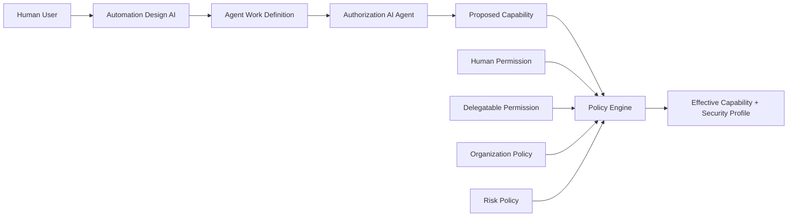

# 03. 権限決定（Authorization Platform）

Authorization Platformは「Agentへ何を許可するか」を決定するアプリである。
内部に**Authorization AI Agent**と**Policy Engine**を持つ。

## 1. 位置づけ

Automation Appから受け取った業務要求を入力に、以下を出力する。

- **Effective Capability**：Agentへ実際に付与する権限
- **Security Profile**：リスク評価結果とIsolation Level

| 内部機能 | 役割 |
|---|---|
| Work Definition構造化 | 業務要求をAgent Work Definitionへ整形し、`operations` / `target_resources` を導出する |
| Authorization AI Agent | Work Definitionから必要なAbstract Capabilityを推論（提案）する。LLM推論はVertex AIで行う |
| Policy Engine | 提案を各Permission / Policyと照合し、Effective Capabilityと最低Isolation Levelを決定する。決定論的に動作する |
| Capability Taxonomy | 定義済みCapabilityの一覧。Authorization AIの出力をこの範囲に制限する |

AIとPolicy Engineの分離：

```text
AI            = Capability Inference（提案）
Policy Engine = Authorization Decision（決定）
```

## 2. 権限の種類

Effective Capabilityの決定に関わる権限とポリシーは以下の6つである。
すべてCapability Taxonomy上のCapabilityを単位として表現する。

| 用語 | 定義 | 誰が決める、どこにあるか | 例 |
|---|---|---|---|
| **Human Permission** | 人間ユーザー本人が各Resourceに対して持つ権限 | Human IdPのグループやロール、社内の権限管理から同期し、Authorization DBにCapability単位で保持 | user-123 は `calendar.event.read` `calendar.event.write` `mail.message.read` `mail.message.send` を持つ |
| **Delegatable Permission** | Human Permissionのうち、Agentへ委譲してよいと組織が定めた範囲 | 管理者がAuthorization DBに定義 | `calendar.event.write` は本人には許可するがAgentへは委譲不可 |
| **Organization Policy** | 組織全体に適用する制約。ユーザーや作業内容によらず常に適用 | 管理者が定義 | Agentからの社外宛メール送信は禁止。利用可能ConnectorはGoogle Workspaceと社内APIのみ |
| **Risk Policy** | Capabilityの性質（write、financial、sensitive、外部通信）からリスクを評価し、追加制約と最低Isolation Levelを決めるルール | 管理者が定義 | `financial_operation = true` なら `full_isolation` 必須 |
| **Authorization AI Proposed Capability** | Authorization AI AgentがWork Definitionから推論した権限候補。あくまで提案であり、最終決定ではない | Authorization AI Agentが出力 | 「Calendarを読んで整理する」→ `calendar.event.read` |
| **Effective Agent Permission**（= Effective Capability） | 上記すべてを満たした結果として、Agentへ実際に付与される権限 | Policy Engineが決定 | `calendar.event.read` |

関係は以下のとおり。

```text
Authorization AI Proposed Capability
        ∩ Human Permission
        ∩ Delegatable Permission
        ∩ Organization Policy
        ∩ Risk Policy
        = Effective Agent Permission
```

したがって常に次が成り立ち、Agentに委譲される権限は人間ユーザー本人の権限を超えない。

```text
Effective Agent Permission ⊆ Human Permission
```

具体例として、Work Definition「Google Calendarを読んで、重要な予定を関係者へメール送信する」を考える。

| 段階 | 内容 |
|---|---|
| Proposed Capability | `calendar.event.read`, `mail.message.send` |
| Human Permission | `calendar.event.read`, `calendar.event.write`, `mail.message.read`, `mail.message.send` |
| Delegatable Permission | `calendar.event.read`, `mail.message.send`（`calendar.event.write` は委譲不可） |
| Organization Policy | `mail.message.send` は社内ドメイン宛のみ |
| Risk Policy | 外部通信を含むためrisk_scoreは上がるが、`standard` で許容 |
| **Effective Capability** | `calendar.event.read`, `mail.message.send`（制約：社内宛のみ） |

## 3. Agent Work Definition

Automation Appから受け取ったBusiness Work Requestを、Authorization Platformが以下のように構造化する。

```yaml
work_definition:
  purpose: daily_schedule_analysis
  description: |
    Google Calendarから当日の予定を取得し、
    重要な予定を抽出して整理する
  operations:
    - retrieve_calendar_events
    - analyze_event_importance
    - summarize_events
  target_resources:
    - calendar
  constraints:
    external_message_send: false
```

`target_resources` の導出はAuthorization Platform内で行う。
Automation側にはアクセス可能なResourceやCapabilityの一覧を保持させない。

## 4. Authorization AI Agent

役割は「Business Work → Abstract Capability」への変換である。

```text
WHAT WORK SHOULD BE DONE?  →  WHAT PERMISSIONS ARE REQUIRED?
```

入力と出力：

```yaml
# 入力
work_definition:
  description: Google Calendarを読んで、重要な予定を関係者へメール送信する

# 出力
authorization_ai_result:
  capabilities:
    - calendar.event.read
    - mail.message.send
  characteristics:
    write_operation: false
    external_communication: true
    financial_operation: false
    sensitive_resource: false
  confidence: 0.92
```

`characteristics` は権限の性質に関する補助情報で、Policy EngineがRisk Policyを適用する際に使う。

Authorization AI Agentがやらないこと：

- API URL、HTTP Method、OAuth Token Endpoint、OAuth Scope、Bridge URLなど、具体的な技術実装方法の判断
- Capability Taxonomyに存在しないCapabilityの生成
- 最終的なAuthorization Decision

## 5. 抽象Capability

Capabilityは `calendar.event.read` のようなVendor非依存の抽象権限である。

```text
calendar.event.read      calendar.event.write
mail.message.read        mail.message.send
chat.message.read        chat.message.post
customer.read            customer.write
finance.payment.read     finance.payment.approve
```

| 区別 | 意味 | 例 |
|---|---|---|
| Capability | 何を許可されているか | `calendar.event.read` |
| Tool | 具体的にどの操作を実行するか | `google.calendar.events.list`, `google.calendar.events.get`, `google.calendar.freebusy.query` |

Capability ≠ API Endpoint であり、Authorization PlatformはGoogle Calendar APIのURLなどを原則知らない。
CapabilityからToolへの対応付けは [04. Tool / Connector Catalog](./04-tool-catalog.md) が担う。

## 6. Policy Engine

Policy Engineは決定論的に動作し、AIを含まない。

| 入力 | 出力 |
|---|---|
| Proposed Capability + characteristics | Effective Capability |
| Human Permission | 各Capabilityの ALLOW / DENY と理由 |
| Delegatable Permission | Capabilityごとの制約（例：社内宛のみ） |
| Organization Policy | Security Profile（risk_score、最低Isolation Level） |
| Risk Policy | Policy ID、Decision Reason（監査用） |

## 7. Security Profile

Risk Policyに基づき、Policy Engineが以下の性質から決定する。

```text
Capability Risk / Resource Sensitivity / Write Permission / Admin Permission
External Communication / Financial Operation / Personal Data Access
```

```yaml
security_profile:
  risk_score: 82
  isolation_level: full_isolation
  reasons:
    - sensitive_resource
    - write_permission
    - financial_operation
```

Authorization AI AgentはSecurity Profileを提案してよいが、最低Isolation LevelはPolicy Engineが決定する。
Isolation Levelの内容は [05. §5](./05-identity.md#5-isolation-model) を参照。

## 8. 権限決定フロー



## 9. 責務の分離まとめ

| 機能 | 答える問い | 出力 |
|---|---|---|
| Automation Design AI | What work should be automated? | Work Definition |
| Authorization AI Agent | What capabilities does that work require? | Proposed Capability |
| Policy Engine | What may the Agent actually do? | Effective Capability + Security Profile |
| Tool / Connector Catalog | How is that capability technically executed? | Tool / Connector Definition |
| Agent OP | Who is the Agent? | ID-JAG |
| Tool Executor | Execute the predefined technical workflow | API Response |
