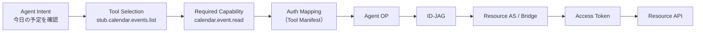

# 04. Tool / Connector CatalogとTool Executor

## 1. Tool / Connector Catalogとは

Tool / Connector Catalogは、**抽象Capabilityを具体的な実行手段へ翻訳する辞書**である。
Authorization Platformが決めるのは `calendar.event.read` までであり、「それをどのAPIで、どの認証方式で実行するか」はこのCatalogが持つ。

| 保持する情報 | 例 |
|---|---|
| Capability → Tool の対応 | `calendar.event.read` → `stub.calendar.events.list` |
| Tool の認証方式 | `native_xaa` / `xaa_bridge` |
| XAA の audience / resource / scope | `google-bridge` / `google-calendar` / `calendar.read` |
| Token取得先 | Google Bridge、社内Resource AS |
| API Endpoint、HTTP Method、Request Schema | `GET /calendar/v3/calendars/{calendarId}/events` |
| Resource Type、Risk Level | `oauth_bridge`, `low` |

位置づけ：

- アプリではなく定義データである。Firestoreの `catalog_tools` と `catalog_connectors` に保持し、プラットフォーム管理者が管理する（§5.1の画面）。AIは編集しない。
- 読むのはAgent Provisioner（Provisioning時にAgentが使えるToolとXAA設定を確定する）と、Tool Executor（Provisionerから渡されたTool Manifestに従って実行する）である。
- Agent OPやAuthorization Platformはこの情報を持たない。

## 2. Resourceの2種類

Catalog上の各Connectorは `resource_type` でどちらかに分類する。

| resource_type | 意味 | 例 | フロー |
|---|---|---|---|
| `native_xaa` | Resource Authorization Server自身がID-JAGを理解する | 社内API、XAA対応SaaS | Agent → Agent OP → ID-JAG → Resource AS → Access Token → Resource API |
| `oauth_bridge` | 外部SaaSがID-JAGを理解しないため、Bridgeが外部OAuth Credentialと交換する | Google、Microsoft、GitHub | Agent → Agent OP → ID-JAG → Bridge → 外部OAuth AS → 外部Access Token → Agent → SaaS API |

Native XAA ResourceにBridgeを強制しない。
Bridgeは互換レイヤーとしてのみ使う（[06. OAuth Bridge](./06-oauth-bridge.md)）。

## 3. Connector Definition例

```yaml
# Native XAA
connector_id: internal-docs-api
resource_type: native_xaa
authorization:
  audience: https://auth.customer.example.com
  resource: https://api.customer.example.com
tools:
  - internal.document.list
  - internal.document.get
```

```yaml
# OAuth Bridge
connector_id: google-workspace
resource_type: oauth_bridge
bridge:
  audience: https://google-bridge.example.com
tools:
  - stub.calendar.events.list
  - google.gmail.message.read
  - google.gmail.message.send
```

## 4. Tool Definition例

```yaml
# OAuth Bridge経由（Google Calendar）
tool_id: stub.calendar.events.list
description: Google Calendarから予定を取得する
required_capability: calendar.event.read
authorization:
  type: xaa_bridge
  audience: google-bridge
  resource: google-calendar
  scope: calendar.read
token:
  provider: google-bridge
api:
  base_url: https://www.googleapis.com
  method: GET
  path: /calendar/v3/calendars/{calendarId}/events
parameters:
  calendarId: { required: true }
  timeMin:    { required: false }
  timeMax:    { required: false }
risk_level: low
```

```yaml
# Native XAA（社内顧客API）
tool_id: internal.document.list
description: 顧客情報一覧を取得する
required_capability: customer.read
authorization:
  type: native_xaa
  audience: https://auth.customer.example.com
  resource: https://api.customer.example.com
  scope: customer.read
api:
  base_url: https://api.customer.example.com
  method: GET
  path: /customers
risk_level: medium
```

## 5. Provisioning時のTool解決

Agent Provisionerは、Effective CapabilityからCatalogを引いて、そのAgentが使える**Allowed Tools**と**XAA静的設定**を確定する。

```text
Effective Capability          Allowed Tools
  calendar.event.read    →      stub.calendar.events.list
                                google.calendar.events.get
  mail.message.send      →      google.gmail.message.send
```

確定した結果は次の2箇所へ静的に注入する。

- Agent OP：許可するaudience / resource / scope（[05. §3](./05-identity.md#3-agent-op)）
- Agent Runtime：Tool Manifest（Allowed ToolsとそのAPI定義）

Agent生成後にRegistryへ問い合わせて動的にToolやaudienceを決めることはしない。

### 5.1 権限とリソースのマッピング画面

CapabilityとToolの対応は、Agent Provisionerの画面から変える。
この画面がAuthorization Platformではなく、ましてAutomation Appでもなくここにあるのは、Catalogを持つのがProvisionerだからである（RULE-16、RULE-07）。

| 画面 | パス | 何をするか |
|---|---|---|
| マッピング一覧 | `GET /admin/mappings` | Connector（Resource）ごとにToolを並べ、それぞれが必要とするCapabilityを表示する。Capabilityから見た対応表と、対応するToolが1つも無いCapabilityの警告も出す |
| マッピングの保存 | `POST /admin/mappings` | 送られたToolの `required_capability` を書き換える |

変えられるのは `required_capability` だけである。
URL、HTTP Method、scope、audienceは画面からもどこからも実行時に変えられない。
任意のURLをToolに与えられる画面は、RULE-17が防いでいる「Agentに任意HTTPを許す」ことと同じになるためである。

送信されたToolまたはCapabilityが存在しない場合、1件も書かずに全体を拒否する。
Capabilityの存在はCapability Taxonomyで確かめる。
Taxonomyに無いCapabilityへ向いたToolは、Policy Engineがそれを落とすため、どの決定からも到達できないResourceになるからである。

変更が効くのは、これ以降にProvisioningされるAgentである。
実行中のAgentはProvisioning時に確定したTool Manifestで動き続ける（RULE-19）。

seedのJobは `catalog_tools` を一度空にしてからYAMLを書き直すため、画面での変更を残すなら `infra/seed/tools/` の該当ファイルにも同じ `required_capability` を入れる。

到達できるのは `ADMIN_PRINCIPALS` に挙げたGoogleアカウントだけであり、Agent ProvisionerはInternetへ公開しないため（RULE-37）、管理者は `gcloud run services proxy` 経由で開く。

## 6. Tool Executor

Tool Executorは**Agent Runtime内部のモジュール**であり、独立したアプリではない。
AI（LLM）が「どのToolを使うか」を決め、Tool Executorが「どう実行するか」を決定論的に処理する。

| 担当 | 決めること |
|---|---|
| Agent Reasoning（LLM） | WHAT：どのToolを、どのパラメータで使うか |
| Tool Executor | HOW：どのOPへ行くか、どのID-JAGを取るか、どのAuthorization Serverへ渡すか、Access Tokenをどう取得するか、どのAPI Endpointを叩くか |

Tool Executorの処理：

```text
1. Tool Manifest読み込み
2. Toolが Allowed Tools に含まれるか確認（含まれなければ拒否）
3. Agent Expiration確認
4. Agent OPへToken Exchange（audience / resource / scope はManifestの値。subject_token / actor_token / DPoP Proofを添える）
5. Resource AS または Bridge へID-JAGを提示し、Access Token取得
6. API Request生成と実行
7. Responseを構造化してAgent Reasoningへ返却

4と5の中身は [05. §6](./05-identity.md#6-cross-app-access) にある。
```



## 7. Agentに任意HTTPを許さない

Agentが好きなURL、Method、scope、audienceを自由に生成してアクセスする設計にはしない。
AgentはProvisioning済みのToolを選択するだけである。

```text
AI Reasoning  →  Tool Selection  →  Deterministic Tool Executor
```

これにより、プロンプトインジェクションなどでAgentが想定外の操作を試みても、Allowed Toolsに含まれない操作はTool Executorの段階で拒否される。
