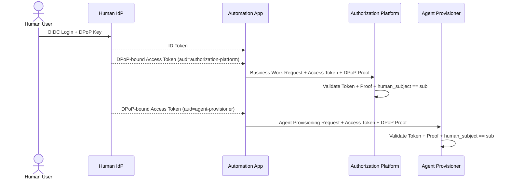
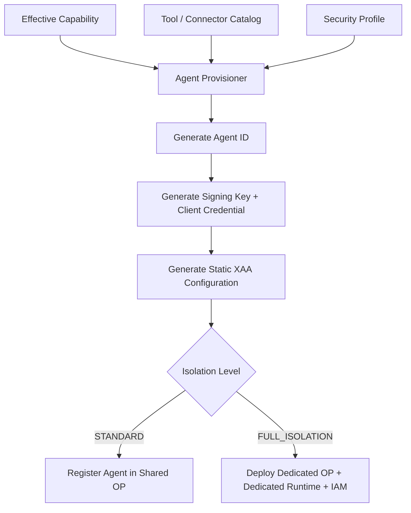
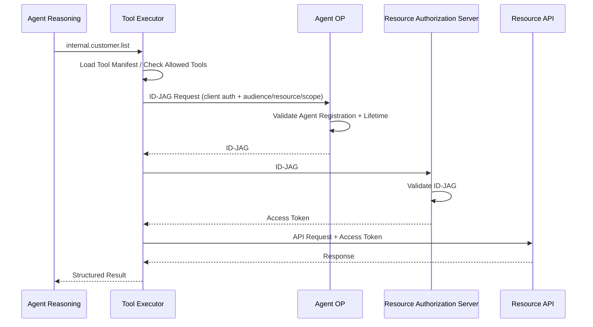

# 05. Identity（Human IdentityとAgent Identity）

本書は「誰であるか」を扱う。
Part Aは人間の認証（Human IdP、DPoP）、Part BはAgentの認証（Agent OP、Agent Registration、Isolation Model、Cross App Access）である。
GCP上のアプリの身元であるGCP Service Accountは [08. §4](./08-gcp-infrastructure.md#4-gcp-service-accountとは) を参照。

---

## Part A：Human Identity

### 1. Human Identity Provider

人間ユーザーの認証を担当する。
OIDC / OAuthを利用する。

Human IdPは、Control Planeの各アプリ向けにAccess Tokenを発行する。
Automation Appはこれを自分で発行せず、ユーザーの認証結果としてHuman IdPから受け取ったものをそのまま転送する。

| 発行するToken | 用途 | aud | scopeの例 |
|---|---|---|---|
| ID Token | Automation Appへのログイン | `automation-app` | （なし） |
| Access Token | Authorization Platform API呼び出し | `authorization-platform` | `workdef:submit` |
| Access Token | Agent Provisioner API呼び出し | `agent-provisioner` | `agent:provision` |
| Access Token | Lifecycle Manager API呼び出し（Agent停止依頼） | `lifecycle-manager` | `agent:revoke` |

APIアクセスにはID TokenではなくAccess Tokenを使う。
`aud` をアプリごとに分けるのは、Authorization Platform向けに発行されたTokenでAgent Provisionerを呼べないようにするためである。
`aud` だけではそのアプリのAPI全体に届いてしまうため、操作の種類は `scope` で分ける。

Control Planeの各アプリを呼ぶ経路には、このAccess Tokenに加えてCloud Run IAMによる呼び出し元の制限をかける（[08. §3](./08-gcp-infrastructure.md#3-アプリ間の呼び出し関係)）。
Access Tokenは「どの人間の代理としての要求か」を、Cloud Run IAMは「どのアプリから来た要求か」を決める。

#### 1.1 human_subjectの出どころ

Control Plane APIにおける `human_subject` は、リクエストボディの値ではなくAccess Tokenの `sub` を正とする。
受け取ったアプリは、ボディに `human_subject` が含まれる場合、`sub` と一致する値だけを受け付ける。

この規定を置かないと、Automation Appが任意の `human_subject` を送って他人の権限でAgentを作れる。
Policy Engineが照合するHuman Permissionは `sub` で引いたユーザーのものであり、Effective Capabilityはその権限を超えない（[03. §2](./03-authorization.md#2-権限の種類)）。
つまり `sub` の正しさが、そのままEffective Capabilityの正しさになる。

適用先は次の3つである。

- Business Work Request（[02. §3](./02-automation-design.md#3-business-work-request)）
- Agent Provisioning Request（[02. §4](./02-automation-design.md#4-agent-definition)）
- 実行中Agentへの操作（[02. §5](./02-automation-design.md#5-実行中agentの操作)）

### 2. DPoP

Human IdPからControl Planeへ渡すAccess Tokenは、Bearer TokenではなくDPoP-bound Access Tokenを優先する。

目的：

```text
Stolen Access Token + DPoP Private Keyなし = 利用不可
```

適用範囲：

| 経路 | DPoP |
|---|---|
| Human IdP → Automation App → Authorization Platform / Agent Provisioner / Lifecycle Manager | 必須 |
| Agent → Resource Authorization Server / Bridge / Resource API | 必須にしない。接続先の仕様に従い Bearer / DPoP / mTLS などを許容する（外部SaaSがDPoPに対応している保証がないため） |



#### 2.1 受け取り側の検証手順

Access TokenとDPoP Proofを受け取ったアプリ（Authorization Platform、Agent Provisioner、Lifecycle Manager）は、次の順で検証する。

| # | 検証内容 | 失敗時 |
|---|---|---|
| 1 | Access Tokenの署名、`iss`、`exp` | 401 |
| 2 | `aud` が自分自身であること | 401 |
| 3 | `scope` が要求された操作を含むこと | 403 |
| 4 | DPoP Proofの署名が、Proofヘッダの `jwk` で検証できること | 401 |
| 5 | Access Tokenの `cnf.jkt` が、Proofヘッダの `jwk` のthumbprintと一致すること | 401 |
| 6 | Proofの `htm` と `htu` が、実際のHTTP MethodとURIに一致すること | 401 |
| 7 | Proofの `iat` が許容範囲内で、`jti` が未使用であること | 401 |
| 8 | ボディの `human_subject` がAccess Tokenの `sub` に一致すること（[§1.1](#11-human_subjectの出どころ)） | 403 |

5がDPoPの本体である。
これを省くと、Proofが添付されているかどうかだけを見てAccess Tokenとの結び付きを確認しない実装になり、盗んだTokenに攻撃者自身の鍵で作ったProofを添えるだけで通ってしまう。
7の `jti` はProofの再利用を防ぐためのもので、`iat` の許容範囲と同じ長さのキャッシュに保持して重複を弾く。

各検証の結果はSecurity DetectionのProtocol Validationへ送る（[09. §5.1](./09-security-monitoring.md#51-protocol-validation)）。

---

## Part B：Agent Identity

### 3. Agent OP

Agent OPは**AgentのOpenID Provider**であり、Agent Identityそのものを表す。
Agent Runtimeからの要求に応じてID-JAGを発行する。

Agent OPが持つもの：

| 分類 | 内容 |
|---|---|
| Identity Profile | issuer、subject、token_endpoint、jwks_uri、signing key reference（Cloud KMS）、supported algorithms / grant types、client information |
| XAA Static Configuration | allowed audience、resource、scope、trusted Resource Authorization Server、expires_at |

Identity ProfileとXAA Static Configurationは概念上分離する。
どちらもProvisioning時に確定して静的に注入し、生成後に外部Registryへ問い合わせて動的に決めることはしない。

Agent OPが持たないもの：自然言語、業務説明、Human Permission DB、Authorization AI、Policy Decision Logic、SaaS Discovery Logic、API仕様、Google Refresh Token / Client Secret、業務AIロジック。

Agent OPは判断しない。
仕事は以下のみである。

```text
Agent Authentication
preconfigured XAAの実行（ID-JAG発行）
Token署名（Cloud KMS）
Agent Expiration確認
```

### 4. Agent Registration（STANDARDでもAgentごとに作る）

Shared Agent OPで共有されるのは**OPのプロセス（Cloud Run Service）だけ**である。
Agentが認証を受けるための「アカウント」に相当する**Agent Registration**は、Isolation Levelに関わらずAgentごとに必ず作成する。

Agent Registrationの内容（Firestore `agents/{agent_id}`）：

```json
{
  "agent_id": "agent-001",
  "human_subject": "user-123",
  "issuer": "https://shared-agent-op.example.com/agents/agent-001",
  "subject": "agent-001",
  "signing_key": "projects/.../cryptoKeys/agent-001-key",
  "client_id": "agent-001",
  "client_auth": {
    "method": "private_key_jwt",
    "jwk_thumbprint": "..."
  },
  "allowed_audiences": ["https://google-bridge.example.com"],
  "resources": ["google-calendar"],
  "scopes": ["calendar.read"],
  "created_at": "2026-08-29T10:00:00+09:00",
  "expires_at": "2026-08-30T10:00:00+09:00",
  "status": "ACTIVE"
}
```

つまり各Agentは、Shared OP上でも issuer / subject / signing key / client credential / XAA config / expires_at をすべて個別に持つ。
Agent AのRegistrationでAgent BのID-JAGを発行することはできない。

Agent RuntimeがAgent OPへID-JAGを要求するときの認証は2層とする。

| 層 | 何を確認するか | 仕組み |
|---|---|---|
| Layer 1：Cloud Run IAM | このワークロードはAgent OPを呼び出してよいか | Agent RuntimeのGCP Service Accountに `run.invoker` を付与 |
| Layer 2：Agent Client Credential | このAgentはこのRegistrationの持ち主か | Provisioningで生成したAgent専用の鍵で `private_key_jwt` によるClient認証 |

Agent Client Credentialは、Provisionerが生成してOPへ登録し、Cloud Run Job Executionの環境変数オーバーライドで当該Executionにのみ渡す。
`expires_at` で失効し、Checkpointへは保存しない。

GCP IAMはXAAの代替ではない。
Layer 1は「どのアプリが呼べるか」、Layer 2は「どのAgentとしてID-JAGを発行するか」であり、役割が異なる。

### 5. Isolation Model

Security Profileに応じて、Agent OPとRuntimeをどこまで物理分離するかを2段階で定める。

| | **STANDARD** | **FULL_ISOLATION** |
|---|---|---|
| 対象 | 通常Agent | 高セキュリティAgent（financial、admin、sensitive write等） |
| Agent OP プロセス | Shared Agent OP（Cloud Run Service共有） | Agent専用Cloud Run Service `dedicated-op-<agent>` |
| Agent Registration | Agentごと | Agentごと |
| Signing Key（KMS） | Agentごと | Agentごと（専用OP SAのみ署名可） |
| XAA Static Config | Agentごと | Agentごと |
| Agent Runtime | Agentごとに1 Cloud Run Job Execution（Job定義とSAは共有） | Agent専用Job定義 + 専用SA `sa-agent-<agent>` |
| IAM Binding | 共有（`sa-agent-runtime` → `shared-agent-op`） | Agent専用（`sa-agent-<agent>` → `dedicated-op-<agent>` のみ） |
| Bridge / XAA Connection | Agent単位のBinding | Agent単位のBinding（専用Connection） |
| Network Policy | 共通 | 必要に応じて専用 |

いずれのLevelでも 1 Agent = 1 Cloud Run Job Execution であり、複数のAgentが1つのプロセスで動くことはない。
共有されるのは「OPのプロセス」と「RuntimeのJob定義とGCP Service Account」であって、Agentの実行そのものや身元ではない。

#### なぜ2段階か（DEDICATED_IDENTITYを廃止した理由）

以前の版では中間段階として「Dedicated OPのみ作り、Runtimeは共有」する `DEDICATED_IDENTITY` を置いていたが、以下の理由で廃止した。

1. **分離の効果が中途半端**：Dedicated OPを作っても、共有Runtime SAからそのOPを呼べる状態では、他Agentの侵害されたRuntimeからDedicated OPへID-JAGを要求できてしまう。OPを分離するなら、それを呼べるRuntime SAとIAM Bindingも同時に分離しないと意味がない。
2. **コスト差がほぼない**：FULL_ISOLATIONで追加されるのはCloud Run Job定義、Service Account、IAM Bindingであり、いずれも無料である。費用が発生するのはDedicated OPのCloud Run Serviceであり、これは両者に共通する。
3. **Runtimeは元々Agentごと**：1 Agent = 1 Job Executionであるため「Runtime共有」という区別自体が弱い。
4. **分岐が減る**：Policy Engineの決定、Provisionerの分岐、Cleanup処理、テストがそれぞれ2通りで済む。

必要になった場合は、Provisioningがテンプレートベースであるため後から中間段階を追加できる。

#### FULL_ISOLATIONの例

```text
Agent finance-001
├ Cloud Run Service   dedicated-op-finance-001
├ Service Account     sa-op-finance-001         （finance-001-signing-keyでの署名のみ許可）
├ Cloud KMS Key       finance-001-signing-key
├ Agent Config        finance-001 only
├ Cloud Run Job       agent-runtime-finance-001
├ Service Account     sa-agent-finance-001      （dedicated-op-finance-001 のinvokeのみ許可）
└ Bridge Connection   finance-001 binding
```

`sa-op-finance-001` には以下を付与する。

```text
ALLOW  finance-001-signing-keyで署名 / finance-001-config読み取り
DENY   他AgentのKey / shared-agent keys / Google Refresh Token / Authorization DB write / Provisioner権限
```

Dedicated OPに専用のService Accountが必要なのは、GCP IAMでKMS鍵への署名権限を「このOPだけ」に絞るためである。
Shared OPのSAを流用すると、そのSAが持つ全Agentの鍵に署名できてしまい、分離の意味がなくなる。

#### Blast Radius

| 侵害箇所 | STANDARD | FULL_ISOLATION |
|---|---|---|
| Agent A のRuntime | Agent AのIdentity / Key / Config / Connection | 同左 |
| Agent A のOP | Shared OPプロセスの侵害 → 全STANDARD Agentの鍵で署名できる可能性 | Agent Aのみ |
| Agent A のRuntime SA | 共有SA → Shared OPへの呼び出し権限（Layer 2でAgentは区別される） | Agent Aのみ |

Shared OPプロセスの侵害が複数Agentへ波及し得ることがSTANDARDの許容リスクであり、それを許容できないAgentがFULL_ISOLATIONになる。

#### Provisioning分岐



### 6. Cross App Access

本システムの主要なResource Accessモデルである。

```text
Agent → Agent OP → ID-JAG → Resource Authorization Server → Access Token → Resource API
```

ID-JAGに含める3つの概念を区別する。

| 項目 | 意味 | Native XAA例 | Google Bridge例 |
|---|---|---|---|
| audience | ID-JAGを受け取るResource Authorization Server | `https://customer-auth.example.com` | `https://google-bridge.example.com` |
| resource | 最終的にアクセスするProtected Resource | `https://customer-api.example.com` | `google-calendar` |
| scope | Resource上で許可する操作 | `customer.read` | `calendar.read` |

Google Bridgeの場合、BridgeがこのID-JAGを認可材料としてGoogle Access TokenをBrokerする。

### 7. Native XAA Runtime Flow

Resource Authorization Server自身がID-JAGを理解する場合のフローである。
Bridgeは存在しない。



### 8. OAuth Bridge Runtime Flow

Googleなど、ID-JAGを理解しない外部SaaSの場合のフローは [06. §4](./06-oauth-bridge.md#4-runtime-flow) を参照。

### 9. Tokenの種類と保持ルール

| Token | 発行者 | 用途 | 備考 |
|---|---|---|---|
| Human ID Token | Human IdP | Human Authentication | |
| Human Access Token | Human IdP | Control Plane API | DPoP-bound |
| ID-JAG | Agent OP | AgentのCross App Access用Identity Assertion | |
| Native Resource Access Token | Native Resource AS | Resource API呼び出し | |
| SaaS Access Token | 外部OAuth AS（Google等） | SaaS API呼び出し | Bridge経由でAgentへ払い出す |

AgentがRuntimeで保持してよいもの：ID-JAG、Resource Access Token、Google Access Token等の短期Token、Task Execution Context。
Access Tokenは原則としてメモリのみ、永続化なし、短期とする。

Agentが保持しないもの：Human Access Token、Google Refresh Token、OAuth Client Secret、Private Key（署名はCloud KMSで行う）、長期の外部Credential。
