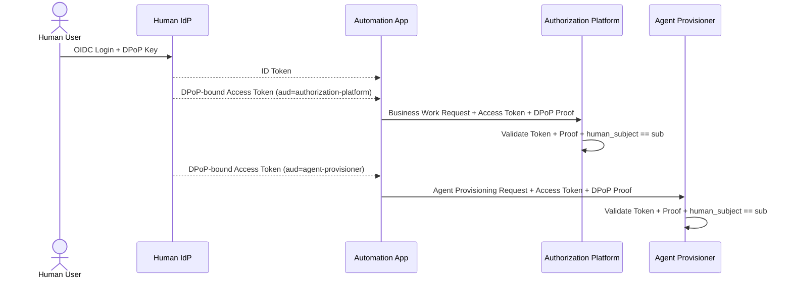
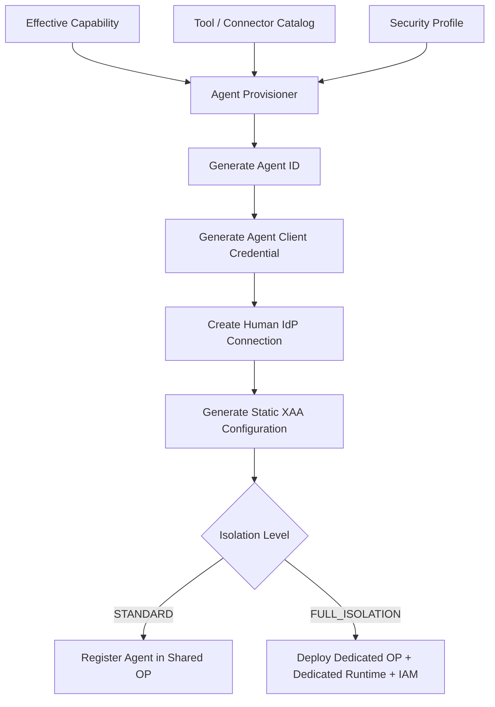
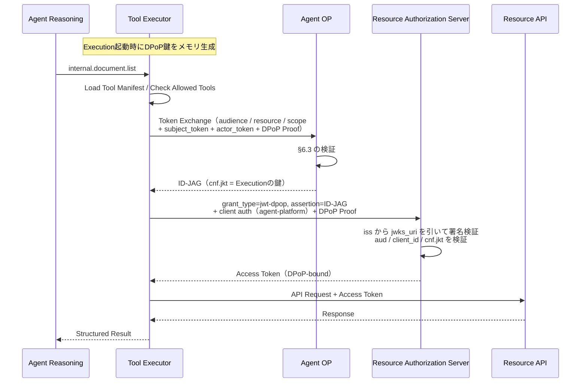

# 05. Identity（Human IdentityとAgent Identity）

本書は「誰であるか」を扱う。
Part Aは人間の認証（Human IdP、DPoP）、Part BはAgentの認証（Agent OP、Agent Registration、Isolation Model、Cross App Access）である。
GCP上のアプリの身元であるGCP Service Accountは [08. §4](./08-gcp-infrastructure.md#4-gcp-service-accountとは) を参照。

---

## Part A：Human Identity

### 1. Human Identity Provider

人間ユーザーの認証を担当する。
OIDC / OAuthを利用する。

Human IdPは、Control Planeの各アプリ向けにAccess Tokenを発行する。
Automation Appはこれを自分で発行せず、ユーザーの認証結果としてHuman IdPから受け取ったものをそのまま転送する。

| 発行するToken | 用途 | aud | scopeの例 |
|---|---|---|---|
| ID Token | Automation Appへのログイン | `automation-app` | （なし） |
| Access Token | Authorization Platform API呼び出し | `authorization-platform` | `workdef:submit` |
| Access Token | Agent Provisioner API呼び出し | `agent-provisioner` | `agent:provision` |
| Access Token | Lifecycle Manager API呼び出し（Agent停止依頼） | `lifecycle-manager` | `agent:revoke` |
| ID Token | Cross App Accessの `subject_token`（[§6.1](#61-token-exchange要求)） | `agent-platform` | `openid offline_access` |
| Refresh Token | 上のID Tokenの再取得。Agent OPだけが保持する（[§4.1](#41-human-idp-connection)） | （`agent-platform` に紐づく） | 同上 |

APIアクセスにはID TokenではなくAccess Tokenを使う。
`aud` をアプリごとに分けるのは、Authorization Platform向けに発行されたTokenでAgent Provisionerを呼べないようにするためである。
`aud` だけではそのアプリのAPI全体に届いてしまうため、操作の種類は `scope` で分ける。

Control Planeの各アプリを呼ぶ経路には、このAccess Tokenに加えてCloud Run IAMによる呼び出し元の制限をかける（[08. §3](./08-gcp-infrastructure.md#3-アプリ間の呼び出し関係)）。
Access Tokenは「どの人間の代理としての要求か」を、Cloud Run IAMは「どのアプリから来た要求か」を決める。

Automation Appへのログイン用ID Tokenと、Cross App Access用のID Tokenは `aud` を分ける。
前者はユーザーの画面操作のためのもので、後者はAgentがResourceへアクセスするための委譲の材料であり、必要な寿命も保管場所も異なるためである。
後者を発行するクライアント `agent-platform` は、Human IdPと各Resource Authorization Serverの双方に登録する。
Agentごとのクライアント登録は作らない（[§6.5](#65-agentごとのクライアント登録を作らない理由)）。

#### 1.1 human_subjectの出どころ

Control Plane APIにおける `human_subject` は、リクエストボディの値ではなくAccess Tokenの `sub` を正とする。
受け取ったアプリは、ボディに `human_subject` が含まれる場合、`sub` と一致する値だけを受け付ける。

この規定を置かないと、Automation Appが任意の `human_subject` を送って他人の権限でAgentを作れる。
Policy Engineが照合するHuman Permissionは `sub` で引いたユーザーのものであり、Effective Capabilityはその権限を超えない（[03. §2](./03-authorization.md#2-権限の種類)）。
つまり `sub` の正しさが、そのままEffective Capabilityの正しさになる。

適用先は次の3つである。

- Business Work Request（[02. §3](./02-automation-design.md#3-business-work-request)）
- Agent Provisioning Request（[02. §4](./02-automation-design.md#4-agent-definition)）
- 実行中Agentへの操作（[02. §5](./02-automation-design.md#5-実行中agentの操作)）

### 2. DPoP

Human IdPからControl Planeへ渡すAccess Tokenは、Bearer TokenではなくDPoP-bound Access Tokenを優先する。

目的：

```text
Stolen Access Token + DPoP Private Keyなし = 利用不可
```

適用範囲：

| 経路 | DPoP |
|---|---|
| Human IdP → Automation App → Authorization Platform / Agent Provisioner / Lifecycle Manager | 必須 |
| Agent Runtime → Agent OP（Token Exchange） | 必須。ここで提示した鍵がID-JAGの `cnf.jkt` になる（[§6.4](#64-id-jag)） |
| Agent Runtime → Native Resource Authorization Server | 必須。`cnf` を持つID-JAGはProofなしで提示すると拒否される（[§7](#7-native-xaa-runtime-flow)） |
| Agent Runtime → Google Bridge / 外部Resource API | 必須にしない。接続先の仕様に従い Bearer / DPoP / mTLS などを許容する（外部SaaSがDPoPに対応している保証がないため） |



#### 2.1 受け取り側の検証手順

Access TokenとDPoP Proofを受け取ったアプリ（Authorization Platform、Agent Provisioner、Lifecycle Manager）は、次の順で検証する。

| # | 検証内容 | 失敗時 |
|---|---|---|
| 1 | Access Tokenの署名、`iss`、`exp` | 401 |
| 2 | `aud` が自分自身であること | 401 |
| 3 | `scope` が要求された操作を含むこと | 403 |
| 4 | DPoP Proofの署名が、Proofヘッダの `jwk` で検証できること | 401 |
| 5 | Access Tokenの `cnf.jkt` が、Proofヘッダの `jwk` のthumbprintと一致すること | 401 |
| 6 | Proofの `htm` と `htu` が、実際のHTTP MethodとURIに一致すること | 401 |
| 7 | Proofの `iat` が許容範囲内で、`jti` が未使用であること | 401 |
| 8 | ボディの `human_subject` がAccess Tokenの `sub` に一致すること（[§1.1](#11-human_subjectの出どころ)） | 403 |

5がDPoPの本体である。
これを省くと、Proofが添付されているかどうかだけを見てAccess Tokenとの結び付きを確認しない実装になり、盗んだTokenに攻撃者自身の鍵で作ったProofを添えるだけで通ってしまう。
7の `jti` はProofの再利用を防ぐためのもので、`iat` の許容範囲と同じ長さのキャッシュに保持して重複を弾く。

各検証の結果はSecurity DetectionのProtocol Validationへ送る（[09. §5.1](./09-security-monitoring.md#51-protocol-validation)）。

---

## Part B：Agent Identity

### 3. Agent OP

Agent OPは、Human IdPと同じissuerのうち、Agentの文脈だけを扱うデプロイである。
Agent RuntimeからのToken Exchange要求を受け、ID-JAGを発行する。

Agent OP自身はAgent Identityを表さない。
Agent Identityを表すのはID-JAGの `act` claimであり、ID-JAGの `sub` は委譲元の人間である（[§6.4](#64-id-jag)）。

#### 3.1 Cross App Accessにおける役割の対応

本システムのコンポーネントが、Identity Assertion Authorization Grant[^draft]（以下「ドラフト」）のどの役割に当たるかを先に定める。
以降の節はこの対応を前提とする。

| ドラフトの役割 | 本システム |
|---|---|
| Client | Agent Runtime（Tool Executor）。`client_id` は `agent-platform` 1つ |
| IdP Authorization Server | Human IdP と Agent OP。issuerは共通、デプロイは分離 |
| Resource Authorization Server | Native Resource AS、Google Bridge |
| Resource Server | Resource API、Google API |

[^draft]: `draft-ietf-oauth-identity-assertion-authz-grant`。Cross App Access（XAA）はこのドラフトが定めるパターンの通称である。本書が参照する節番号はこのドラフトのものを指す。

#### 3.2 issuerを分けずデプロイだけ分ける理由

ドラフト §2.1 が定めるIdP Authorization Serverは「Resource ASがSSOのために既に信頼しているissuer」である。
Agent OPを別のissuerとして立てると、Resource ASから見て未知の発行者になり、Cross App Accessが成立しない。
したがってID-JAGの `iss` はHuman IdPのissuer識別子でなければならない。

一方で、Human IdPにAgentの概念を持ち込みたくない。
Agentごとのクライアント登録、Agent向けのポリシー、Agent Registryのいずれも、人間の認証を担当するアプリの関心事ではない。

両立させるため、issuerを1つに保ったまま、リクエストのパスでデプロイを分ける。

```text
https://idp.example.com/
 ├ /authorize  /token  /userinfo  /logout   → Human IdP app（人間の文脈のみ）
 ├ /.well-known/openid-configuration        → Human IdP app
 ├ /jwks.json                               → 共有JWKS（両アプリの公開鍵。kidで区別）
 ├ /xaa/token                               → Agent OP app（Agentの文脈のみ）
 └ /xaa/callback                            → Agent OP app（IdP ConnectionのOAuth Callback）
```

Human IdP appが引き受けるのは、`agent-platform` に対するOIDCログイン（`offline_access` を含む）と、issuer共通のメタデータおよびJWKSの配信だけである。
メタデータには `identity_chaining_requested_token_types_supported` に `urn:ietf:params:oauth:token-type:id-jag` を含める（ドラフト §7.1）。
Agent Registryも、Agentごとのクライアント登録も、Agent向けポリシーも持たない。

`/xaa/token` がRFC 8414メタデータの `token_endpoint` と異なる点は、プロトコル上の参加者から見えない。
Resource ASはIdPのtoken endpointを呼ばず、`iss` からメタデータを引いて `jwks_uri` で署名を検証するだけである。
Token Exchangeを送るのはAgent Runtimeだけで、その送り先はProvisioning時に静的注入される（[§6.1](#61-token-exchange要求)）。
サードパーティのXAAクライアントへこのissuerを開放する場合は、標準の `/token` が `grant_type=token-exchange` を受け付ける必要が生じる。
その時点で、リクエストボディによる振り分けができる前段を置くことになる。

GCP上の配置とバックエンドの割り当ては [08. §2.1](./08-gcp-infrastructure.md#21-human-idpとagent-opの配置) を参照。

#### 3.3 Agent OP署名鍵の制約

Agent OPの署名鍵は共有issuerのJWKSに載る。
この鍵で署名したJWTは、Resource ASからissuer本人の発行物として扱われる。

そのため次の2つを不変条件とする。

- Agent OPの署名鍵は、Human IdPのSSO署名鍵と別のKMS鍵とし、`kid` も分ける
- Agent OPの署名鍵は、`typ` が `oauth-id-jag+jwt` のJWT以外を署名しない

2つ目により、この鍵が漏れてもSSO用のID Tokenは偽造できない。
偽造できるのはID-JAGに限られ、その効力はResource ASに登録した `agent-platform` のscopeが上限になる。
したがって各Resource ASにおける `agent-platform` の登録scopeは、そのResource ASで必要な最小に保つ。

この鍵の目的外使用は、Security DetectionのProtocol Validationで検知する（[09. §5.1](./09-security-monitoring.md#51-protocol-validation)）。

#### 3.4 Agent OPが持つもの、持たないもの

| 分類 | 内容 |
|---|---|
| Issuer Profile | 共有issuer識別子、ID-JAG署名鍵の参照（Cloud KMS）、`kid` |
| Agent Registration | [§4](#4-agent-registrationstandardでもagentごとに作る) |
| XAA Static Configuration | allowed audience、resource、scope、trusted Resource Authorization Server、expires_at |
| Human IdP Connection | Agentごとの暗号化済みRefresh Token（[§4.1](#41-human-idp-connection)） |

Agent RegistrationとXAA Static Configurationは概念上分離する。
どちらもProvisioning時に確定して静的に注入し、生成後に外部Registryへ問い合わせて動的に決めることはしない。

Agent OPが持たないもの：自然言語、業務説明、Human Permission DB、Authorization AI、Policy Decision Logic、SaaS Discovery Logic、API仕様、Google Refresh Token / Client Secret、業務AIロジック、人間のSSOセッション。

Agent OPは判断しない。
仕事は以下のみである。

```text
Agent Authentication
subject_token / actor_token の検証と委譲関係の照合
静的XAA設定との照合
ID-JAG発行とKMS署名
Agent Expiration確認
subject_tokenの再取得
```

### 4. Agent Registration（STANDARDでもAgentごとに作る）

Shared Agent OPで共有されるのは**OPのプロセス（Cloud Run Service）だけ**である。
Agentが認証を受けるための「アカウント」に相当する**Agent Registration**は、Isolation Levelに関わらずAgentごとに必ず作成する。

Agent Registrationの内容（Firestore `agents/{agent_id}`）：

```json
{
  "agent_id": "agent-001",
  "human_subject": "user-123",
  "client_auth": {
    "method": "private_key_jwt",
    "jwk_thumbprint": "..."
  },
  "idp_connection_id": "idpconn-001",
  "allowed_audiences": ["https://google-bridge.example.com"],
  "resources": ["google-calendar"],
  "scopes": ["calendar.read"],
  "created_at": "2026-08-29T10:00:00+09:00",
  "expires_at": "2026-08-30T10:00:00+09:00",
  "status": "ACTIVE"
}
```

issuerとsubjectはAgentごとには持たない。
issuerは共有issuer1つであり、ID-JAGの `sub` は委譲元の人間だからである。
Agentごとに分かれるのは、Client Credential、XAA設定、Human IdP Connection、`expires_at` である。
`actor_token` はこのClient Credentialと同じ鍵で署名するため、鍵はAgentごとに1つでよい。
Agent AのRegistrationでAgent Bのactor_tokenを作ることはできない。

Agent RuntimeがAgent OPを呼ぶときの認証は2層とする。

| 層 | 何を確認するか | 仕組み |
|---|---|---|
| Layer 1：Cloud Run IAM | このワークロードはAgent OPを呼び出してよいか | Agent RuntimeのGCP Service Accountに `run.invoker` を付与 |
| Layer 2：Agent Client Credential | このAgentはこのRegistrationの持ち主か | Provisioningで生成したAgent専用の鍵で `private_key_jwt` によるClient認証 |

Agent Client Credentialは、Provisionerが生成してOPへ公開鍵だけを登録し、秘密鍵はCloud Run Job Executionの環境変数オーバーライドで当該Executionにのみ渡す。
`expires_at` で失効し、Checkpointへは保存しない。
この鍵はAgent OPに対するクライアント認証と `actor_token` の署名にだけ使い、外部のResource ASへは提示しない。

GCP IAMはXAAの代替ではない。
Layer 1は「どのアプリが呼べるか」、Layer 2は「どのAgentからの要求か」であり、役割が異なる。

#### 4.1 Human IdP Connection

Agentは最大24時間動き、その間ユーザーは居ない。
ID Tokenの有効期限は数分から1時間程度であり、Provisioning時に取得した1枚では最後まで持たない。
そのためRefresh Tokenを用意し、`subject_token` を取り直せるようにする。

ドラフト §4.3 は `subject_token` にRefresh Tokenを直接使うことも認めているが、本システムでは使わない。
RuntimeへRefresh Tokenを渡さない方針（[§9](#9-tokenの種類と保持ルール)）を保ち、Agent OPがRefresh Tokenを保持してID Tokenだけを払い出す。

Google BridgeのConnection / Agent Binding 2層モデル（[06. §3](./06-oauth-bridge.md#3-credential保持方針)）と同じ形をHuman IdP側にも置く。
ただし単位と寿命が異なる。

| | Google Connection | Human IdP Connection |
|---|---|---|
| 単位 | 人間ユーザーごと | Agentごと |
| 保持者 | Google Bridge | Agent OP |
| 寿命 | ユーザーが取り消すまで | Agentの `expires_at` まで（最大24時間） |
| 理由 | 外部SaaSであり、再Consentのコストが高い | 自社IdPであり、短寿命の付与を毎回作れる |

Connectionレコード（Firestore `idp_connections`）：

```text
idp_connection_id
agent_id
human_subject
encrypted_refresh_token   （KMSで暗号化。Connector Encryption Keyとは別鍵）
granted_scopes
status
created_at
expires_at                （= Agentの expires_at）
```

取得はProvisioning時に行う。
ユーザーはHuman IdPで `openid offline_access` の認可を1回行い、Google Consentと同じ中断と再開の機構（[06. §5](./06-oauth-bridge.md#5-google-consent)、[07. §3.2](./07-lifecycle.md#32-provisioning-transaction)）で戻る。
リダイレクトで返すのは `transaction_id` とone-time codeだけとし、Refresh TokenはProvisionerとAgent OPの間のServer-to-Server通信で渡す。
IdPに有効なセッションがあり同意済みであれば `prompt=none` で無操作にできる。

Refresh Token Rotationと再利用検知を有効にする。
保持者がAgent OPだけであるためrotationで競合が起きず、再利用が検知された場合は漏洩の証拠として扱える。

破棄はAgent Cleanupで行い、Human IdPへRevokeを送る（[07. §6](./07-lifecycle.md#6-expiration--緊急停止)）。
Agentごとの付与であるため、他のAgentや本人のSSOセッションを巻き込まない。

##### 保持者をAgent OPとする理由

候補はAutomation AppとAgent OPの2つである。

Automation Appは、Internetへ公開する唯一のControl Planeアプリであり（[08. §8](./08-gcp-infrastructure.md#8-ネットワークと公開範囲)）、Automation Design AIがユーザーの日報やメールを読む面でもある。
人間のIdentity Assertionを取得できる資格情報を置く場所として適さない。
権限に関する情報をAutomation側へ持ち込まない方針（[02. §2](./02-automation-design.md#2-automation-design-aiが決めること決めないこと)）にも反する。
またAgent RuntimeからAutomation Appへの呼び出しが生じ、Control Planeが一方向に呼ばれるだけという今の関係（[08. §3](./08-gcp-infrastructure.md#3-アプリ間の呼び出し関係)）が崩れる。

Agent OPはすでにRuntimeの呼び出し先であり、内部限定で、Agent Registrationの `expires_at` を持つ。
新しい呼び出し経路も新しい信頼境界も増えない。

ただしAgent OPは [§3.3](#33-agent-op署名鍵の制約) の署名鍵も併せ持つ。
その代償は [§5](#5-isolation-model) のBlast Radiusに記す。

### 5. Isolation Model

Security Profileに応じて、Agent OPとRuntimeをどこまで物理分離するかを2段階で定める。

| | **STANDARD** | **FULL_ISOLATION** |
|---|---|---|
| 対象 | 通常Agent | 高セキュリティAgent（financial、admin、sensitive write等） |
| Agent OP プロセス | Shared Agent OP（Cloud Run Service共有） | Agent専用Cloud Run Service `dedicated-op-<short>` |
| Agent Registration | Agentごと | Agentごと |
| ID-JAG署名鍵（KMS） | Shared OPに1つ | 専用OPごとに1つ（専用OP SAのみ署名可） |
| Agent Client Credential | Agentごと（Executionへ渡す） | Agentごと |
| XAA Static Config | Agentごと | Agentごと |
| Agent Runtime | Agentごとに1 Cloud Run Job Execution（Job定義とSAは共有） | Agent専用Job定義 + 専用SA `sa-agent-<short>` |
| IAM Binding | 共有（`sa-agent-runtime` → `shared-agent-op`） | Agent専用（`sa-agent-<short>` → `dedicated-op-<short>` のみ） |
| Human IdP Connection | Agentごと（Shared OPが保持） | Agentごと（専用OPが保持） |
| Bridge Agent Binding | Agentごと | Agentごと（専用Connection） |
| Network Policy | 共通 | 必要に応じて専用 |

いずれのLevelでも 1 Agent = 1 Cloud Run Job Execution であり、複数のAgentが1つのプロセスで動くことはない。
共有されるのは「OPのプロセス」と「RuntimeのJob定義とGCP Service Account」であって、Agentの実行そのものや身元ではない。

#### なぜ2段階か（DEDICATED_IDENTITYを廃止した理由）

以前の版では中間段階として「Dedicated OPのみ作り、Runtimeは共有」する `DEDICATED_IDENTITY` を置いていたが、以下の理由で廃止した。

1. **分離の効果が中途半端**：Dedicated OPを作っても、共有Runtime SAからそのOPを呼べる状態では、他Agentの侵害されたRuntimeからDedicated OPへID-JAGを要求できてしまう。OPを分離するなら、それを呼べるRuntime SAとIAM Bindingも同時に分離しないと意味がない。
2. **コスト差がほぼない**：FULL_ISOLATIONで追加されるのはCloud Run Job定義、Service Account、IAM Bindingであり、いずれも無料である。費用が発生するのはDedicated OPのCloud Run Serviceであり、これは両者に共通する。
3. **Runtimeは元々Agentごと**：1 Agent = 1 Job Executionであるため「Runtime共有」という区別自体が弱い。
4. **分岐が減る**：Policy Engineの決定、Provisionerの分岐、Cleanup処理、テストがそれぞれ2通りで済む。

必要になった場合は、Provisioningがテンプレートベースであるため後から中間段階を追加できる。

#### FULL_ISOLATIONの例

```text
Agent finance-001
├ Cloud Run Service   dedicated-op-finance-001
├ Service Account     sa-op-finance-001         （下記2鍵での署名のみ許可）
├ Cloud KMS Key       dedicated-op-finance-001-idjag-key  （ID-JAG署名。共有JWKSへ公開）
├ Agent Config        finance-001 only
├ Cloud Run Job       agent-runtime-finance-001
├ Service Account     sa-agent-finance-001      （dedicated-op-finance-001 のinvokeのみ許可）
└ Bridge Connection   finance-001 binding
```

`sa-op-finance-001` には以下を付与する。

```text
ALLOW  dedicated-op-finance-001-idjag-keyで署名 / finance-001-config読み取り
       finance-001のIdP Connection復号
DENY   他AgentのKey / shared-agent keys / 他AgentのIdP Connection
       Google Refresh Token / Authorization DB write / Provisioner権限
```

Dedicated OPに専用のService Accountが必要なのは、GCP IAMでKMS鍵への署名権限を「このOPだけ」に絞るためである。
Shared OPのSAを流用すると、そのSAが持つ全Agentの鍵に署名できてしまい、分離の意味がなくなる。

ただしFULL_ISOLATIONでも縮まらない範囲がある。
Dedicated OPのID-JAG署名鍵も共有issuerのJWKSに載るため、この鍵が漏れた場合に偽造できるID-JAGの範囲は、Shared OPの鍵が漏れた場合と変わらない（[§3.3](#33-agent-op署名鍵の制約)）。
FULL_ISOLATIONが縮めるのは、1つの侵害で到達できるRegistrationとRefresh Tokenの数であって、偽造能力の広さではない。

#### 実行時作成に伴う制約

FULL_ISOLATIONの資源はTerraformではなくAgent Provisionerが実行時に作り、Lifecycle ManagerがCleanupで消す。
名前は `<short>`（`agent_id` の乱数部の末尾12文字）から組み立てる。
Service Accountの `account_id` が6文字以上30文字以下という制約に収まる長さである。

- 同時に存在できるFULL_ISOLATION Agentの数は変数 `max_full_isolation_agents`（既定 5）で上限を持つ。上限に達した要求は `full_isolation_capacity_reached` と 503 で返り、Firestoreには何も書かれない。
- KMSのCryptoKeyは削除できない。Cleanupが行うのはCryptoKeyVersionの破棄予約であり、空のKeyがKey Ringに残る。課金と利用はVersionの破棄で止まる。
- 実行時に作る資源は `dedicated-op-<short>` / `sa-op-<short>` / `idjag-<short>` / `idpconn-<short>` / `agent-runtime-<short>` / `sa-agent-<short>` の6接頭辞に限る。作成と削除の呼び出しはこの接頭辞の検査（`assertRuntimeName`）を通す。

#### Blast Radius

| 侵害箇所 | STANDARD | FULL_ISOLATION |
|---|---|---|
| Agent A のRuntime | Agent Aの `subject_token`、Executionの DPoP鍵、取得済みAccess Token、Tool Manifest | 同左 |
| Agent A のOP | ID-JAG署名鍵と、全STANDARD AgentのRegistrationとRefresh Token | ID-JAG署名鍵と、Agent AのRegistrationとRefresh Token |
| Agent A のRuntime SA | 共有SA → Shared OPへの呼び出し権限（Layer 2でAgentは区別される） | Agent Aのみ |

Runtimeが持つのは短期のTokenだけであり、Refresh Tokenと署名鍵はRuntimeの外にある（[§4.1](#41-human-idp-connection)、[§9](#9-tokenの種類と保持ルール)）。
Runtime侵害の影響は、そのAgentの `expires_at` までの範囲にとどまる。

Agent OPの侵害はこれと質が異なる。
Agent OPの署名鍵は共有issuerのJWKSに載っているため、侵害された場合は `subject_token` の有無に関わらず任意の `sub` でID-JAGを署名できる。
Refresh Tokenを別のアプリへ移してもこの点は変わらないため、主要な統制はRefresh Tokenの配置ではなく署名鍵の管理になる（[§3.3](#33-agent-op署名鍵の制約)）。
Shared OPプロセスの侵害が複数Agentへ波及し得ることがSTANDARDの許容リスクであり、それを許容できないAgentがFULL_ISOLATIONになる。

#### Provisioning分岐



### 6. Cross App Access

本システムの主要なResource Accessモデルである。

```text
Agent Runtime → Agent OP → ID-JAG → Resource Authorization Server → Access Token → Resource API
```

Runtimeが行うのは次の2手である。
どちらもTool Executorが決定論的に実行し、Agent Reasoningは関与しない（[04. §6](./04-tool-catalog.md#6-tool-executor)）。

1. Agent OPへToken Exchangeを送り、ID-JAGを得る
2. Resource ASへID-JAGを提示し、Access Tokenを得る

#### 6.1 Token Exchange要求

Agent Runtimeが `/xaa/token` へ送る内容は次のとおり。

```text
grant_type=urn:ietf:params:oauth:grant-type:token-exchange
requested_token_type=urn:ietf:params:oauth:token-type:id-jag
audience=<Resource Authorization Serverのissuer識別子>
resource=<Resource Serverの識別子>
scope=<Tool Manifestのscope>
subject_token=<人間のID Token>
subject_token_type=urn:ietf:params:oauth:token-type:id_token
actor_token=<Agent Assertion>
actor_token_type=urn:ietf:params:oauth:token-type:jwt
DPoP: <Executionの鍵で作ったProof>
```

`audience`、`resource`、`scope` の3つは意味が異なるため区別する。

| 項目 | 意味 | Native XAA例 | Google Bridge例 |
|---|---|---|---|
| audience | ID-JAGを受け取るResource Authorization Server | `https://customer-auth.example.com` | `https://google-bridge.example.com` |
| resource | 最終的にアクセスするProtected Resource | `https://customer-api.example.com` | `google-calendar` |
| scope | Resource上で許可する操作 | `customer.read` | `calendar.read` |

3つの値はProvisioning時にTool / Connector Catalogから解決してAgent OPへ静的注入したものに限る（[04. §5](./04-tool-catalog.md#5-provisioning時のtool解決)）。
Agentが任意の値を要求しても、[§6.3](#63-agent-opの検証手順) の9で弾かれる。

`subject_token` は、ユーザーがHuman IdPで認証して得たID Tokenである。
有効期限が切れた場合、RuntimeはAgent OPへ再取得を要求する（[§4.1](#41-human-idp-connection)）。

#### 6.2 actor_token（本システム独自のプロファイル）

ドラフト §4.3 は `actor_token` を任意パラメータとして認めるが、その処理内容は定義していない。
§9.7 は、将来のプロファイルが定めるべきものとして3つを挙げている。
`actor_token` の検証方法、クライアントとsubjectとactorの関係をどう認可するか、`act` claimをどう導出するかである。
本節がそのプロファイルに当たる。
相互運用は前提とせず、本システムのAgent OPとNative Resource ASの間でのみ通用する。

Agent Assertionの内容：

```json
{ "typ": "agent-assertion+jwt", "kid": "agent-001-client-key" }
{
  "iss": "agent-001",
  "sub": "agent-001",
  "aud": "https://idp.example.com/xaa/token",
  "exp": 1756500000,
  "iat": 1756499700,
  "jti": "..."
}
```

署名にはAgent Client Credentialの鍵を使う（[§4](#4-agent-registrationstandardでもagentごとに作る)）。
この鍵はExecutionの中だけに存在し、`expires_at` で失効する。
Agent OPへのクライアント認証と同じ鍵を使うのは、どちらも「この要求はagent-001から来た」ことだけを示すものであり、分ける理由がないためである。

#### 6.3 Agent OPの検証手順

Token Exchange要求を受けたAgent OPは、次の順で検証する。

| # | 検証内容 | 失敗時 |
|---|---|---|
| 1 | Cloud Run IAMによる呼び出し元Service Accountの確認（Layer 1） | 403 |
| 2 | Agent Client Credentialによるクライアント認証（Layer 2） | `invalid_client` |
| 3 | `subject_token` の署名、`iss`、`exp` | `invalid_grant` |
| 4 | `subject_token` の `aud` が `agent-platform` であること（ドラフト §4.3.3） | `invalid_grant` |
| 5 | `actor_token` の署名が、Agent Registrationの `client_auth.jwk_thumbprint` に対応する鍵で検証できること | `invalid_grant` |
| 6 | `actor_token` の `exp` が有効で、`jti` が未使用であること | `invalid_grant` |
| 7 | Agent Registrationの `human_subject` が `subject_token` の `sub` と一致すること | `invalid_grant` |
| 8 | Agentの `expires_at` を過ぎていないこと | `invalid_grant` |
| 9 | `audience`、`resource`、`scope` が静的XAA設定の範囲内であること | `invalid_scope` |
| 10 | DPoP Proofの検証（RFC 9449 §4.3。`htm` は `POST`、`htu` は `/xaa/token`） | `invalid_dpop_proof` |

7が本プロファイルの要である。
これを省くと、有効な `subject_token` に無関係な `actor_token` を組み合わせるだけで、実際には委譲されていないAgentとしてID-JAGを得られる。
ドラフト §9.7 が名指しで警告している危険がこれに当たる。

4はドラフトが求める検証をAgent OP側で実装したものである。
`subject_token` がそのクライアント宛に発行されたものであることを確認しないと、別のクライアント向けに発行されたID Tokenを持ち込めてしまう。

各検証の結果はSecurity DetectionのProtocol Validationへ送る（[09. §5.1](./09-security-monitoring.md#51-protocol-validation)）。

#### 6.4 ID-JAG

検証を通った要求に対し、Agent OPはID-JAGを発行する。

```json
{ "typ": "oauth-id-jag+jwt", "kid": "agent-op-signing-1" }
{
  "iss": "https://idp.example.com",
  "sub": "user-123",
  "act": { "sub": "agent-001" },
  "aud": "https://customer-auth.example.com",
  "client_id": "agent-platform",
  "resource": "https://customer-api.example.com",
  "scope": "customer.read",
  "cnf": { "jkt": "0ZcOCORZNYy-DWpqq30jZyJGHTN0d2HglBV3uiguA4I" },
  "exp": 1756500300,
  "iat": 1756500000,
  "jti": "..."
}
```

| claim | 誰を指すか | 出どころ |
|---|---|---|
| `iss` | 共有issuer | 固定 |
| `sub` | 委譲元の人間 | `subject_token` の `sub` |
| `act` | 代理として動くAgent | `actor_token` の `sub` |
| `aud` | ID-JAGを受け取るResource AS | 要求の `audience`。静的XAA設定で制限 |
| `client_id` | Resource ASに登録したクライアント | `agent-platform` 固定 |
| `resource` / `scope` | 対象のProtected Resourceと許可する操作 | 要求値。静的XAA設定で制限 |
| `cnf.jkt` | このID-JAGを使える鍵 | DPoP Proofの `jwk` のthumbprint |

`sub` と `act` を分けるのは、ドラフト §9.7 が両者の区別を求めているためである。
同じ節は「認証されたクライアントの識別子はactorの識別子の代わりにならない」とも述べており、`client_id` はプラットフォームを表すだけでAgent個体を表さない。

`exp` はAgentの `expires_at` を超えない。
`cnf` を持たないID-JAGは発行しない。

#### 6.5 Agentごとのクライアント登録を作らない理由

ID-JAGの `client_id` はResource ASに登録されたクライアントを指し、実行インスタンスを指すものではない（ドラフト §3.1）。
Agentごとに `client_id` を分けるには、Human IdPと各Resource ASの双方にAgentごとのクライアント登録を作り、さらにIdPが両者の対応表を保持する必要がある（ドラフト §5）。
Agentは最大24時間で捨てるため、登録と削除がAgentの生成と破棄のたびに発生する。
加えて、外部のXAA対応SaaSがDynamic Client Registrationを開ける保証はなく、この方式は社内Resourceでしか成立しない。

Agent個体の識別は次の3つで行う。

| 手段 | 何に効くか | 準拠 |
|---|---|---|
| `cnf.jkt` | ID-JAGとAccess Tokenをその Executionへ暗号的に束縛する。盗まれても他では使えない | ドラフト §9.8.1 に準拠 |
| `act` | Resource AS側のログでAgentを識別する | 本システム独自のプロファイル（[§6.2](#62-actor_token本システム独自のプロファイル)） |
| Security Detectionのログ | Agentの完全な追跡 | 仕様外（[09. §2](./09-security-monitoring.md#2-収集するログ)） |

失効はAgent単位で効く。
Human IdP ConnectionのRefresh TokenがAgentごとに分かれているため、1つを失効させても他のAgentと本人のSSOセッションは残る（[§4.1](#41-human-idp-connection)）。

### 7. Native XAA Runtime Flow

Resource Authorization Server自身がID-JAGを理解する場合のフローである。
Bridgeは存在しない。



Access Token要求の内容は次のとおり。

```text
grant_type=urn:ietf:params:oauth:grant-type:jwt-dpop
assertion=<ID-JAG>
DPoP: <Executionの鍵で作ったProof>
```

`agent-platform` としてのクライアント認証を伴う。
ドラフト §4.4.1 は、ID-JAGの `client_id` と認証されたクライアントが一致することを要求する。

ID-JAGが `cnf` を持つため、Proofを添えない提示はResource ASが `invalid_grant` で拒否する（ドラフト §9.8.1.2.2）。
DPoP鍵はExecution起動時にメモリ上で生成し、Executionの終了とともに失われる。
`cnf` はDPoP Proofから導出されるため、鍵の事前登録は要らない。

### 8. OAuth Bridge Runtime Flow

Googleなど、ID-JAGを理解しない外部SaaSの場合のフローは [06. §4](./06-oauth-bridge.md#4-runtime-flow) を参照。

### 9. Tokenの種類と保持ルール

共有issuerと共有JWKSの下では、ID TokenもAccess TokenもID-JAGも同じ `iss` と同じ鍵集合の下に並ぶ。
種別を分けるのは `typ` だけであり、取り違えはそのまま検証の穴になる。
そのため8種を1つの定数表（`packages/xaa-contracts/src/token-catalog.ts` の `TOKEN_CATALOG`）と
1対1で対応させ、表に無い種別を作れないようにしている。

| Token | 発行者 | 用途 | `typ` | `aud` | DPoP | 定数キー | 備考 |
|---|---|---|---|---|---|---|---|
| Human ID Token（ログイン用） | Human IdP | Automation Appへのログイン | `JWT` | `automation-app` | 不要 | `human_id_token_login` | - |
| Human Access Token | Human IdP | Control Plane API | `at+jwt` | 呼び先のアプリ名 | 必須 | `human_access_token` | - |
| Human ID Token（XAA用） | Human IdP | Token Exchangeの `subject_token` | `JWT` | `agent-platform` | 不要 | `human_id_token_xaa` | 短期 |
| Human Refresh Token（XAA用） | Human IdP | 上のID Tokenの再取得 | `opaque` | - | 不要 | `human_refresh_token_xaa` | Agentごと。Agent OPだけが保持 |
| Agent Assertion | Agent自身 | Token Exchangeの `actor_token` | `agent-assertion+jwt` | Agent OPの `/xaa/token` | 不要 | `agent_assertion` | 本システム独自のプロファイル |
| ID-JAG | Agent OP（共有issuerとして） | Cross App Accessの認可グラント | `oauth-id-jag+jwt` | Resource ASのissuer | 必須 | `id_jag` | `sub` は人間、`act` はAgent |
| Native Resource Access Token | Native Resource AS | Resource API呼び出し | `at+jwt` | Resource ASのissuer | 必須 | `native_resource_access_token` | - |
| SaaS Access Token | 外部OAuth AS | SaaS API呼び出し | `opaque` | 外部SaaSの定めるもの | 不要 | `saas_access_token` | Bridge経由でAgentへ払い出す。外向きにDPoPを要求しない |

AgentがRuntimeで保持してよいもの：XAA用のHuman ID Token、ID-JAG、Resource Access Token、Google Access Token等の短期Token、ExecutionのDPoP鍵、Task Execution Context。
Access Tokenは原則としてメモリのみ、永続化なし、短期とする。

Agentが保持しないもの：Human Access Token、Human Refresh Token、Google Refresh Token、OAuth Client Secret、ID-JAG署名鍵、他AgentのCredential、長期の外部Credential。

Agent Client Credentialの秘密鍵は例外として当該Executionが持つ。
Agent OPへ「agent-001から来た要求である」ことを示すには、Agent自身が署名できなければならないためである。
この鍵は `expires_at` で失効し、Checkpointへ書かず、Execution終了とともに失われる。

XAA用のHuman ID TokenをRuntimeが持つのは、ドラフトのClientがAgent Runtimeだからである（[§3.1](#31-cross-app-accessにおける役割の対応)）。
Token Exchangeには `subject_token` が要り、その供給源であるRefresh Tokenだけを外に置く。
ExecutionのDPoP鍵はExecution内で生成してExecutionとともに失われるため、`expires_at` より長く残る秘密は増えない。
