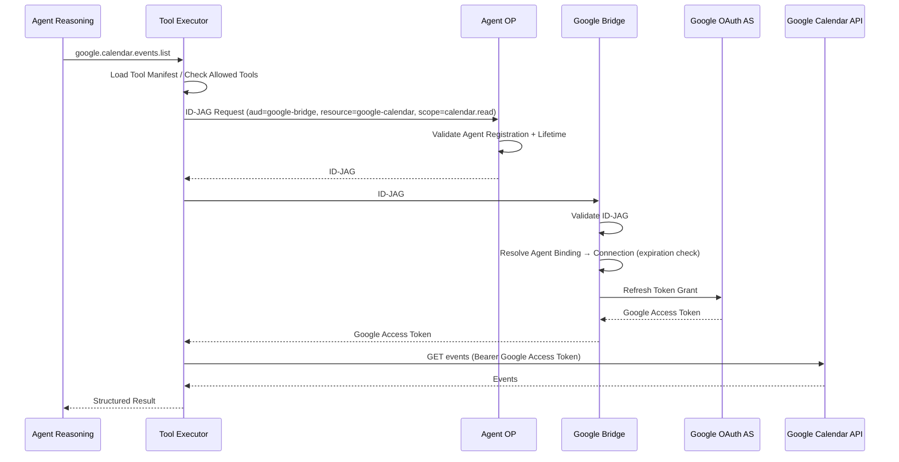
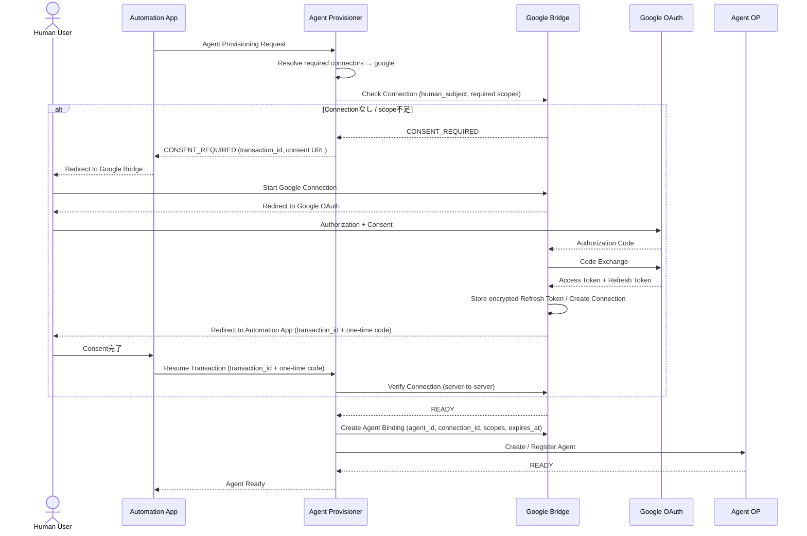

# 06. OAuth Bridge（Google Bridge）

## 1. 位置づけ

OAuth Bridgeは、ID-JAGを理解しない外部OAuth SaaSをXAAモデルへ接続する互換レイヤーである。
XAAそのものの必須要素ではなく、Native XAA Resourceでは存在しない。

Googleは本システムのID-JAGを直接理解しない前提のため、Google向けResource Authorization Server互換レイヤーとして**Google Bridge**を設ける。
Microsoft、GitHubなど他のOAuth SaaSも同じパターンで `other-oauth-bridge` として追加する。

GCP上ではCloud Run Serviceとして配置し、以下の2つの面を持つ。

| 面 | 公開範囲 | 用途 |
|---|---|---|
| Agent向け内部API | 非公開（Cloud Run IAM） | ID-JAG → Google Access Token の交換 |
| OAuth Callback | 公開 | ユーザーのGoogle Consent |

## 2. 役割とやらないこと

| 担当する | 担当しない |
|---|---|
| ID-JAG Validation | Gmail / Calendar APIの実行 |
| AgentとGoogle Connectionの紐付け | AI Reasoning、Tool Selection |
| Google OAuth Client情報管理 | 業務ロジック、API Request生成 |
| Google Refresh Token管理 | |
| Google Access Token取得とAgentへの払い出し | |
| Connection / Binding Expiration管理 | |

Google APIそのものは、Bridgeが返したAccess Tokenを使ってAgent（Tool Executor）が直接呼び出す。

## 3. Credential保持方針

| Credential | 保持場所 | Agentへ渡すか |
|---|---|---|
| Google OAuth Client Secret | Secret Manager（Bridge SAのみ読取可） | 渡さない |
| Google Refresh Token | Credential DB（KMSで暗号化） | 渡さない |
| Consent時に発行される初回Access Token | Bridge内部のみで保持または破棄 | 渡さない |
| Runtime中のGoogle Access Token | Agentがメモリ上で一時保持 | 渡す（ID-JAG提示時） |

Credential DBのConnectionレコード：

```text
connection_id
human_subject
external_subject          （GoogleアカウントID）
encrypted_refresh_token   （KMSで暗号化）
granted_scopes
status
created_at
expires_at
```

ConnectionとAgentの関係は2層に分ける。

| 層 | 単位 | 寿命 |
|---|---|---|
| **Connection** | 人間ユーザー（human_subject）ごと | Consentで作成され、ユーザーが取り消すか組織が失効させるまで有効。複数Agentから再利用できる |
| **Agent Binding** | Agentごと（agent_id ↔ connection_id + 許可scope） | Agentの `expires_at` まで（最大24時間）。Agent破棄時に必ず削除 |

これにより、同じユーザーが2つ目のAgentを作るときに再度Consentは不要であり（必要なscopeがConnectionに含まれていれば）、Agentの失効はBinding削除で確実に行える。

## 4. Runtime Flow



## 5. Google Consent

Google OAuthにはユーザーのConsentが必要になる。
本システムでは**Agent OP生成前のProvisioning処理**として行う。
Consent後のリダイレクト先はAutomation Appとし、Agent ProvisionerはInternetへ公開しない（[08. §8](./08-gcp-infrastructure.md#8-ネットワークと公開範囲)）。



Redirectのルール：

- Google BridgeからAutomation Appへ戻す際、`access_token` / `refresh_token` をURLへ載せない。返すのは `transaction_id` と one-time completion code のみとする。
- Automation AppはHuman Access Token（DPoP-bound）でProvisionerのTransaction再開を呼び、ProvisionerとBridge間はServer-to-Server通信で `Connection READY` を確認する。
- Consentで中断した処理は [07. §3.2 Provisioning Transaction](./07-lifecycle.md#32-provisioning-transaction) により復元する。
