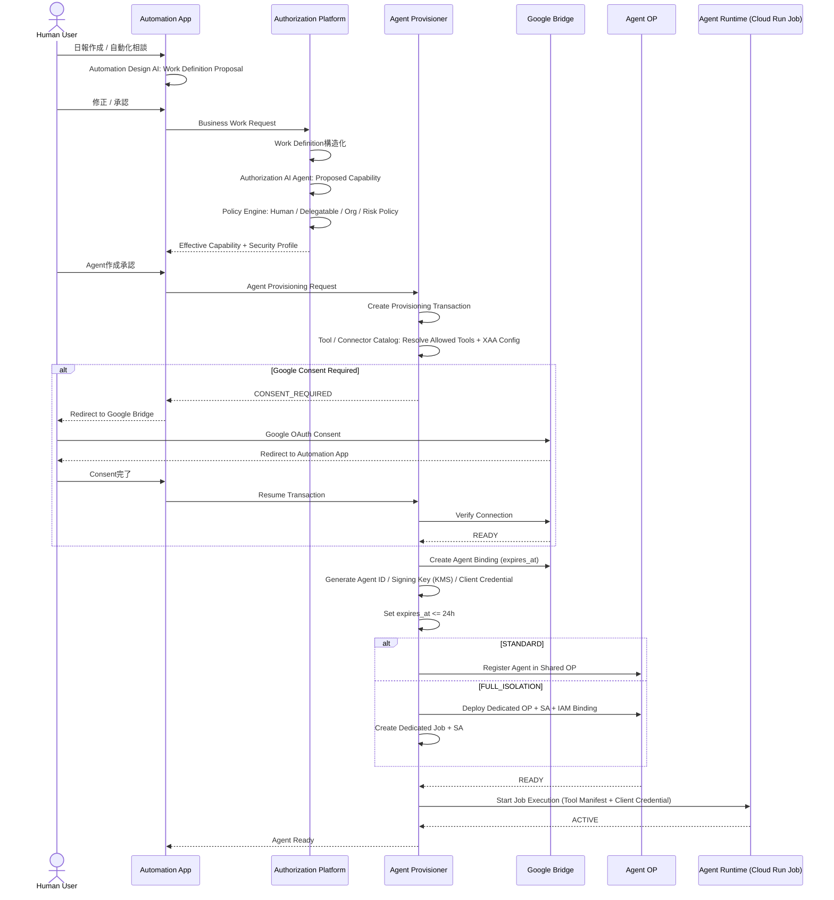
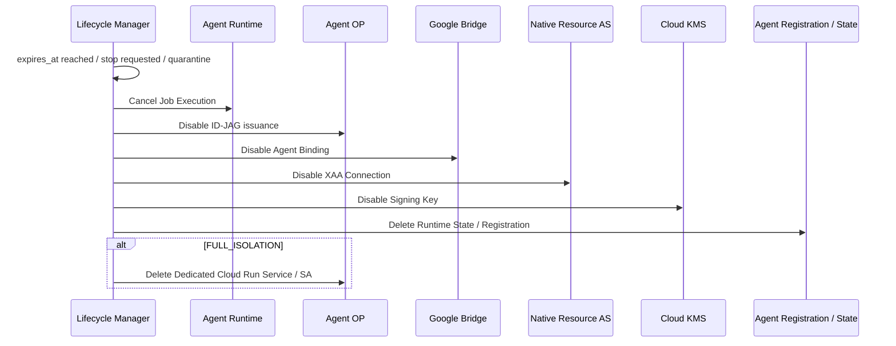

# 07. AgentのProvisioningとLifecycle

## 1. Agent Lifetime

AI Agentは永続Identityとしない。
各Agentには必ず最大生存時間を設定する。

```text
Maximum Agent Lifetime = 24 hours
```

Agent生成時に `created_at` と `expires_at` を確定し、24時間を超えてAgentを生存させない。

```text
created_at = 2026-08-29T10:00:00+09:00
expires_at = 2026-08-30T10:00:00+09:00
```

## 2. Lifecycle状態

```text
通常:   CREATED → PROVISIONING → ACTIVE → EXPIRING → EXPIRED → REVOKED → DESTROYED
異常時: ACTIVE → SUSPICIOUS → QUARANTINED → REVOKED → DESTROYED
停止:   ACTIVE → REVOKED → DESTROYED
```

## 3. Provisioning

Agent Provisionerが担当する。

### 3.1 Provisioning時にすべて確定する

Agent Identity生成の前に、以下から必要な設定をすべて解決し、Agent OPとAgent Runtimeへ静的設定として注入する。

```text
Effective Capability + Tool / Connector Catalog + Security Profile
    ↓
Agent ID / Signing Key / Client Credential
Allowed Tools（Tool Manifest）
XAA Static Configuration（audience / resource / scope）
Isolation Level に応じたインフラ
expires_at（<= 24h）
```

Agent生成後に外部Registryへ問い合わせてXAA設定を決定することはしない。

### 3.2 Provisioning Transaction

Google Consentなどの外部認可で処理が一時中断されても復元できるよう、Provisioning Transactionを作成する。

```json
{
  "transaction_id": "txn-001",
  "human_subject": "user-123",
  "agent_draft_id": "agent-draft-001",
  "required_capabilities": ["calendar.event.read", "mail.message.send"],
  "required_connectors": ["google"],
  "isolation_level": "standard",
  "status": "WAITING_EXTERNAL_CONSENT"
}
```

### 3.3 End-to-End Provisioning Flow

参加者はアプリ（デプロイ単位）であり、アプリ内部の機能は自己呼び出しとして示す。



通常Agentでは「Agent Creation ≠ Infrastructure Creation」であり、Shared OP上にAgent固有のRegistration / Key / Configのみを生成する。
FULL_ISOLATIONでは「Agent Creation = Dedicated Infrastructure Provisioning」である（[05. §5](./05-identity.md#5-isolation-model)）。

## 4. Agent Runtime

### 4.1 実行形態

Agentは常駐するCloud Run Serviceではなく、**Cloud Run Job Execution**として起動する。

```text
1 Agent = 1 Cloud Run Job Execution
timeout = 24h
```

各Executionは独立したコンテナ、プロセス、メモリを持つ。
STANDARD AgentはJob定義とGCP Service Accountを共有するが、実行は完全に独立している（[08. §4.1](./08-gcp-infrastructure.md#41-agent-runtimeが共有service-accountで動く意味)）。

```text
Agent Provisioning → Job Execution Start → ACTIVE → 0〜24h → 終了 or timeout → Lifecycle Cleanup
```

### 4.2 Lifetimeの多層強制

Agent Lifetimeの保証をCloud Run timeoutだけに依存しない。

| レイヤー | 強制手段 |
|---|---|
| Runtime | Cloud Run Job timeout |
| Identity | Agent Registration の `expires_at`、Agent OPによるID-JAG発行停止 |
| Authorization | Native XAA Connection expiration |
| Connection | Bridge Agent Binding expiration |
| Cleanup | Lifecycle Managerによる定期チェックと強制破棄 |

### 4.3 Runtime State

Agent Runtimeは稼働中、Task Context、Conversation Context、Execution State、Pending Tool Calls、Agent Statusを保持し、Firestore（`agents/{agent_id}/state`）へCheckpoint保存する。
Automation Appからの状況確認と追加指示はこのCheckpointを介して行う（[02. §5](./02-automation-design.md#5-実行中agentの操作)）。

Raw Token、Refresh Token、Private Key、Client Secretは保存しない。

## 5. Disposable設計

Agent OPとRuntimeは、Template-based、Immutableに近い、Automated Provisioning、Maximum 24h Lifetime、Automated Re-Provision、Automated Revoke、Automated Destruction を目指す。
「更新する」より「捨てて作り直す」を優先する。

## 6. Expiration / 緊急停止

期限到達（EXPIRED）、ユーザーによる停止、異常検知（QUARANTINED）のいずれでも、Lifecycle Managerが同じCleanupを実行する。

```text
 1. Agent Runtime停止（Job Execution cancel）
 2. Agent OPからの新規ID-JAG発行停止
 3. Native XAA Connection無効化
 4. Bridge Agent Binding無効化
 5. 発行済みCredentialを失効可能な範囲でRevoke（異常時は外部Refresh Tokenも Revoke）
 6. Agent Signing Key Disable（→ Destroy Scheduled）
 7. Agent Runtime State削除
 8. Dedicated OPが存在する場合はCloud Run Service削除
 9. Dedicated Service Accountが存在する場合はDisable / Delete
10. Agent Registration / Config削除
11. 必要な監査情報のみSecurity Planeへ保持
```

Agent OPの削除だけでは不十分である。
既にAccess Tokenが払い出されている可能性があるため、Resource Authorization Server側とBridge側のConnection / Bindingも停止する。



## 7. 権限変更時の扱い

原則は既存Agentの権限を変更しないことである。
変更が必要なら、古いAgentをRevokeして新しいAgentをProvisionする（Re-Provisioning）。
Disposable設計と整合し、権限昇格の経路を持たないためである。

### 7.1 Agent自身の作業内容、権限を変えたい場合

ユーザーが追加指示で権限外の作業を求めた場合、既存Agentは拒否する。
ユーザーは新しいWork Definitionから新しいAgentを作成する（[02. §5](./02-automation-design.md#5-実行中agentの操作)）。

```text
Old Agent Revoke → New Work Definition → Authorization AI再評価 → New Effective Capability → New Agent Provision
```

### 7.2 Human Userの権限が変更された場合（Re-Provisioning）

`Effective Agent Permission ⊆ Current Human Permission` を常に維持する。
Human Permissionの変更は即時に既存Agentへ反映する。

```text
Human Permission変更イベント（Human IdP / 権限管理システム）
    ↓ Pub/Sub
Authorization Platform
    ↓ 対象ユーザーのACTIVE Agentを列挙
Policy Engineで再評価（保存済みのProposed Capabilityを再利用。AI再推論は不要）
    ↓
    ├ Effective Capabilityが変わらない → 何もしない
    ├ 縮小した → Lifecycle ManagerへRe-Provisioningを依頼
    └ 拡大した → 既存Agentには反映しない（権限昇格しない）
```

Re-Provisioningの手順（Lifecycle Managerが実行し、新規ProvisionはAgent Provisionerへ依頼する）：

```text
1. 既存AgentをREVOKED → DESTROYED（§6のCleanup）
2. 同じWork Definitionと新しいEffective Capabilityで新AgentをProvision
   - expires_at は元Agentの値を引き継ぐ（生存時間を延長しない）
   - Checkpointは引き継がない（新Agentは最初から実行する）
3. 新しいEffective CapabilityではWork Definitionが実行不能な場合は
   Provisionせず、ユーザーへ通知する
4. ユーザーへ「権限変更によりAgentを作り直した」ことを通知し、監査ログへ記録する
```

Human Permissionが拡大した場合にAgentへ広い権限を与えたいなら、ユーザーが新しいAgentを作成する。

### 7.3 Human Userの退職、無効化

Human Identityが無効化された場合、そのユーザーの全Agentを即時Revoke → Destroyする。
24時間以内であっても待たない。
