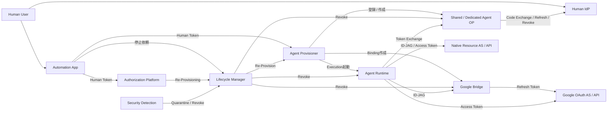

# 08. GCP実行基盤

本書は、[01. §3.1](./01-overview.md#31-アプリと機能の区別) で分けた各アプリをGCP上のどのサービスとして配置し、どのGCP Service Accountで動かし、どのGCPリソースを使わせるかを定める。

図中の破線の枠はGCP ProjectとProject内の論理的なまとまりを、実線の箱はデプロイ単位のアプリを表す。
編集用の元データは [diagrams/architecture.drawio](./diagrams/architecture.drawio) にある。

## 1. GCP Projectと監査領域の構成

GCP Projectは1つだけ作る。

| Project | 置くもの |
|---|---|
| （単一のProject） | 実行系と監査の両方。Cloud Run Service / Job、Firestore、Cloud KMS、Secret Manager、Pub/Sub、Cloud Logging、Vertex AI、BigQuery（`security_audit` dataset） |

責務の分離はService Account、IAM、KMS Key、Secret、Firestoreのパスガードの単位で行う。
データストアはFirestore（Native mode、名前付きDB `xaa`）1本とする。

実行系と監査領域の分離は、同じProjectの中で3層で行う。

- 監査ログはBigQueryの `security_audit` dataset に置き、読み書きするのは専用のService Account `sa-security` だけとする。dataset のIAMはauthoritativeなbindingで固定し、実行系のService Accountには削除可能なロールを一切付けない。
- 書き込み経路はLog Sinkのwriter identityのみとする。アプリはCloud Loggingへ書くだけで、datasetへ直接書けるIdentityを持たない。
- 変数 `enable_deny_policy` を有効にすると、監査データの削除に当たる権限をDeny Policyで拒否する。

**この構成では、同一ProjectのOwnerは実行系と監査ログの両方へ届く。`enable_deny_policy=false` のとき、Ownerによる監査ログの削除は防げない。プロジェクトを分ける構成より保護は弱い。**

監査ログを別Projectへ分ける案は採らなかった。
検証構成で2つ目のProjectを立てる手間と費用に対し、得られる保護が「同一ProjectのOwnerでも監査ログを消せない」という1点に限られるためである。
そのかわり、Log Sinkのwriter identityだけがBigQueryへ書けること、Platform側のService Accountに `roles/bigquery.admin` と `roles/bigquery.dataOwner` を与えないことをTerraformとCIの禁止ロール検査で固定している。
この判断とその限界は[逸脱レジストリのDEV-14](./deviations.md)に記録してある。

## 2. デプロイ単位と内部機能

アプリ（デプロイ単位）と、その中で動く機能の対応を図にする。
Automation Design AI、Authorization AI Agent、Policy Engine、Tool Executorは独立したアプリではなく、それぞれのアプリ内部のモジュールである。
LLM推論はすべてVertex AIへのAPI呼び出しであり、各アプリは推論結果を受け取るだけでモデルを持たない。

```mermaid
flowchart TB
    subgraph AUTO["Automation App（Cloud Run Service）"]
        A1[Web UI / 日報管理]
        A2[Automation Design AI]
        A3[Agent操作]
    end
    subgraph AUTHZ["Authorization Platform（Cloud Run Service）"]
        Z1[Work Definition構造化]
        Z2[Authorization AI Agent]
        Z3[Policy Engine]
        Z4[Capability Taxonomy]
    end
    subgraph PROV["Agent Provisioner（Cloud Run Service）"]
        P1[Provisioning Transaction]
        P2[Tool / Connector Catalog解決]
        P3[Agent登録 / Dedicated OP作成 / Job起動]
    end
    subgraph LIFE["Lifecycle Manager（Cloud Run Service + Cloud Scheduler）"]
        L1[期限監視 / Revoke / Destroy / Re-Provisioning]
    end
    subgraph OP["Shared Agent OP / Dedicated Agent OP（Cloud Run Service）"]
        O1[Agent認証 / subject_token・actor_token検証]
        O2[ID-JAG発行 / KMS署名 / 期限確認]
        O3[Human IdP Connection / subject_token払い出し]
    end
    subgraph GB["Google Bridge（Cloud Run Service）"]
        G1[ID-JAG検証 / Consent / Refresh Token管理 / Access Token払い出し]
    end
    subgraph RUN["Agent Runtime（Cloud Run Job Execution。1 Agent = 1 Execution）"]
        R1[Agent Reasoning]
        R2[Tool Executor]
        R3[Checkpoint / Telemetry]
    end
    subgraph SEC["Security Detection（Cloud Run Service）"]
        S1[Protocol Validation / Rule / Correlation / Risk Score]
        S2[Security AI]
        S3[Response]
    end
    VAI[(Vertex AI)]
    A2 -.-> VAI
    Z2 -.-> VAI
    R1 -.-> VAI
    S2 -.-> VAI
```

各アプリのGCP上の実体、公開範囲、動作に使うService Accountは次のとおり。
内部機能の一覧は [01. §3.1](./01-overview.md#31-アプリと機能の区別) を正とし、ここでは繰り返さない。

| アプリ | GCPの実体 | 公開範囲 | Service Account |
|---|---|---|---|
| Automation App | Cloud Run Service | 公開（Human IdPでログイン） | `sa-automation-app` |
| Authorization Platform | Cloud Run Service | 内部 | `sa-authorization` |
| Agent Provisioner | Cloud Run Service | 内部 | `sa-provisioner` |
| Lifecycle Manager | Cloud Run Service。Cloud Schedulerから定期起動 | 内部 | `sa-lifecycle` |
| Shared Agent OP | Cloud Run Service（1つ） | 内部API。Human IdPのOAuth Callbackだけ公開 | `sa-shared-agent-op` |
| Dedicated Agent OP | Cloud Run Service（FULL_ISOLATION Agentごとに1つ） | 同上 | `sa-op-<short>` |
| Google Bridge | Cloud Run Service | 内部API。OAuth Callbackだけ公開 | `sa-google-bridge` |
| Native Resource AS / API | Cloud Run Service（社内Resourceの場合） | 内部 | `sa-native-resource-as` / `sa-native-resource-api` |
| Agent Runtime | Cloud Run Job。STANDARDは共通のJob定義、FULL_ISOLATIONはAgent専用のJob定義。1 Agent = 1 Execution | 非公開（HTTP Ingressなし） | `sa-agent-runtime` / `sa-agent-<short>` |
| Security Detection | Cloud Run Service | 内部 | `sa-security` |

### 2.1 Human IdPとAgent OPの配置

Cross App Accessの成立にはID-JAGの `iss` がHuman IdPのissuer識別子である必要がある一方、Human IdPにAgentの文脈は持ち込まない（[05. §3.2](./05-identity.md#32-issuerを分けずデプロイだけ分ける理由)）。
そのため、1つのissuer `https://idp.example.com` をExternal Application Load Balancerで受け、パスでバックエンドを分ける。

| パス | バックエンド | 公開 |
|---|---|---|
| `/authorize` `/token` `/userinfo` `/logout` | Human IdP（Cloud Run Service） | 公開 |
| `/.well-known/openid-configuration` | Human IdP（Cloud Run Service） | 公開 |
| `/jwks.json` | Cloud Storage（Backend Bucket） | 公開 |
| `/xaa/token` | Agent OP（Cloud Run Service） | 内部からのみ到達可 |
| `/xaa/callback` | Agent OP（Cloud Run Service） | 公開 |

`/jwks.json` をアプリではなくBucketで配信するのは、Human IdPとAgent OPのどちらか一方が落ちてももう一方の署名検証が続くようにするためである。
両アプリは自分の公開鍵をこのBucketへ書き、Resource ASはBucketの内容だけを読む。
Bucketへの書き込みは各アプリのService Accountに限り、削除権限は与えない。

`/xaa/token` はAgent Runtimeだけが呼ぶ。
公開する必要はないため、Cloud Armorとロードバランサ側の制限に加えて、Cloud Run IngressをInternal限定にしたバックエンドへ向ける。
`/xaa/callback` はユーザーのブラウザがHuman IdPからリダイレクトされて到達するため公開する。
これはGoogle BridgeのOAuth Callbackと同じ位置づけである（[06. §5](./06-oauth-bridge.md#5-google-consent)）。

## 3. アプリ間の呼び出し関係

アプリ単位で「誰が誰を呼ぶか」と、その呼び出しを何で認証するかを示す。
Agent作成の時系列は [07. §3.3](./07-lifecycle.md#33-end-to-end-provisioning-flow) にあり、ここでは呼び出しの向きだけを扱う。

| 呼び出し | 認証と認可 |
|---|---|
| Human User → Automation App | Human IdPのOIDCログイン |
| Automation App → Authorization Platform / Agent Provisioner / Lifecycle Manager | Human Access Token（DPoP-bound、`aud` と `scope` は各アプリ）に加えて、Cloud Run IAMで `sa-automation-app` にだけ `run.invoker` を付与。`human_subject` はTokenの `sub` を正とする（[05. §1.1](./05-identity.md#11-human_subjectの出どころ)） |
| Automation App ↔ Firestore | `sa-automation-app` でAgentのstate読み取りとinstructions書き込み（[02. §5](./02-automation-design.md#5-実行中agentの操作)） |
| 権限管理システム → Authorization Platform | Human Permission変更イベントをPub/Sub Push Subscriptionで配信。Pub/SubのOIDC Tokenで認証 |
| Authorization Platform → Lifecycle Manager | Cloud Run IAM |
| Agent Provisioner → Shared Agent OP / Google Bridge | Cloud Run IAM |
| Agent Provisioner → GCP API | `sa-provisioner` でCloud Run Job Executionの起動と、FULL_ISOLATION用のCloud Run Service、Service Account、KMS Key、IAM Bindingの作成 |
| Lifecycle Manager → Agent Runtime / OP / Bridge / Native AS / KMS | Cloud Run IAMとGCP API。Cloud SchedulerからのOIDC Tokenで定期起動 |
| Agent Runtime → Agent OP | Layer 1：Cloud Run IAM（`sa-agent-runtime` または `sa-agent-<short>`）。Layer 2：Agent Client Credential（[05. §4](./05-identity.md#4-agent-registrationstandardでもagentごとに作る)）。要求には `subject_token`、`actor_token`、DPoP Proofを添える |
| Agent OP → Human IdP | `agent-platform` としてのクライアント認証。Authorization Code Exchange、`refresh_token` grant、Token Revocation |
| Agent Runtime → Google Bridge | Cloud Run IAMに加えてID-JAG |
| Agent Runtime → Native Resource AS / Resource API | ID-JAG、そしてAccess Token。Cloud Run IAMは社内Resourceの場合に追加してよいが、XAAの代替にはしない |
| Agent Runtime → Google API | Google Bridgeが返したGoogle Access Token |
| Google Bridge → Google OAuth AS | OAuth Client Secret（Secret Manager）とRefresh Token（Credential DB） |
| 各アプリ → Cloud Logging → Pub/Sub → Security Detection | Cloud Loggingの標準経路。Security Detectionは `sa-security` でSubscribe |
| Cloud Logging → BigQuery（`security_audit` dataset） | Log Sink。Sinkのwriter identityにだけ書き込み権限を付与 |
| 各アプリ → Pub/Sub（`agent-activity-stream`）→ Automation App | Cloud Loggingを経由しない別系統。発行元アプリのService AccountでPublishし、Automation Appが `sa-automation-app` でSubscribeしてFirestore（`users/*/activity`）へ書き込む（[11. §4](./11-activity-timeline.md#4-配信経路)） |
| Security Detection → Lifecycle Manager | Cloud Run IAM |

Resource AS の `/token` は RFC 6749 §5.2 に従い 400 と `invalid_request` または `invalid_grant` を返す。401 と `WWW-Authenticate` を返すのは Resource API 側である。

## 4. GCP Service Accountとは

GCP Service Accountは、GCP上で動くアプリ（Cloud Run ServiceやJob）が**GCPのIAMに対して名乗る身元**である。
「AI Agentが外部サービスへアクセスするときに名乗る身元」ではない。
本システムでその役割を担うのは、Agent OPが発行するID-JAGである。
ID-JAGは人間（`sub`）とAgent（`act`）の両方を運ぶ（[05. §6.4](./05-identity.md#64-id-jag)）。

| | GCP Service Account | Agent Identity（ID-JAG） |
|---|---|---|
| 誰の身元か | Cloud Run Service / Jobというアプリ | 1人の人間と、その代理として動く1つのAI Agent |
| 誰に対して名乗るか | GCP IAM（KMS、Secret Manager、Firestore、他のCloud Run） | Resource Authorization Server、OAuth Bridge |
| 何が決まるか | そのアプリがどのGCPリソースを使えるか | どの人間の代理として、どのAgentが、どのResourceへどのscopeでアクセスできるか |
| 誰が発行するか | GCP | Human IdPと共有するissuer（Agent OPが署名） |
| いつ作るか | アプリのデプロイ時。Dedicated OPと専用Runtimeの分だけProvisioning時 | Agent Provisioning時 |
| 寿命 | アプリと同じ。Dedicated分はAgentと同じ | 最大24時間 |

したがって、AI Agentを含まないアプリにもService Accountは必要になる。
Google Bridgeを例にすると、Bridgeは動作のために次のGCPリソースへアクセスする。

- Secret ManagerからGoogle OAuth Client Secretを読む
- Cloud KMSでRefresh Tokenを復号する
- Firestoreの `idp_connections` を読む

これらの可否はGCP IAMが `sa-google-bridge` に対して判定する。
Service Accountを指定しないCloud RunはProject共通のデフォルトService Accountで動作し、その権限はProject全体に及ぶため、アプリごとに専用のService Accountを作って必要な権限だけを付与する。

### 4.1 Agent Runtimeが共有Service Accountで動く意味

`sa-agent-runtime` はCloud Run Job定義に紐づくService Accountであり、そのJobから起動されるすべてのExecutionがこのService Accountとして動く。
STANDARD Agentは1つのJob定義を共有するため、Service Accountも共有する。
しかし、共有されるのはService AccountとJob定義だけである。
実行は 1 Agent = 1 Execution であり、コンテナ、プロセス、メモリ、Tool Manifest、Agent Client CredentialはAgentごとに独立している（[07. §4.1](./07-lifecycle.md#41-実行形態)）。
複数のAgentを1つのAI Agentプロセスで動かす構成ではない。

Service Accountが共有されていても、Agent OPが「どのAgentからの要求か」はService Accountでは決まらない。
それを決めるのは、Provisioning時にそのExecutionにだけ渡すAgent Client Credentialと、そのAgentの鍵で署名した `actor_token` である（[05. §6.2](./05-identity.md#62-actor_token本システム独自のプロファイル)）。
Agent AのExecutionはAgent BのClient Credentialを持たず、Agent Bの鍵で署名を依頼することもできないため、Agent Bとして名乗れない。

STANDARD AgentごとにService Accountを分けない理由は3つある。

1. Service AccountはAgentの身元ではないため、分けてもAgent間の分離（Layer 2）は変わらない。
2. 24時間で使い捨てるAgentごとにService Accountを作ると、ProjectあたりのService Account数の上限（既定100）と、IAM変更の反映遅延（最大数分）が運用上の制約になる。
3. Agent専用のService Accountが意味を持つのは、Dedicated OPへの呼び出し権限をそのAgentのRuntimeだけに絞るときである。それが必要なFULL_ISOLATIONでは `sa-agent-<short>` を作る。

### 4.2 Dedicated OPにService Accountを分ける理由

Dedicated OPに専用のService Account `sa-op-<short>` を作るのは、GCP IAMでKMS鍵への署名権限を「このOPだけ」に絞るためである。
Shared OPのService Accountを流用すると、そのService Accountが持つ全Agentの鍵に署名できてしまい、OPを分けた意味がなくなる。
Blast Radiusの比較は [05. §5](./05-identity.md#5-isolation-model) を参照。

## 5. Service Account一覧

各Service Accountに付与する権限と、明示的に付与しない権限を示す。
「付与しない」欄は、侵害時にそのService Accountで到達できてはならない範囲である。

| Service Account | 付与する | 付与しない |
|---|---|---|
| `sa-automation-app` | Authorization Platform / Provisioner / Lifecycle Managerの `run.invoker`。Vertex AI推論。Firestore（`work_definitions`、`agent_definitions`、`sessions`）。Firestore（`agents/*/state` 読み取り、`agents/*/instructions` 書き込み、`users/*/activity` 書き込み）。Pub/Sub Subscribe（`agent-activity-stream`） | Signing Key。Secret。Credential DB。Authorization DBの書き込み。Tool Catalog |
| `sa-authorization` | Vertex AI推論。Firestore（`authorization_decisions`、`policy_decisions`、`capability_taxonomy`、`human_permissions`）。Lifecycle Managerの `run.invoker`。Pub/Sub Subscribe（Human Permission変更） | Signing Key。Refresh Token。Client Secret。Resource APIの直接実行。Agent Runtimeの操作 |
| `sa-provisioner` | Shared OP / Google Bridgeの `run.invoker`。Firestore（`provisioning_transactions`、`catalog_tools`、`catalog_connectors`、`agent_definitions`）。Firestore（`agents/*` 書き込み）。Agent OPへのIdP Connection作成依頼と状態確認。Cloud Run Job Executionの起動。FULL_ISOLATION用のCloud Run Service、Service Account、KMS Key、IAM Bindingの作成 | Refresh Token。Client Secret。既存Agent Keyでの署名。Authorization DBの書き込み。Security Project |
| `sa-lifecycle` | Job Executionの取り消し。OP / Bridge / Native AS / Provisionerの `run.invoker`。KMS Keyの無効化。Dedicated Cloud Run ServiceとService Accountの削除。Firestore（`agents/*` 削除） | Refresh Token。Client Secret。署名 |
| `sa-shared-agent-op` | Shared OPのID-JAG署名鍵での署名（`cloudkms.signerVerifier`）。Firestore（`agents/*` 読み取り）。Firestore（`idp_connections`）。IdP Connection Encryption Keyでの暗号化と復号。JWKS Bucketへの自鍵の書き込み | Dedicated OP用Key。Human IdPのSSO署名鍵。Google Refresh Token。Authorization DB。Provisionerの権限 |
| `sa-op-<short>` | そのAgentのID-JAG署名鍵の利用。そのAgentのRegistrationと `idp_connection` 行の読み取り。JWKS Bucketへの自鍵の書き込み | 他AgentのKeyとIdP Connection。Human IdPのSSO署名鍵。Google Refresh Token。Authorization DBの書き込み。Provisionerの権限 |
| `sa-agent-runtime` | Shared OP / Google Bridge / Native ASの `run.invoker`。Vertex AI推論。Firestore（自Agentの `state` と `instructions`） | Secret Manager。Credential DB。`idp_connection`。KMS鍵の利用。Authorization DBの書き込み。Provisionerの権限 |
| `sa-agent-<short>` | `dedicated-op-<short>` の `run.invoker`。Google Bridge / Native ASの `run.invoker`。Vertex AI推論。Firestore（自Agentの `state` と `instructions`） | Shared OPの `run.invoker`。上記 `sa-agent-runtime` と同じ |
| `sa-google-bridge` | Google OAuth Client Secretの読み取り。Credential DBの読み書き。Connector Encryption Keyでの暗号化と復号 | Agent OP Signing Key。Authorization DBの書き込み。Agent Runtimeの操作 |
| `sa-native-resource-as` | Resource AS Signing Keyでの署名。Resource側の認可DB | Agent OP Signing Key。Platform側DB |
| `sa-security` | Pub/Sub Subscribe。BigQuery（`security_audit` dataset）の読み書き。Vertex AI推論。Lifecycle Managerの `run.invoker` | Platform側DBの書き込み。Signing Key。Secret |

`sa-provisioner` と `sa-lifecycle` はCloud Run ServiceやService Account、KMS Keyを作成および削除できるため、Project内で最も強い権限を持つ。
権限は既製の編集者ロールではなくカスタムロール `dedicated_op_creator`（Provisioner）と `dedicated_op_destroyer`（Lifecycle Manager）で与える。
どちらも作成・削除に要る権限だけを列挙し、IAMポリシー全体を書き換える権限は含めない。
作成と削除の対象は `dedicated-op-` / `sa-op-` / `sa-agent-` / `idjag-` / `idpconn-` / `agent-runtime-` の6接頭辞に限り、
実行時に作った資源にはラベル `xaa-managed=runtime` を付ける。
接頭辞の検査は共有関数 `assertRuntimeName` が行い、Terraformが管理する名前を引数に取ったところで例外になる。
両アプリは内部公開に限定し、ProvisionerはHuman Access Token（DPoP-bound）を伴う要求だけを受け付ける。
Tokenの検証手順は [05. §2.1](./05-identity.md#21-受け取り側の検証手順) にある。

Activity Event（[11](./11-activity-timeline.md)）を発行するアプリのService Account（`sa-automation-app`、`sa-authorization`、`sa-provisioner`、`sa-shared-agent-op`、`sa-op-<short>`、`sa-agent-runtime`、`sa-agent-<short>`、`sa-lifecycle`、`sa-security`）には、`agent-activity-stream`へのPub/Sub Publish権限を追加で付与する。表の「付与する」列には既存の主要な権限だけを示し、この横断的な権限は行ごとに繰り返さない。

## 6. 鍵と秘密情報

### 6.1 Cloud KMS

鍵は用途ごとにKey Ringを分ける。

| Key Ring | 鍵 | 使う者 |
|---|---|---|
| `idjag-signing` | ID-JAG署名鍵。Shared OPに1つ、Dedicated OPごとに1つ | STANDARDは `sa-shared-agent-op`、FULL_ISOLATIONは `sa-op-<short>` のみ |
| `resource-as-signing` | Native Resource ASのAccess Token署名鍵 | `sa-native-resource-as` |
| `connector-encryption` | 外部SaaSのRefresh Tokenの暗号化鍵 | `sa-google-bridge` |
| `idp-connection-encryption` | Human IdP ConnectionのRefresh Tokenの暗号化鍵 | `sa-shared-agent-op`、`sa-op-<short>` |

`idjag-signing` の鍵は共有issuerのJWKSへ公開する。
Human IdPのSSO署名鍵とは別鍵とし、`kid` も分ける。
この鍵で `typ` が `oauth-id-jag+jwt` 以外のJWTを署名しないことを不変条件とする（[05. §3.3](./05-identity.md#33-agent-op署名鍵の制約)）。

Human IdP ConnectionのRefresh Tokenを `connector-encryption` と別鍵にするのは、Google Bridgeの侵害で人間のIdentity Assertionまで取得できる状態を作らないためである。

Dedicated OPではOP、Service Account、ID-JAG署名鍵を1対1で対応させる。
鍵は破棄時に即時Disableし、Destroyは予約する。
KMSに置いた秘密鍵はKMSの外へ出さず、署名はすべてKMS APIで行う。

KMSに置かない鍵が2つある。
Agent Client Credentialの秘密鍵はProvisionerが生成してExecutionへ渡し、ExecutionのDPoP鍵はExecution内のメモリで生成する。
どちらもExecutionの終了とともに失われ、`expires_at` より長く残らない（[05. §9](./05-identity.md#9-tokenの種類と保持ルール)）。

### 6.2 Secret Manager

Google OAuth Client Secretなど、外部SaaSの静的なClient SecretはSecret Managerへ保存する。
各Secretは対応するBridgeのService Accountにだけ `secretAccessor` を付与する。
Refresh TokenはSecret Managerではなく、KMSで暗号化してCredential DBへ保存する（[06. §3](./06-oauth-bridge.md#3-credential保持方針)）。

## 7. データストア

### 7.1 Firestore（Native mode）

データストアはFirestoreの名前付きデータベース `xaa` 1本である。
データ層の責務分離はDBのGRANTではなく、`packages/gcp/src/firestore-guard.ts` の許可マトリクスによるパスガードで強制する。
IAMはデータベース単位の `roles/datastore.user` のみを付与する。
Firestoreにドキュメント単位のIAMが無いための代替であり、[deviations.md](./deviations.md) のDEV-05に記録がある。

| コレクション | 内容 | 読み書きするService Account |
|---|---|---|
| `authorization` | Human Permission、Delegatable Permission、Organization Policy、Risk Policy、Policy Decisionの記録 | `sa-authorization` |
| `capability_taxonomy` | 定義済みCapabilityの一覧 | `sa-authorization`（読み取り）。seed（投入） |
| `catalog/tools` と `catalog/connectors` | Tool / Connector Definition | `sa-provisioner`（読み取り）。seed（投入） |
| `agents` | Agent Registration、Work Definition、Agent Definition、Provisioning Transaction | `sa-automation-app`、`sa-provisioner`、`sa-lifecycle` |
| `dedicated_resources` | FULL_ISOLATIONで実行時に作った資源の台帳 | `sa-provisioner`、`sa-lifecycle` |
| `idp_connections` | Human IdP Connection。Agentごとの暗号化Refresh Token（[05. §4.1](./05-identity.md#41-human-idp-connection)） | `sa-shared-agent-op`、`sa-op-<short>` |
| `documents` と `payments` | Native Resourceの本体データ | `sa-resource-docs-api`、`sa-resource-finance-api` |

### 7.2 Firestore

Agent単位、またはユーザー単位で高速に読み書きするものはFirestoreに置く。

| パス | 内容 | 書く者 | 読む者 |
|---|---|---|---|
| `agents/{agent_id}` | Agent Registration（[05. §4](./05-identity.md#4-agent-registrationstandardでもagentごとに作る)） | Provisioner、Lifecycle Manager | Agent OP |
| `agents/{agent_id}/state` | Runtime Checkpoint、Agent Status | Agent Runtime | Automation App、Lifecycle Manager |
| `agents/{agent_id}/instructions` | ユーザーからの追加指示 | Automation App | Agent Runtime |
| `users/{human_subject}/activity` | Activity Event（[11](./11-activity-timeline.md)） | Automation App（`agent-activity-stream`のSubscriber） | Automation App（Web UI経由で本人へ配信） |

いずれのストアにもRaw Token、Refresh Token（暗号化前）、Private Key、Client Secretは保存しない。

## 8. ネットワークと公開範囲

Internetへ公開するのは、Automation App、Google BridgeのOAuth Callback、Agent OPのOAuth Callback（`/xaa/callback`）、およびissuerのメタデータとJWKSだけである。
Consent後のリダイレクト先はいずれもAutomation Appとし、Automation AppがProvisionerのTransaction再開をServer-to-Serverで呼ぶ（[06. §5](./06-oauth-bridge.md#5-google-consent)、[07. §3.3](./07-lifecycle.md#33-end-to-end-provisioning-flow)）。
それ以外のCloud Run ServiceはIngressを内部に限定し、Cloud Run IAMで呼び出し元のService Accountを絞る。
Agent RuntimeはCloud Run Jobであり、受信するHTTPエンドポイントを持たない。

FirestoreへPrivate IPで接続するなど、VPC内へ出る必要がある場合はDirect VPC Egressを使う。
Serverless VPC Access Connectorは常時費用と運用負荷を伴うため使わない。

Cloud Run IAMはXAAの代替ではない。
Cloud Run IAMは「どのアプリが呼べるか」を決め、ID-JAGは「どのAgentとして何にアクセスできるか」を決める（[05. §4](./05-identity.md#4-agent-registrationstandardでもagentごとに作る)）。

## 9. 使用するGCPサービス一覧

| GCPサービス | 用途 |
|---|---|
| Cloud Run Service | Automation App、Authorization Platform、Agent Provisioner、Lifecycle Manager、Shared / Dedicated Agent OP、Google Bridge、Native Resource AS / API、Security Detection |
| Cloud Run Job | Agent Runtime（timeout 24h） |
| Cloud Load Balancing | issuer `https://idp.example.com` のパス分割（§2.1） |
| Cloud Storage | 共有JWKS（`/jwks.json`）のBackend Bucket |
| Cloud Scheduler | Lifecycle Managerの定期起動 |
| Vertex AI | Automation Design AI、Authorization AI Agent、Agent Reasoning、Security AIの推論 |
| Firestore | §7.1のコレクション。Agent Registration、Runtime Checkpoint、追加指示、Activity Event |
| Cloud KMS | ID-JAG署名鍵、Resource AS署名鍵、Connector暗号化鍵、IdP Connection暗号化鍵 |
| Secret Manager | OAuth Client Secret |
| Pub/Sub | Human Permission変更イベント、Security Detectionへのログ配信、Activity Event配信（`agent-activity-stream`） |
| Cloud Logging | 全アプリのログ収集とLog Sink |
| BigQuery（`security_audit` dataset） | Security Data Lake、長期監査ログ、Security Findings |
