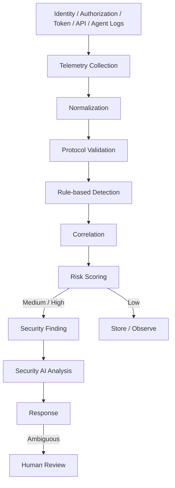

# 09. セキュリティ監視（Security Detection）

Security Detectionは、Identity、Authorization、Token、Tool、APIの各ログからAgentの異常を検知し、Lifecycle Managerへ隔離や失効を依頼するアプリである。
アプリの配置と権限は [08. §2](./08-gcp-infrastructure.md#2-デプロイ単位と内部機能) と [08. §5](./08-gcp-infrastructure.md#5-service-account一覧) を参照。

本書が扱うのは検知と自動対応であり、判断の主体は機械である。操作している人間向けに、判断済みの結果を時系列で見せる画面は[11. アクティビティタイムライン](./11-activity-timeline.md)を参照。

## 1. 基本方針

すべてのログをLLMへ直接送ることはしない。
機械的に判定できるものは機械が判定し、AIには相関済みのSecurity Findingだけを渡す。



## 2. 収集するログ

各アプリが出すログのうち、検知に使う項目を示す。
すべてのログに `human_subject`、`agent_id`、`trace_id`、`timestamp` を含める。

| 発生源 | 項目 |
|---|---|
| Human IdP | Client ID、audience、scope、認証結果、DPoP検証結果、送信元IP、デバイス情報 |
| Authorization Platform（Authorization AI Agent） | Agent Draft ID、Work Definition IDとそのHash、推論したCapability、Confidence、Capability Taxonomyのバージョン、AIモデルのバージョン |
| Authorization Platform（Policy Engine） | Proposed Capability、Effective Capability、Security Profile、Isolation Level、ALLOW / DENY、Policy ID、Decision Reason |
| Agent Provisioner | Isolation Level、Dedicated OPの有無、Provisioned Tool、静的XAA設定（audience、resource、scope）、IdP Connectionと外部Connectorの状態、created / expires / destroyed |
| Agent OP | OP Runtime ID、Shared / Dedicated、Token Exchange要求（audience、resource、scope）、`subject_token` の `iss` と `aud` と `sub`、`actor_token` の `sub` と `jti`、委譲関係の照合結果、DPoP検証結果、発行したID-JAGの `jti` と `kid` と `cnf.jkt`、期限確認結果、エラーコード |
| Agent OP（Human IdP Connection） | `idp_connection_id`、Refresh Token Rotationの結果、再利用検知、`subject_token` 再取得の成否、Revoke要求の結果 |
| Google Bridge | ID-JAG issuerと検証結果、Connection ID、要求されたresourceとscope、Agent期限の検証結果、Google Token Refreshの結果、Access Token払い出し結果 |
| Native Resource AS | ID-JAG の `iss` と `sub` と `act` と `client_id`、audience、resource、scope、`cnf.jkt` とDPoP Proofの照合結果、Token発行結果、認可判定 |
| Resource API / Google API（取得できる場合） | Tool ID、API operation、HTTP Method、Resource、Response Status、実行結果、Latency |
| Agent Runtime | Task ID、Execution ID、Tool ID、要求した操作、対象Resource、結果、Agent Age、expires_at、Span ID |

Work Definitionの全文は無条件にSecurity AIへ送らない。
必要な場合はHash、構造化した操作種別、Capabilityの結果を使う。

## 3. ログへ残さないもの

| 残さないもの | 相関に使う代替 |
|---|---|
| Raw Access Token、Raw ID-JAG、Raw DPoP Proof、Raw subject_token、Raw actor_token | `jti`、`kid`、`jkt`、Token fingerprint |
| Refresh Token、Private Key、Client Secret、Authorization Code | key thumbprint、`connection_id`、`idp_connection_id` |
| （上記のいずれにも該当しない相関キー） | `request_id`、`trace_id` |

## 4. 正規化と保存

各アプリ固有のログはそのままAIへ送らず、共通のEvent Schemaへ正規化する。
Schemaには、OCSFのようなVendor非依存のSecurity Schemaを採用することを検討する。

保存経路は次の一方向のみとする。

```text
各アプリ → Cloud Logging → Log Sink / Pub/Sub → agent-security-prod（BigQuery）
```

Platform側のService AccountにはSecurity Project上のログを削除する権限を与えない（[08. §1](./08-gcp-infrastructure.md#1-gcp-projectの構成)）。

## 5. 検知の段階

### 5.1 Protocol Validation

次の違反はAI分析ではなく、受信した時点で機械的に判定する。

```text
Invalid Signature / Expired Token / Expired Agent
audience mismatch / resource mismatch / invalid scope
unknown issuer / invalid client / invalid ID-JAG
invalid DPoP Proof / replayed DPoP Proof / DPoP key binding mismatch (cnf.jkt)
human_subject mismatch (body vs token sub)
unauthorized Tool
expired Bridge Connection / expired Human IdP Connection
```

Cross App Accessの導入に伴い、次の3つを追加する。
いずれも既存のログ項目では拾えないため、§2で挙げた項目を前提とする。

| 検知 | 何を示すか |
|---|---|
| ID-JAGの `sub` が、`actor_token` の `agent_id` に対応するAgent Registrationの `human_subject` と一致しない | 委譲関係の偽装。ドラフト §9.7 が名指しで警告している攻撃であり、[05. §6.3](./05-identity.md#63-agent-opの検証手順) の7で拒否したものを記録する |
| Agent OPの `kid` で署名されたJWTの `typ` が `oauth-id-jag+jwt` 以外 | ID-JAG署名鍵の目的外使用。SSO用ID Tokenの偽造を試みている（[05. §3.3](./05-identity.md#33-agent-op署名鍵の制約)） |
| Token Exchangeの `audience`、`resource`、`scope` が静的XAA設定の範囲外 | Runtime侵害、またはAgent OPの設定改竄 |

2つ目はAgent OP自身のログだけでは検出できない。
侵害されたAgent OPは自分の不正な発行をログへ書かないためである。
Resource AS側で受け取ったJWTの `kid` と `typ` を突き合わせ、Agent OPの発行記録に対応するものが無いID-JAGを検出する。

Human IdP ConnectionのRefresh Token再利用検知も、Protocol Validationとして扱う（[05. §4.1](./05-identity.md#41-human-idp-connection)）。
保持者はAgent OPだけであるため、再利用は漏洩の証拠になる。

### 5.2 Rule-based Detection

第一段階ではAIを使わず、閾値と条件で検出する。

| 分類 | 例 |
|---|---|
| Token | Token要求の急増。ID-JAGの大量発行。Google Token Refresh失敗の急増。`subject_token` 再取得の急増。認証失敗の急増 |
| Authorization | 大量の401 / 403。異常なscope要求。未知のaudienceやresource |
| Tool | 未知のToolの利用。ProvisioningされていないToolの実行。普段使わないResourceへのアクセス |
| Lifetime | Agent Lifetimeの超過。期限後のアクセス |
| Isolation | Cross-Agent IdP Access。Dedicated OPから他AgentのConfigやIdP Connectionへのアクセス。ある `actor_token` に対して複数の `human_subject` のID-JAGが発行されている状態 |
| Authorization AI | 存在しないCapabilityの生成。Capability Taxonomy外の権限生成。AI結果とPolicy Decisionの異常な乖離 |

### 5.3 Correlation

単一のイベントでは判断できないものをまとめ、1つのFindingにする。

```text
10:00  Agent A  unknown audience request
10:01  Agent A  Agent B のOPへアクセス
10:02  Agent A  ID-JAG request x 100
10:03  Agent A  API 403 x 50
        ↓
Finding: Potential Agent Compromise（Agent A）
```

Correlationは複数Agentを横断して行う。
Agent AからAgent B、C、DのOPへの横方向アクセスは、Agent単体のログでは見えず、中央でまとめて初めて検出できる。
Agent OPやAgent Runtimeの内部には軽量なRule Engineだけを置き、重い判定ロジックは持たせない。

### 5.4 Agent Baseline

AI Agentは業務用途が限定されるため、人間よりBaselineを作りやすい。
ただし最大Lifetimeが24時間であるため、長期の履歴ではなく、Agent Definitionから期待値を導く。

| Baselineの根拠 | 例（Agent A） |
|---|---|
| Effective Capability | `calendar.event.read`、`mail.message.send` |
| Expected Tools | `stub.calendar.events.list`、`google.gmail.message.send` |
| Expected Resources | Google Calendar、Gmail |
| Expected Rate | ID-JAG 2〜20回、API Request 10〜100回 |
| Lifetime | 24時間以内 |
| Current Session Behavior | 現在のExecutionでの実際の挙動 |

Baselineからの逸脱として扱う例：通常使わないTool、Effective Capabilityに存在しないTool、未知のResource、ID-JAG 500回、別Agent OPへのアクセス、期限後のアクセス。

### 5.5 Risk Score

| Score | Level |
|---|---|
| 0〜29 | LOW |
| 30〜59 | MEDIUM |
| 60〜79 | HIGH |
| 80〜100 | CRITICAL |

Scoreの要素：Protocol Violation、Authorization Violation、Authorization AI Anomaly、Behavior Deviation、Token / API Request Rate、Resource Sensitivity、Cross-Agent Activity、DPoP Failure、Delegation Mismatch、Signing Key Misuse、Privilege Escalation Attempt、Agent Expiration Violation、Isolation Boundary Violation。

Delegation MismatchとSigning Key Misuseは、単発でもCRITICALとして扱う。
前者は委譲されていないAgentとしてResourceへ届こうとした事象であり、後者はissuerの署名鍵が意図した用途の外で使われた事象だからである。

LOWは保存と観測にとどめ、MEDIUM以上をSecurity Findingとして次の段階へ渡す。

### 5.6 Security AI Analysis

AIへ渡すのはRaw Logではなく、次の要約情報である。

```text
Security Finding / Risk Score / Related Events
Agent Baseline / Agent Definition / Work Definition Summary
Authorization AI Proposed Capability / Effective Capability / Allowed Tools
Isolation Level / Relevant Authorization Decisions
audience / resource / scope / Agent Age / Time Series
```

AIに期待する出力は次のとおり。

| 観点 | 内容 |
|---|---|
| 逸脱 | 通常挙動との差。Authorization AI推論およびEffective Capabilityとの整合性 |
| 判断 | 侵害の可能性。誤検知の可能性。関連イベントの因果関係 |
| 影響 | 影響範囲。Shared / Dedicated OPへの波及 |
| 推奨 | 推奨するResponseとConfidence |

## 6. Response

Findingに応じて、Security DetectionはLifecycle Managerへ次のいずれかを依頼する。

```text
ACTIVE → SUSPICIOUS → QUARANTINED → REVOKED → DESTROYED
```

QUARANTINEDではAgent OPの新規ID-JAG発行と `subject_token` の払い出しを止め、REVOKED以降は [07. §6](./07-lifecycle.md#6-expiration--緊急停止) のCleanupを実行する。
判断が曖昧な場合はHuman Reviewへ回す。
侵害時の影響範囲がIsolation Levelでどう変わるかは [05. §5](./05-identity.md#5-isolation-model) を参照。
