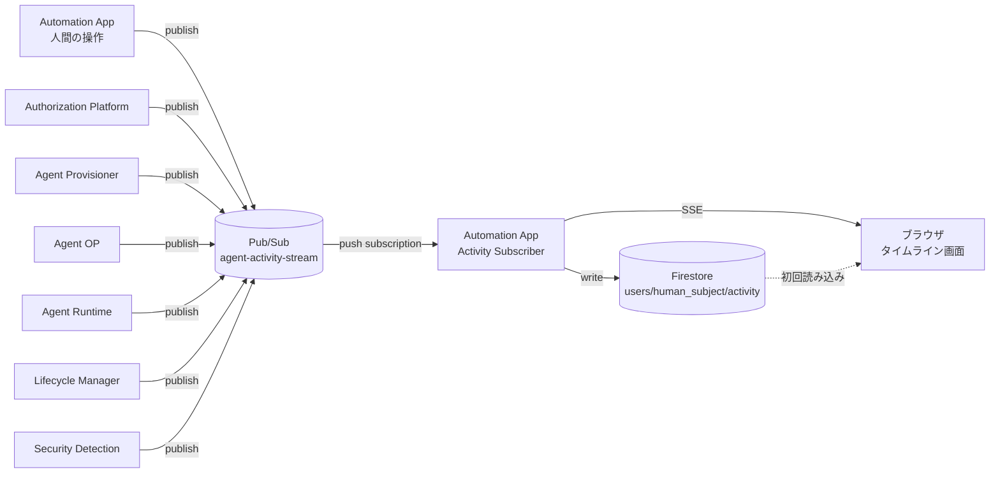

# 11. アクティビティタイムライン（Activity Monitoring UI）

## 1. 位置づけ

Security Detection（[09](./09-security-monitoring.md)）は、ログから異常を検知しLifecycle Managerへ隔離や失効を依頼する仕組みである。判断の主体は機械であり、人間が関与するのはMEDIUM以上のFindingがHuman Reviewに回ったときだけである（[09. §6](./09-security-monitoring.md#6-response)）。

本書が定義する**アクティビティタイムライン**は、判断そのものを行わない。Policy Engine、Tool Executor、Security Detectionがすでに下した決定を、操作している本人が時系列で追えるように見せるだけの画面である。用途は2つある。

| 用途 | 内容 |
|---|---|
| 通常利用時の可視化 | 自分のログインから、自動化の提案、権限の決定、Agentの実行、外部Resourceへのアクセスまでを一連の流れとして見せる |
| デモ時の可視化 | 権限外の操作や侵害を模した操作を試したとき、それがどこで、なぜ遮断されたかを見せる |

どちらも同じ画面、同じデータで実現する。デモ専用の別画面は作らない。

## 2. 基本方針

- **可視化と判断を分離する**：本画面はAgentやToolの実行を止めたり許可したりしない。表示する遮断は、Tool Executor（[04. §7](./04-tool-catalog.md#7-agentに任意httpを許さない)）、Policy Engine（[03. §6](./03-authorization.md#6-policy-engine)）、Security Detection（[09. §6](./09-security-monitoring.md#6-response)）がすでに下した決定である。
- **自分の範囲だけを見せる**：表示対象はAccess Tokenの`sub`と一致する`human_subject`のイベントに閉じる。他ユーザーのログインやAgentは表示しない。Control Plane APIで`human_subject`を`sub`に固定する既存の考え方（[05. §1.1](./05-identity.md#11-human_subjectの出どころ)）をここでも使う。全ユーザー横断のダッシュボードは今回の対象外とする（[§8](#8-今後の検討事項)）。
- **人間の操作とAgentの操作を1本の時系列にする**：ログインや追加指示のような人間自身の操作と、Agentの実行結果を別々の画面に分けない。ユーザーから見れば「自分が指示し、Agentが動いた」という1つの流れだからである。
- **表示専用のイベントを別系統で持つ**：Security Detectionが収集する詳細ログ（[09. §2](./09-security-monitoring.md#2-収集するログ)）はDPoP検証結果やID-JAGの`jti`など技術的な内容であり、そのままでは人間向けの説明にならない。本書はこれとは別に、意味のある区切りごとに人間向けの説明文を持つ**Activity Event**を新たに定義する（[§3](#3-activity-event)）。既存の詳細ログを置き換えるものではなく、その横に並ぶ軽量な系統である。
- **遮断のデモは実際の拒否経路を使う**：Tool Executorの拒否やPolicy EngineのDENYは、デモのための特別な演出ではなく実際に動いている仕組みである。安全に再現できるものは実際に操作して見せ、実演が危険または非現実的なものだけ台本化した表示で補う（[§6](#6-侵害を見せるデモ)）。

## 3. Activity Event

### 3.1 スキーマ

Activity Eventは次の形を持つ。

```yaml
activity_event:
  event_id: evt-8f2c1a
  trace_id: trace-9a01
  human_subject: user-123
  agent_id: agent-001         # ログインなどAgent作成前のイベントはnull
  occurred_at: "2026-08-29T10:01:05+09:00"
  source: agent-runtime       # 発行元アプリ
  phase: tool_call            # login / work_definition / authorization / provisioning / tool_call / security / lifecycle
  outcome: blocked            # info / success / blocked
  title: 実行を拒否
  message: mail.message.send は許可されたToolに含まれないため、Tool Executorが実行を拒否しました
  detail:                     # 折りたたみ表示。省略可
    tool_id: mail.message.send
    effective_capabilities: [calendar.event.read]
    reason: not_in_allowed_tools
  related_finding_id: null    # Security DetectionのFindingと対応する場合のみ
  is_simulated: false         # デモ用の台本イベントだけtrue（6.2）
```

`title`と`message`は発行元のアプリがイベントを出す時点で生成する。生データを画面側で人間向けの文章へ変換するロジックは持たせない。理由を最もよく知っているのは、その判断を下した本人（Policy Engine、Tool Executorなど）だからである。

`outcome`は3値に絞る。`denied`と`blocked`のような細分化はしない。ユーザーから見れば「権限が足りず断られた」も「実行中に拒否された」も同じ「止められた」であり、区別する意味が薄いためである。ただし`phase`が`tool_call`か`security`かで、画面上の強調度を変える（[§5.2](#52-表示のルール)）。

### 3.2 発行するイベントの例

既存の各段階に対応させる。網羅ではなく代表例を示す。

| phase | event_type | 発生元 | 出典 | 表示例 |
|---|---|---|---|---|
| login | LOGGED_IN | Automation App | [05. §1](./05-identity.md#1-human-identity-provider) | ログインしました |
| work_definition | PROPOSED | Automation App | [02. §1](./02-automation-design.md#1-基本方針) | Automation Design AIが「{purpose}」を提案しました |
| work_definition | CONFIRMED | Automation App | [02. §3](./02-automation-design.md#3-business-work-request) | 作業内容を確定しました |
| authorization | CAPABILITY_DECIDED | Authorization Platform | [03. §6](./03-authorization.md#6-policy-engine) | 許可：{allowed}／却下：{denied}（理由：{reason}） |
| authorization | ISOLATION_DECIDED | Authorization Platform | [03. §7](./03-authorization.md#7-security-profile) | isolation_level={level}に決定（risk_score {n}） |
| provisioning | CONSENT_REQUIRED | Agent Provisioner | [07. §3.2](./07-lifecycle.md#32-provisioning-transaction) | {connector}への追加の同意が必要です |
| provisioning | AGENT_PROVISIONED | Agent Provisioner | [07. §3.3](./07-lifecycle.md#33-end-to-end-provisioning-flow) | Agentを作成しました（有効期限{expires_at}） |
| tool_call | TOOL_SUCCEEDED | Agent Runtime | [04. §6](./04-tool-catalog.md#6-tool-executor) | {tool_id}を実行しました |
| tool_call | TOOL_BLOCKED | Agent Runtime | [04. §7](./04-tool-catalog.md#7-agentに任意httpを許さない) | {tool_id}は許可されたToolに含まれないため拒否しました |
| security | PROTOCOL_VIOLATION | 要求を受けたアプリ（Agent OP、Tool Executor等） | [09. §5.1](./09-security-monitoring.md#51-protocol-validation) | {検証名}に違反したため要求を拒否しました |
| security | AGENT_QUARANTINED | Security Detection | [09. §6](./09-security-monitoring.md#6-response) | 異常検知によりAgentを隔離しました（Finding: {finding_id}） |
| lifecycle | AGENT_STOPPED | Automation App | [02. §5](./02-automation-design.md#5-実行中agentの操作) | Agentを停止しました |
| lifecycle | AGENT_EXPIRED | Lifecycle Manager | [07. §6](./07-lifecycle.md#6-expiration--緊急停止) | 有効期限に達したため終了しました |
| lifecycle | RE_PROVISIONED | Lifecycle Manager | [07. §7.2](./07-lifecycle.md#72-human-userの権限が変更された場合re-provisioning) | 権限変更によりAgentを作り直しました |

CAPABILITY_DECIDEDは`denied`側も表示する。却下されたCapabilityとその理由（Delegatable Permission外、Organization Policy違反など）は、実際には何も実行されていなくても「何が許されなかったか」を示す情報であり、遮断の理解に欠かせない。

## 4. 配信経路



各アプリはActivity Eventを`agent-activity-stream`というPub/Subトピックへ直接publishする。Security Detectionへの経路（Cloud Logging → Log Sink / Pub/Sub、[09. §4](./09-security-monitoring.md#4-正規化と保存)）とは別系統とし、Cloud Loggingを経由しない。フォレンジック用の詳細ログと、表示用の軽量イベントとで求める速さと形式が異なるためである。

Automation Appはこのトピックをpush subscriptionで受け、`human_subject`ごとにFirestore（`users/{human_subject}/activity/{event_id}`）へ書き込む。画面が開かれている間はAutomation AppがサーバーサイドでFirestoreを購読し、Server-Sent Eventsでブラウザへ転送する。ページを開いた直後はFirestoreから直近の履歴を読み、以降はSSEで追記を受け取る。

ブラウザからFirestoreへ直接アクセスすることはしない。Automation Appの認証済みセッションを介した配信だけを許す。Firestoreへ直接アクセスさせると、Human IdPが発行するAccess Tokenとは別に、Firestore用の認可の仕組みを新たに持ち込むことになるためである。

`agents/{agent_id}/state`（[02. §5](./02-automation-design.md#5-実行中agentの操作)）とは役割が異なる。`state`は現在の状態のスナップショットであり、停止や追加指示の判断材料として使う。`users/{human_subject}/activity`は過去に起きたことの記録であり、タイムライン表示にだけ使う。

## 5. 画面

### 5.1 タイムラインの例

Google Calendarの予定を整理するAgent（[02. §1](./02-automation-design.md#1-基本方針)の例）で、ユーザーが追加指示によって権限外の操作を試した場合の表示例を示す。

```text
[10:00:00] [情報]   ログインしました

[10:00:15] [情報]   Automation Design AIが「Google Calendarから予定を取得し、
                     重要な予定を整理する」を提案しました

[10:00:40] [情報]   作業内容を確定しました

[10:00:42] [成功]   許可：calendar.event.read
                     isolation_level = standard（risk_score 12）

[10:00:50] [成功]   Agent agent-001 を作成しました（有効期限 2026-08-30 10:00）

[10:01:05] [成功]   google.calendar.events.list を実行しました（12件取得）

[10:01:07] [成功]   google.calendar.events.list を実行しました（重要な予定3件を抽出）

[10:03:00] [情報]   追加指示を送信しました：
                     「抽出した予定を取引先にもメールして」

[10:03:01] [遮断]   mail.message.send は許可されたToolに含まれないため、
                     実行を拒否しました
                     （このAgentに許可された操作：calendar.event.read のみ）

[10:05:00] [情報]   Agentを停止しました
```

`[遮断]`の行は、ユーザーが自分から権限外の指示を試した結果であり、実際にTool Executorが下した拒否である（[§6.1](#61-実操作で見せる)）。

### 5.2 表示のルール

- `outcome`が`blocked`の行は、`info`や`success`と明確に区別できる見た目にする（枠線の色、アイコンなど、具体的な意匠は実装時に決める）。
- `phase`が`security`の`blocked`は、`tool_call`の`blocked`よりさらに強く強調する。前者はプロトコル違反や隔離など攻撃的な操作を示し、後者は権限外の依頼という通常運用でも起こりうる拒否だからである。両者を同じ強さで示すと、日常的な権限エラーのたびに「侵害」のような印象を与えてしまう。
- `detail`は既定で折りたたみ、必要な人だけが技術的な内容（Capabilityの一覧、Policy ID、Finding IDなど）を開けるようにする。
- 複数のAgentを持つユーザーには、Agentごとの見出し（目的、Effective Capability、Isolation Level、残り有効時間）でタイムラインを区切る。人間自身の操作（ログイン、追加指示）はどの見出しにも属させず、常にAgentの区切りをまたいで独立に並べる。
- `is_simulated: true`のイベントには常時「デモ実行（模擬）」の表示を付け、実イベントと同じ見た目にはしない（[§6.2](#62-台本で補う)）。

## 6. 侵害を見せるデモ

### 6.1 実操作で見せる

次はAgentやTool Executorに実際に操作させ、既存の拒否経路で遮断させる。

| 見せたい状況 | 実際に踏む経路 | 出典 |
|---|---|---|
| 権限外の操作を拒否される | 追加指示で許可されていない作業を指示する | [02. §5](./02-automation-design.md#5-実行中agentの操作)、[04. §7](./04-tool-catalog.md#7-agentに任意httpを許さない) |
| 組織ポリシーで禁止された操作が通らない | 社外ドメイン宛の送信など、Organization Policyに反する作業を依頼する | [03. §2](./03-authorization.md#2-権限の種類)、[03. §6](./03-authorization.md#6-policy-engine) |
| 有効期限切れ後にアクセスできない | `requested_lifetime_hours`を短く設定したAgentを作り、期限後に追加指示を送る | [07. §4.2](./07-lifecycle.md#42-lifetimeの多層強制)、[07. §6](./07-lifecycle.md#6-expiration--緊急停止) |
| 権限縮小でAgentが作り直される | デモ用にHuman Permissionを縮小するイベントを発行する | [07. §7.2](./07-lifecycle.md#72-human-userの権限が変更された場合re-provisioning) |

いずれも攻撃コードを書く必要がなく、本番の仕組みをそのまま安全に踏める。デモの説得力は、これが演出ではなく実際の拒否であることに支えられている。

### 6.2 台本で補う

次は実演のために本物の攻撃を再現する必要があり、デモ環境であっても実際には行わない。

| 見せたい状況 | 実演が難しい理由 | 出典 |
|---|---|---|
| 委譲関係の偽装（`sub`と`act`の不一致） | 偽の`actor_token`を作る攻撃コードが要る | [09. §5.1](./09-security-monitoring.md#51-protocol-validation)、[05. §6.3](./05-identity.md#63-agent-opの検証手順) |
| ID-JAG署名鍵の目的外使用 | 署名鍵を持ち出す、または悪用する操作そのものになる | [09. §5.1](./09-security-monitoring.md#51-protocol-validation)、[05. §3.3](./05-identity.md#33-agent-op署名鍵の制約) |
| Cross-Agent Isolationの侵害 | 他Agentの設定へ実際に到達する経路を作る必要がある | [09. §5.2](./09-security-monitoring.md#52-rule-based-detection) |
| DPoP Proofの再送 | 正規のProofを盗聴し再利用する操作になる | [05. §2.1](./05-identity.md#21-受け取り側の検証手順) |

これらは、あらかじめ用意した`is_simulated: true`のActivity Eventを、実際のAgentやSecurity Detectionを経由せずタイムラインへ直接書き込むデモ専用の操作で補う。トリガーは操作者自身のセッションでのみ有効な機能とし、他ユーザーのタイムラインへは書き込めない（[§7](#7-アクセス制御)）。

## 7. アクセス制御

- タイムラインの参照範囲はAccess Tokenの`sub`と一致する`human_subject`に限る（[05. §1.1](./05-identity.md#11-human_subjectの出どころ)と同じ考え方）。
- ブラウザはFirestoreへ直接アクセスしない。配信はAutomation Appの認証済みセッションを介してのみ行う（[§4](#4-配信経路)）。
- [§6.2](#62-台本で補う)の台本再生も操作者自身のセッション範囲に閉じる。他ユーザーのタイムラインへ`is_simulated`イベントを注入することはできない。

## 8. 今後の検討事項

次は今回の対象外とし、必要になった時点で改めて設計する。

- **全ユーザー横断のデモ観覧画面**：会場のスクリーンに複数ユーザー・複数Agentの動きを同時に映したいという要望が出た場合、閲覧用の権限モデルを新たに作る必要がある。現時点ではAutomation Appへログインした本人だけが自分のタイムラインを見る。
- **`users/{human_subject}/activity`の保持期間**：Agent破棄後どれだけ残すかは未決定である。
