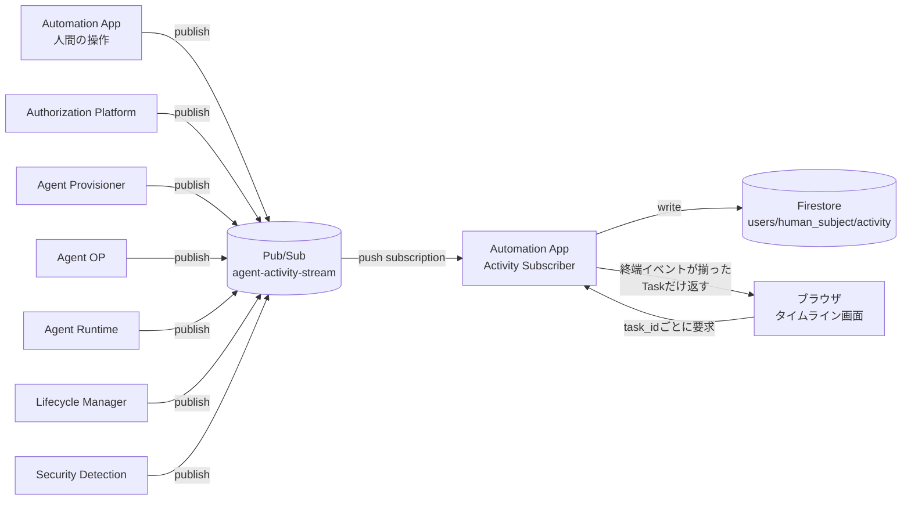

# 11. アクティビティタイムライン（Activity Monitoring UI）

## 1. 位置づけ

Security Detection（[09](./09-security-monitoring.md)）は、ログから異常を検知しLifecycle Managerへ隔離や失効を依頼する仕組みである。判断の主体は機械であり、人間が関与するのはMEDIUM以上のFindingがHuman Reviewに回ったときだけである（[09. §6](./09-security-monitoring.md#6-response)）。

本書が定義する**アクティビティタイムライン**は、判断そのものを行わない。Policy Engine、Tool Executor、Security Detectionがすでに下した決定を、操作している本人が時系列で追えるように見せるだけの画面である。用途は2つある。

Security Detectionの判断そのもの（Risk Score、AIの4観点、推奨する対応）を読む画面は本書の範囲外であり、[09. §7](./09-security-monitoring.md#7-判断を本人へ見せる)にある。タイムラインが答えるのは「自分の作業に何が起きたか」であり、あちらが答えるのは「見張っている側が自分のAgentをどう見ているか」で、問いが違う。

| 用途 | 内容 |
|---|---|
| 通常利用時の可視化 | 自分のログインから、自動化の提案、権限の決定、Agentの実行、外部Resourceへのアクセスまでを一連の流れとして見せる |
| デモ時の可視化 | 権限外の操作や侵害を模した操作を試したとき、それがどこで、なぜ遮断されたかを見せる |

どちらも同じ画面、同じデータで実現する。デモ専用の別画面は作らない。

## 2. 基本方針

- **可視化と判断を分離する**：本画面はAgentやToolの実行を止めたり許可したりしない。表示する遮断は、Tool Executor（[04. §7](./04-tool-catalog.md#7-agentに任意httpを許さない)）、Policy Engine（[03. §6](./03-authorization.md#6-policy-engine)）、Security Detection（[09. §6](./09-security-monitoring.md#6-response)）がすでに下した決定である。
- **自分の範囲だけを見せる**：表示対象はAccess Tokenの`sub`と一致する`human_subject`のイベントに閉じる。他ユーザーのログインやAgentは表示しない。Control Plane APIで`human_subject`を`sub`に固定する既存の考え方（[05. §1.1](./05-identity.md#11-human_subjectの出どころ)）をここでも使う。全ユーザー横断のダッシュボードは今回の対象外とする（[§9](#9-今後の検討事項)）。
- **常に記録する**：Activity Eventの記録は、通常利用かデモかを区別せず、Agentが動くたびに常時行う。デモのために記録を開始する操作は無い。操作者が明示的に行うのは、実演が難しいケースを補うための台本イベントの追加（[§6.2](#62-台本で補う)）だけである。
- **完了してから、まとめて再生する**：実行中のイベントを逐次配信することはしない。常時接続の配信経路は接続維持や順序保証の負担が大きく、途中経過を文字で流すだけでは効果も薄い。ログイン〜Provisioning、Taskごとの処理、Agent終了のそれぞれが完了した時点で、その一連の流れをまとめて再生する（[§3.3](#33-task境界)、[§4](#4-配信経路)）。実行中かどうかだけを素早く知りたい場合は、既存の状況確認（[02. §5](./02-automation-design.md#5-実行中agentの操作)）を使う。
- **一覧だけで終わらせない**：完了した処理は、文字の一覧に加えて、実際に発生した呼び出しの経路をアニメーションで再生する。遮断はその経路がどこで止まったかを動きで示す（[§5.2](#52-再生の中身)）。
- **一文で終わらせない**：`title` と `message` は「何が起きたか」を一文で言う。だが人が実際に知りたいのは「どこへ何を送り、何が返り、送る前に何を確かめ、Agent 自身は何と書いたか」であり、これは一文でも key/value の平坦な表でも表せない。そこで発行元が、順序を持った内訳（**Activity Record**、[§3.4](#34-activity-record)）を書く。画面はそれを並べるだけで、文章は作らない。
- **人間の操作とAgentの操作を1本の時系列にする**：ログインや追加指示のような人間自身の操作と、Agentの実行結果を別々の画面に分けない。ユーザーから見れば「自分が指示し、Agentが動いた」という1つの流れだからである。
- **表示専用のイベントを別系統で持つ**：Security Detectionが収集する詳細ログ（[09. §2](./09-security-monitoring.md#2-収集するログ)）はDPoP検証結果やID-JAGの`jti`など技術的な内容であり、そのままでは人間向けの説明にならない。本書はこれとは別に、意味のある区切りごとに人間向けの説明文を持つ**Activity Event**を新たに定義する（[§3](#3-activity-event)）。既存の詳細ログを置き換えるものではなく、その横に並ぶ軽量な系統である。
- **遮断のデモは実際の拒否経路を使う**：Tool Executorの拒否やPolicy EngineのDENYは、デモのための特別な演出ではなく実際に動いている仕組みである。安全に再現できるものは実際に操作して見せ、実演が危険または非現実的なものだけ台本化した表示で補う（[§6](#6-侵害を見せるデモ)）。

## 3. Activity Event

### 3.1 スキーマ

Activity Eventは次の形を持つ。

```yaml
activity_event:
  event_id: evt-8f2c1a
  trace_id: trace-9a01
  human_subject: user-123
  agent_id: agent-001         # ログインなどAgent作成前のイベントはnull
  task_id: task-2             # 再生の単位（3.3）。provisioning / task-{n} / lifecycle
  occurred_at: "2026-08-29T10:01:05+09:00"
  source: agent-runtime       # 発行元アプリ
  phase: tool_call            # login / work_definition / authorization / provisioning / tool_call / security / lifecycle
  outcome: blocked            # info / success / blocked / failed
  title: 実行を拒否
  message: mail.message.send は許可されたToolに含まれないため、Tool Executorが実行を拒否しました
  detail:                     # 折りたたみ表示。省略可
    tool_id: mail.message.send
    effective_capabilities: [calendar.event.read]
    reason: not_in_allowed_tools
    target: resource-api      # 再生でどの箱へ向かう動きかを示す。省略可
  record:                     # この1件の内訳（3.4）。省略可
    headline: mail.message.send の実行を拒否しました
    checks: [...]
    sections: [...]
    hops: [...]
  related_finding_id: null    # Security DetectionのFindingと対応する場合のみ
  is_simulated: false         # デモ用の台本イベントだけtrue（6.2）
```

`title`と`message`は発行元のアプリがイベントを出す時点で生成する。生データを画面側で人間向けの文章へ変換するロジックは持たせない。理由を最もよく知っているのは、その判断を下した本人（Policy Engine、Tool Executorなど）だからである。

`outcome`は `info`、`success`、`blocked`、`failed` の4値とし、実行失敗を情報と区別する。`denied`と`blocked`のような細分化はしない。ユーザーから見れば「権限が足りず断られた」も「実行中に拒否された」も同じ「止められた」であり、区別する意味が薄いためである。ただし`phase`が`tool_call`か`security`かで、画面上の強調度を変える（[§5.3](#53-表示のルール)）。

### 3.2 発行するイベントの例

既存の各段階に対応させる。網羅ではなく代表例を示す。

| phase | event_type | 発生元 | 出典 | 表示例 |
|---|---|---|---|---|
| login | LOGGED_IN | Automation App | [05. §1](./05-identity.md#1-human-identity-provider) | ログインしました |
| work_definition | PROPOSED | Automation App | [02. §1](./02-automation-design.md#1-基本方針) | 「{purpose}」を ToDo として登録しました |
| work_definition | DRAFT_REVISED | Automation App | [02. §2](./02-automation-design.md#2-automation-design-aiが決めること決めないこと) | Automation Design AIが「{purpose}」の内容を書き直しました |
| work_definition | CONFIRMED | Automation App | [02. §3](./02-automation-design.md#3-business-work-request) | ToDo の内容を確定しました |
| authorization | DECISION_REQUESTED | Automation App | [02. §3](./02-automation-design.md#3-business-work-request) | 「{purpose}」の作業内容をAuthorization Platformへ送り、必要な権限の決定を求めました |
| authorization | CAPABILITY_DECIDED | Authorization Platform | [03. §6](./03-authorization.md#6-policy-engine) | 許可：{allowed}／却下：{denied}（理由：{reason}） |
| authorization | ISOLATION_DECIDED | Authorization Platform | [03. §7](./03-authorization.md#7-security-profile) | isolation_level={level}に決定（risk_score {n}） |
| authorization | DECISION_RECEIVED／DECISION_REFUSED | Automation App | [02. §3](./02-automation-design.md#3-business-work-request) | Authorization Platformから決定{decision_id}が返りました／決定が返りませんでした |
| authorization | AGENT_DEFINITION_APPROVED | Automation App | [02. §4](./02-automation-design.md#4-agent-definition) | 提示された権限を承認しました |
| provisioning | PROVISION_REQUESTED／PROVISION_REFUSED | Automation App | [07. §3.3](./07-lifecycle.md#33-end-to-end-provisioning-flow) | Agentの作成を依頼しました／Agentを作れませんでした |
| provisioning | CONSENT_REQUIRED | Agent Provisioner | [07. §3.2](./07-lifecycle.md#32-provisioning-transaction) | {connector}への追加の同意が必要です |
| provisioning | AGENT_PROVISIONED | Agent Provisioner | [07. §3.3](./07-lifecycle.md#33-end-to-end-provisioning-flow) | Agentを作成しました（有効期限{expires_at}） |
| work_definition | INSTRUCTION_ADDED | Automation App | [02. §5](./02-automation-design.md#5-実行中agentの操作) | Agentに ToDo を伝えました／Agentに追加の指示を出しました |
| tool_call | TOOL_SUCCEEDED | Agent Runtime | [04. §6](./04-tool-catalog.md#6-tool-executor) | {tool_id}を実行しました |
| tool_call | TOOL_BLOCKED | Agent Runtime | [04. §7](./04-tool-catalog.md#7-agentに任意httpを許さない) | {tool_id}は許可されたToolに含まれないため拒否しました |
| security | PROTOCOL_VIOLATION | 要求を受けたアプリ（Agent OP、Tool Executor等） | [09. §5.1](./09-security-monitoring.md#51-protocol-validation) | {検証名}に違反したため要求を拒否しました |
| security | AGENT_QUARANTINED | Security Detection | [09. §6](./09-security-monitoring.md#6-response) | 異常検知によりAgentを隔離しました（Finding: {finding_id}） |
| lifecycle | AGENT_STOPPED | Automation App | [02. §5](./02-automation-design.md#5-実行中agentの操作) | Agentを停止しました |
| lifecycle | AGENT_EXPIRED | Lifecycle Manager | [07. §6](./07-lifecycle.md#6-expiration--緊急停止) | 有効期限に達したため終了しました |
| lifecycle | RE_PROVISIONED | Lifecycle Manager | [07. §7.2](./07-lifecycle.md#72-human-userの権限が変更された場合re-provisioning) | 権限変更によりAgentを作り直しました |
| authorization | PERMISSION_CHANGE_IGNORED | Authorization Platform | [07. §7.2](./07-lifecycle.md#72-human-userの権限が変更された場合re-provisioning) | 権限が広がりましたが、実行中のAgentには反映しません |

CAPABILITY_DECIDEDは`denied`側も表示する。却下されたCapabilityとその理由（Delegatable Permission外、Organization Policy違反など）は、実際には何も実行されていなくても「何が許されなかったか」を示す情報であり、遮断の理解に欠かせない。何も許可できなかった決定も同じ理由で発行する。許可が空の決定は、人がいちばん説明を求める決定である。

Automation Appは、人が画面で行った操作と、他のアプリへ何を頼み何が返ったかを、自分が知る範囲で発行する。DECISION_REQUESTEDは送った業務の言葉を、DECISION_RECEIVEDは返った値を届いたまま並べる。なぜ許可され、なぜ却下されたかはAuthorization Platformが自分のイベントに書き、Automation Appはその`decision_id`を名指すだけで理由を言い直さない（RULE-07）。INSTRUCTION_ADDEDは、確定した作業内容を最初の指示としてAgentへ渡した瞬間と、人が追加の指示を書いた瞬間を、そのAgentのTaskの側に置く。

### 3.3 Task境界

再生の単位は`task_id`でまとめる。`task_id`は次の3種類のいずれかを持つ。

| task_id | 範囲 | 終端イベント |
|---|---|---|
| `provisioning` | ログインからAgent作成完了まで | AGENT_PROVISIONED |
| `task-{n}` | 最初のWork Definition実行、または追加指示1回ごとの一連の処理 | TASK_COMPLETED（成功）／TASK_BLOCKED（権限外のため一部拒否）／TASK_FAILED（それ以外の失敗） |
| `lifecycle` | Agentの終了 | AGENT_EXPIRED／AGENT_STOPPED／AGENT_QUARANTINED／AGENT_REVOKED_SECURITY |

終端イベントが記録された`task_id`だけが再生の対象になる。終端イベントがまだ無い`task_id`は「実行中」として名前だけ示し、途中経過を先出しで再生しない（[§4](#4-配信経路)）。

`task_id`はAgentごとに振り直される。どのAgentにも`provisioning`と`task-1`と`lifecycle`があるので、読む側は`task_id`だけでまとめてはならない。まとめる単位はAgentである。Agentができる前のイベント（ログイン、提案、決定）には`agent_id`が無いので、イベントが名指すidの連鎖でAgentへつなぐ。提案は`work_definition_id`を、Automation Appが受け取った決定は`work_definition_id`と`decision_id`を、Provisionerの最初のイベントは`decision_id`と、自分が採番した`agent_id`を持つ。この連鎖をたどると、ログインからAgentの終了までが1本の物語になる。連鎖がまだAgentに届いていない作業（決定は返ったがAgentは未作成）は、届いているidを名前にした独立の物語として「実行中」に並べる。ログインはidを持たないので、その次に始まった物語の先頭に置く。どの作業にもつながらなかったログインは、どのAgentの物語でもないので並べない。

TASK_COMPLETED、TASK_BLOCKED、TASK_FAILEDはAgent Runtimeが発行する。1回の指示に対する処理は複数のTool呼び出しを含みうるため、それらがすべて終わった時点でAgent Runtimeが結果を判定する。

### 3.4 Activity Record

`title` と `message` は一文、`detail` は平坦な key/value である。どちらも「Agentがどこへ何を送り、何が返り、送る前に何を確かめ、自分では何と書いたか」には答えられない。答えは順序を持つからである。

そこで**Activity Record**を置く。1件のActivity Eventの内訳であり、次の4つを持つ。

| 要素 | 内容 |
|---|---|
| `headline` | その1手を一言で言うと何だったか |
| `checks` | 実行の前に確かめたことと、その結果（`passed` / `blocked` / `failed` / `skipped`） |
| `sections` | 見出しつきの区画。`label`、一文の`message`、名前つきの値（`fields`）、本文（`text`）を持つ |
| `hops` | その処理で実際に発生した、箱から箱への移動（[§5.2](#52-再生の中身)） |

**人が読む文字列は、すべて発行元がその場で書く。** `label`も`message`も`text`も、判断を下した本人が、判断した時点の言葉で埋める。画面はそれらを並べ、字下げし、どこを畳むかを決めるだけで、一文も作らない（RULE-54）。`status: 403`を画面が「拒否されました」と言い換えれば、それは自分が立ち会っていない出来事を画面が解釈したことになり、文言を変えた日に過去の記録まで書き換わる。

`checks`の`skipped`は埋め草ではない。許可されていないToolとして最初の段階で断られた呼び出しは、そもそも制約の確認まで到達していない。「制約を満たした」と「制約を見ていない」は別のことである。

Tool呼び出しでAgent Runtimeが記録する内容を挙げる。

| 区画 | 内容 |
|---|---|
| `intent` | 選んだTool、渡そうとした引数、そしてAgent自身がその手で書いた文章 |
| `capability` | そのToolが要求するCapability |
| `authorization` | Catalogが決めている宛先（`audience`）、対象（`resource`）、範囲（`scope`） |
| `access_token` | 受け取ったAccess Tokenの有効期限と提示方法。Tokenそのものは記録しない |
| `request` | Method、宛先、送った本文、宣言に無いため落とした引数 |
| `response` | HTTPステータス、所要時間、許可された項目だけに絞った後の値 |
| `failure` | 止まった段階と種別。止まった場合だけ |

Recordは人に見せるものであり、タイムラインが残る限り残る。Raw Token、Secret、Private Keyを入れてはならない（RULE-38）。発行元が入れないだけでなく、応答本文に紛れ込んだ場合に備えて、書き出す直前にJWT形状の文字列を落とし、長すぎる本文を切り詰める。

## 4. 配信経路



各アプリはActivity Eventを`agent-activity-stream`というPub/Subトピックへ直接publishする。Security Detectionへの経路（Cloud Logging → Log Sink / Pub/Sub、[09. §4](./09-security-monitoring.md#4-正規化と保存)）とは別系統とし、Cloud Loggingを経由しない。フォレンジック用の詳細ログと、表示用の軽量イベントとで求める速さと形式が異なるためである。

Automation Appはこのトピックをpush subscriptionで受け、`human_subject`ごとにFirestore（`users/{human_subject}/activity/{event_id}`）へ書き込む。この書き込み自体はリアルタイムに行うが、ブラウザへは配信しない。

ブラウザがタイムライン画面を開いたとき、または一覧を更新したときに、Automation Appは`task_id`ごとに終端イベント（[§3.3](#33-task境界)）の有無を確認し、揃っているTaskだけをまとめて返す。終端イベントがまだ無い`task_id`は「実行中」として件数や名前だけを示し、中身は返さない。常時接続の配信経路は持たない。

ブラウザからFirestoreへ直接アクセスすることはしない。取得はAutomation Appの認証済みセッションを介してのみ行う。Firestoreへ直接アクセスさせると、Human IdPが発行するAccess Tokenとは別に、Firestore用の認可の仕組みを新たに持ち込むことになるためである。

`agents/{agent_id}/state`（[02. §5](./02-automation-design.md#5-実行中agentの操作)）とは役割が異なる。`state`は現在の状態のスナップショットであり、停止や追加指示の判断材料として使う。`users/{human_subject}/activity`は完了したTaskの記録であり、終わった後の再生にだけ使う。

## 5. 画面

### 5.1 画面の構成

アクティビティ画面は3層になる。

1. **Agentのカード**：ユーザーの全Agentについて、Agentごとに1枚のカードにまとめ、新しく始めたAgentを上に置く。カードの頭には、Agentの目的、開始と最後の記録の時刻、Taskの数、実行中のTaskの数、遮断を含むTaskの数、失敗を含むTaskの数、終了したかどうかを出す。どれもイベントの`outcome`と`task_id`を数えたものであり、画面が結論を作ることはない（RULE-54）。Agentがまだ無い物語は「Agentはまだ作られていません」と添える。Agentの画面へのリンクと、そのAgentだけに絞る操作もここに置く。終わった区切りが1つでもあるAgentには、その物語を通しで再生する操作（[§5.2](#52-再生の中身)）もここに置く。`agent_id`のような識別子は「ID を表示」に畳み、頭には出さない。画面の先頭には、Agentの数・実行中の数・遮断のあった数・失敗のあった数をまとめて出し、その下にTaskの終端の`outcome`の割合を1本の帯で出す。
2. **Taskの並び**：1つのAgentの中は起きた順（`provisioning`、完了順の`task-{n}`、`lifecycle`）に、縦の線に沿って並べる。呼び名は`task_id`そのものではなく「準備」「作業 1」「終了」「デモ」とし、各行にはそのTaskの最後のイベントの`title`、終端の`outcome`、イベント1件につき1つの点（`phase`と`outcome`から色を決める）、完了時刻、所要時間、イベントの件数、そのうち遮断された件数と失敗した件数を出す。実行中の`task_id`は「実行中」として名前だけ出し、開けない。閉じた状態では1つのTaskが1行で、開くと3の中身が出る。いちばん新しいAgentのTaskは開いた状態で、それ以外は閉じた状態で届く。1つのAgentに絞ったときは、そのAgentのTaskをすべて開く。
3. **開いたTaskの中身**：左に**できごと**の一覧（[§5.4](#54-できごとの一覧)）、右に**動きを図で見る**（[§5.2](#52-再生の中身)）を並べる。右は一覧をスクロールしても画面に留まり、再生中の1手は一覧の対応する行を強調し、その行が見えるところまで一覧を寄せる。狭い画面では一覧の下に図が来る。

一覧と再生は代替ではない。再生は「何と何が話し、どこで止まったか」に答え、一覧は「何を送り、何が返り、先に何を確かめたか」に答える。片方だけでは、もう片方の問いが残る。アニメーションを見られない人にとっても、失われるのは動きだけである。再生していない間はどの行も強調しない。

**問題があったものだけを見る切り替え**を画面の先頭に置く。押すと`outcome`が`blocked`でも`failed`でもない行がスタイルで隠れ、該当の無いTaskは「遮断や失敗はありません」とだけ出し、該当のあるTaskだけが開く。行を消すのではなく隠すだけなので、スクリプトの無い環境では全部が見える。検索欄は目的・`agent_id`・Taskの呼び名で Agent のカードを絞り、同じく隠すだけである。

Google Calendarの予定を整理するAgent（[02. §1](./02-automation-design.md#1-基本方針)の例）で、追加指示によって権限外の送信を試みた場合のTaskの並びを示す。

```text
準備     Agent が使えるようになりました        成功   10:00:50   10 件のできごと
作業 1   作業が完了しました                    成功   10:01:07   6 件のできごと
作業 2   作業を途中で止めました                遮断   10:03:01   4 件のできごと   遮断 1 件
終了     Agent を停止しました                  成功   10:05:00   1 件のできごと
```

「作業 2」は、ユーザーが自分から権限外の指示を試した結果であり、実際にTool Executorが下した拒否である（[§6.1](#61-実操作で見せる)）。各行の見出しはそのTaskの最後のイベントの`title`であり、画面が書いたものではない。これを開くと、できごとの一覧と[§5.2](#52-再生の中身)の再生が出る。

### 5.2 再生の中身

再生は、そのTaskで実際に呼び出しが発生したアプリを結ぶ図に、呼び出しの動きを重ねたものである。図に含める登場人物はTaskごとに異なり、実際に登場したアプリだけを表示する（`task-1`ならAgent Runtime、Agent OP、Resource AS、Resource APIだけで足り、Authorization Platformは登場しない）。

箱の座標は固定して書き下す。同じ系のTaskを2回見る人にとって、絵が毎回同じ場所にあることが「矢印がResource APIの手前で止まった」を認識できる条件だからである（DEC-APP-06）。各箱には名前に加えて、その箱が何をするところかを一行で添える。図の読み方（上段と下段の別、丸が1回のやり取りであること、止められた動きは届かないこと、出ていない箱はこの処理に関わっていないこと）も図の隣に置く。これらは図の凡例であり、個々のイベントの解釈ではない。

**箱の名前だけでは何をするところか分からない。** `agent-op`や`resource-as`という名前は、docs 05を読んだ人にしか読めない。そこで登場するもの1つずつについて、画面が呼ぶ日本語の名前（「Agent の身元発行」「リソース認可」）・正式名（Agent OP、Resource AS）・一行の役割・**すること**・**しないこと**の5つを固定文として持ち、その記録に出てきたものだけを一覧として画面の先頭に畳んで置く。図の箱、一覧の各行、図の下の枠はどれも日本語の名前で呼び、正式名は説明の中と、名前に重ねた注記に残す。図の箱を押しても同じ説明が出る。「しないこと」を必ず書くのは、この基盤の要点が「決める側と動く側が別である」ことであり、それを知らない読み手には矢印が手前で止まる意味が分からないからである。この辞書は図・一覧・説明の3か所が同じ名前を使うための単一の出所でもある。これらも凡例であって、個々のイベントの解釈ではない（RULE-54）。

**1回のTool呼び出しは1本の矢印ではない。** Agent OPがID-JAGを発行し、Resource ASがそれをAccess Tokenに換え、Resource APIが答える——実際には4往復である。1本の矢印で描くと「Agentが何かに触った」しか言えず、遮断がどこで起きたのかも示せない。そこで発行元が経路を`hops`（[§3.4](#34-activity-record)）として記録し、再生はその1本ずつを順に動かす。経路を知っているのは呼び出した本人であり、画面ではない。

**動きには言葉を添える。** 丸が動くだけでは「何かがどこかへ行った」としか分からない。矢印のそばにはその往復の`label`を描き、関わった2つの箱を光らせ、図の下の枠に「どこからどこへ」「何という往復か」「発行元の`message`」を出す。どれも発行元が書いた文字列と箱の固定の見出しを置くだけで、ブラウザが文を作ることはない（RULE-54）。`hops`も宛先も持たないイベント——権限の決定や登録のように、1つの箱の中で起きたこと——は、矢印を描かずにその箱を光らせる。以前はこうしたイベントを、直前の箱へ戻る矢印として描いていたが、それは起きていない呼び出しを描くことだった。

**線と文字は箱に重ねない。** 箱の上に引かれた線は、その箱がその呼び出しに関わっていたと読める。だから矢印は両端とも箱の縁から縁へ引き、間に別の箱がある往復——Agent RuntimeからResource APIのように、Resource ASを挟むもの——は、段の外の空き帯を通して迂回させる。`label`も箱の上には置かず、上段の上・下段の下・2段の間という、箱が決して置かれない3つの帯のいずれかに出す。文字の幅はブラウザしか知らないので、位置は高さだけで決める。

再生は次の順で進む。

1. そのTaskのActivity Eventを`occurred_at`の順に並べ、`hops`を持つイベントはその順に展開する。
2. 1件ずつ、発生元から宛先へ向かう動きを表示し、到達した時点でその`message`を示す。同時に、[§5.4](#54-できごとの一覧)の対応する行を強調する。図に出すのは、いま動いている1件だけである。前の1件が描いた矢印・`label`・`message`は次へ進む前に消す。全部を残すと、絵は「いま何が起きているか」に、それまでに起きたこと全部を重ねて答えることになる。起きたことの全部は[§5.4](#54-できごとの一覧)に順番どおり残る。
3. `outcome`が`blocked`のものは、宛先の手前で止め、到達させない。同時に`message`（拒否の理由）を示す。`task-2`の例では、Agent RuntimeからResource APIへ向かう動きがTool Executorの位置で止まり、「mail.message.send は許可されたToolに含まれないため、実行を拒否しました」を示す。
4. 全ステップを表示し終えたら、そのTaskの結果（成功／遮断）を静止した状態で残す。

再生の間隔は実際の経過時間に比例させない。Provisioning中のConsent待ちのように数分かかる区間もあれば、Tool呼び出しのように数百ミリ秒で終わる区間もあり、実時間のまま再生すると間延びするか速すぎるかのどちらかになる。1ステップあたり一定の長さで進める。**1ステップは4〜5秒とし、そのうち動きは1〜2秒に収める。** 残りは動き終わった絵をそのまま止めておく時間であり、添えた文を読むのはこの間である。1ステップを2秒に収めていたときは、丸が着いたときにはまだ文を読み終えていなかった。5秒を超えると、4往復あるTool呼び出しが待ち時間になる。

一定の速さで一度流れるだけの再生は、読むものではなく眺めるものになる。人が止まりたいのは、意外なことを言っているステップである。そこで再生・一時停止・次へ・最初から の4操作と、いま何ステップ目かの表示を付ける。押しても記録は変わらない。動かしているのは絵だけである。

**絵の下に、その手で何を考えたかを出す。** 図が答えるのは「何がどこへ行ったか」だけで、人が実際に聞きたい「AIエージェントが何を考えて、どうすると決めたのか」には答えていない。その答えは[§3.4](#34-activity-record)のRecordに最初から入っているが、要求本文やTokenの有効期限と同じ形で畳まれていて、絵が動いている間は誰も開かない。そこで再生中の1手について、Recordを次の4つに仕分けて図の下に出す。

| 区分 | 何を出すか | どこから取るか |
|---|---|---|
| 読み取ったこと | その手の頭で読んだ指示、AIが読み取った作業 | `sections`のうち`received`と`work_definition` |
| 考えたこと | モデル自身の言葉、AIが述べた根拠 | 発行元が`format: text`と印を付けた`sections`（引用として出す） |
| 決めたこと | 選んだTool、渡そうとした引数、Policy Engineの可否 | 上記以外の`sections`（名前と値の組） |
| 確かめたこと | 実行前の検査とその判定 | `checks` |

仕分けの根拠は、発行元が書いた`id`と「本文を散文と宣言したかどうか」の2つだけである。並べ替えと見出しは画面のものだが、文は1つも画面が作らない（RULE-54、REQ-11-002）。1件のイベントが4つのhopsに展開されるとき、この枠はそのイベントの間ずっと同じものを出し続ける。考えたのはhopではなくイベントだからである。

一覧の各行は、再生を見る前後どちらでも[§3.1](#31-スキーマ)の`detail`を「技術的な詳細」として開けるようにし、技術的な内容はそこで確認できるようにする。`detail`の鍵のうち画面が知っているもの（`decision_id`、`tool_id`など）には固定の日本語の見出しを添え、鍵そのものも残す。値は届いたまま出す。

**区切りをまたいで通しで見る。** 1つの区切りの再生は、その区切りで何が起きたかに答える。だが人に見せるときに要るのは、ログインから、権限の決定、Agentの作成、Toolの呼び出し、終了までが1本につながって動く絵であり、区切りを4つ開いて再生を4回押す形では見せられない。そこでAgentのカードの頭に「流れを通しで見る」を置く。押すと、カードの頭と区切りの並びの間に、そのAgentの終わった区切りをすべて起きた順につないで再生する枠が開く。図、矢印のそばの`label`、図の下の枠、考えたことの枠、1ステップの長さは区切りの再生と同じであり、違いは次の4つだけである。

- 箱は、どれかの区切りに登場したものをすべて出し、区切りが変わっても消さない。区切りごとに箱が現れたり消えたりすると、見ている人は景色の変化をできごとと読む。
- 図の上に区切りの並びを置く。各区切りは呼び名（「準備」「作業 1」「終了」「デモ」）、その区切りの最後のイベントの`title`、終端の`outcome`を持ち、いま再生している区切りを光らせ、通り過ぎた区切りを薄くする。区切りを押すと、そこから再生する。図の直上には、いまの区切りの呼び名と、その区切りの中で何手目かを出す。手数は物語全体を通して数え、区切りの中の手数はその横に添える。
- 再生中の区切りは、下の並びでも印を付け、その区切りが開いていれば、いま説明している行を[§5.4](#54-できごとの一覧)と同じように強調する。1手の位置を持つのは通しの再生の側であり、並びはそれを受け取って描くだけである。
- 「速さ」を「ふつう」「速く」から選べる。「速く」は1ステップと動きをともに半分にする。上で決めた長さは添えた文を読むための長さであり、人前で話しながら見せるときは待ち時間になるためである。2倍より速くはしない。それ以上では丸の動きが「箱から箱へ移った」と読めない。「全画面で見る」は、この枠だけを画面いっぱいに出す。

通しの再生も、押すまで開かず、自分から動き出さず、繰り返さない。デモ専用の画面ではなく、同じ画面の同じ記録を、まとめて動かしているだけである（[§1](#1-位置づけ)）。台本の区切りが含まれるときは、その区切りに「デモ実行（模擬）」の表示が付いたまま再生される（[§5.3](#53-表示のルール)）。

### 5.3 表示のルール

- 一覧・再生のどちらでも、`outcome`が`blocked`の行は`info`や`success`と明確に区別できる見た目にする（色、アイコンなど、具体的な意匠は実装時に決める）。
- `phase`が`security`の`blocked`は、`tool_call`の`blocked`よりさらに強く強調する。前者はプロトコル違反や隔離など攻撃的な操作を示し、後者は権限外の依頼という通常運用でも起こりうる拒否だからである。両者を同じ強さで示すと、日常的な権限エラーのたびに「侵害」のような印象を与えてしまう。
- `detail`は既定で折りたたみ、必要な人だけが技術的な内容（Capabilityの一覧、Policy ID、Finding IDなど）を開けるようにする。
- 一覧はAgentごとに区切る。`provisioning`と`lifecycle`は各Agentの先頭と末尾に固定で並べ、`task-{n}`はその間に完了順で並べる。
- `is_simulated: true`のTaskには常時「デモ実行（模擬）」の表示を付け、実イベントと同じ見た目にはしない（[§6.2](#62-台本で補う)）。

### 5.4 できごとの一覧

開いたTaskの左に、そのTaskのイベントを文章として上から並べる（[§5.1](#51-画面の構成)）。1件ごとに、何番目か、発生元の箱の日本語の名前、**その箱が何をするところかの一行**、`phase`の呼び名（ログイン、ToDo、権限の決定、Agent の作成、ツールの実行、セキュリティ、終了）、時刻、`outcome`のバッジ、`title`、`message`、そして[§3.4](#34-activity-record)のRecordを置く。名前と一行はどちらも§5.2の辞書から取り、図と同じ言葉で呼ぶ。`phase`の呼び名は固定の7語であり、値の呼び名であって解釈ではない。Recordのうち`checks`は最初から開いておく。「何かに止められたのか」への答えであり、開かないと分からない形にすると読まれないからである。発行元が`format: text`と印を付けた文章——Agentが自分で書いた考え、Authorization AIが述べた根拠、人が書いた指示——も開いたまま引用として出す。読む人が最初に知りたいのは「何を考えていたか」だからである。技術的な値（要求、応答、Token の有効期限など）は畳んでおく。`hops`は「やり取りの経路」として畳んで並べ、図を見ない人にも経路が残るようにする。

時刻は記録どおりの値（UTC）を`<time>`に持たせ、ブラウザが読む人の時計で表示し直す。並び順は変わらない。記録の値そのものは要素に残す。

この一覧はサーバー側で描画する。ブラウザが行うのは、再生がいま説明している行に印を付けることだけで、文章は書かない。ブラウザが一文でも作れば、それは立ち会っていない出来事についてブラウザが述べたことになる（RULE-54）。

### 5.5 Agent画面の実行ログ

タイムラインはTaskが終わってから再生する（RULE-59）。だが8手動くAgentを見ている人が、3手を権限外で断られていたことを、終わるまで知れないのは困る。

そこでAgent画面（[02. §5](./02-automation-design.md#5-実行中agentの操作)）に**実行ログ**を置く。読むのはCheckpointであり、Checkpointは1手ごとに書き換わるので、実行中の内容が見える。表示するものは[§3.4](#34-activity-record)の同じRecordであり、タイムラインと同じ記録を別の場所から読んでいるだけである。

この画面はタイムラインではない。`task_id`の行も、再生も持たない。両者が答える問いは違い、混同されると「まだ動いているのに記録が無い」と読まれてしまう。

### 5.6 実行状況と分析進捗の更新

Agent画面は、状況確認と詳細な実行ログを認証済みAPIから5秒ごとに取得する。
実行ログは、手ごとの結果を1列に並べたリボン、各手の確認結果の内訳、通った箱を並べた経路を、記録に書かれた値から描く。手の結果は、確認の判定、経路の結果、`failure` 節の有無から決め、文章は記録のものをそのまま出す。
ログ分析モニター（`/security`）も同じ間隔で、Security Detectionが記録した段階、所要時間、スコア内訳、AIの起動理由、対応結果を読み取る。
モニターの先頭には判断の流れ図があり、各判定は記録された `reason` から通った経路に戻して図の上に重ねる。閾値は `@xaa/contracts` の値を図と判定の両方が読む。
各画面はReactの状態を更新し、展開した詳細と入力中の操作欄を保持する。
自動更新は停止でき、取得に失敗した場合は前回の表示であることを示す。

これらのモニターは表示専用であり、分析や状態遷移を決定しない。
AIの回答の詳細は既存のAnalysis Consoleで確認する。
異常系試験とモニターの利用手順は[利用手順](./user-guide.md#72-実際の実行失敗を試す)に記載する。

## 6. 侵害を見せるデモ

権限外の指示や組織ポリシー違反は、Tool ExecutorやPolicy Engineがその場で判定するため、操作した直後にTaskが完了扱いになる。完了してから再生する設計（[§2](#2-基本方針)）にしても、デモの体感速度はほとんど変わらない。

### 6.1 実操作で見せる

次はAgentやTool Executorに実際に操作させ、既存の拒否経路で遮断させる。

| 見せたい状況 | 実際に踏む経路 | 出典 |
|---|---|---|
| 権限外の操作を拒否される | 追加指示で許可されていない作業を指示する | [02. §5](./02-automation-design.md#5-実行中agentの操作)、[04. §7](./04-tool-catalog.md#7-agentに任意httpを許さない) |
| 組織ポリシーで禁止された操作が通らない | 社外ドメイン宛の送信など、Organization Policyに反する作業を依頼する | [03. §2](./03-authorization.md#2-権限の種類)、[03. §6](./03-authorization.md#6-policy-engine) |
| 有効期限切れ後にアクセスできない | `requested_lifetime_minutes`を短く設定したAgentを作り、期限後に追加指示を送る | [07. §4.2](./07-lifecycle.md#42-lifetimeの多層強制)、[07. §6](./07-lifecycle.md#6-expiration--緊急停止) |
| 権限縮小でAgentが作り直される | デモ用にHuman Permissionを縮小するイベントを発行する | [07. §7.2](./07-lifecycle.md#72-human-userの権限が変更された場合re-provisioning) |

いずれも攻撃コードを書く必要がなく、本番の仕組みをそのまま安全に踏める。デモの説得力は、これが演出ではなく実際の拒否であることに支えられている。

### 6.2 台本で補う

次は実演のために本物の攻撃を再現する必要があり、デモ環境であっても実際には行わない。

| 見せたい状況 | 実演が難しい理由 | 出典 |
|---|---|---|
| 委譲関係の偽装（`sub`と`act`の不一致） | 偽の`actor_token`を作る攻撃コードが要る | [09. §5.1](./09-security-monitoring.md#51-protocol-validation)、[05. §6.3](./05-identity.md#63-agent-opの検証手順) |
| ID-JAG署名鍵の目的外使用 | 署名鍵を持ち出す、または悪用する操作そのものになる | [09. §5.1](./09-security-monitoring.md#51-protocol-validation)、[05. §3.3](./05-identity.md#33-agent-op署名鍵の制約) |
| Cross-Agent Isolationの侵害 | 他Agentの設定へ実際に到達する経路を作る必要がある | [09. §5.2](./09-security-monitoring.md#52-rule-based-detection) |
| DPoP Proofの再送 | 正規のProofを盗聴し再利用する操作になる | [05. §2.1](./05-identity.md#21-受け取り側の検証手順) |

これらは、あらかじめ用意した`is_simulated: true`のActivity Eventを、実際のAgentやSecurity Detectionを経由せずタイムラインへ直接書き込むデモ専用の操作で補う。トリガーは操作者自身のセッションでのみ有効な機能とし、他ユーザーのタイムラインへは書き込めない（[§7](#7-アクセス制御)）。

## 7. アクセス制御

- タイムラインの参照範囲はAccess Tokenの`sub`と一致する`human_subject`に限る（[05. §1.1](./05-identity.md#11-human_subjectの出どころ)と同じ考え方）。[09. §7.1](./09-security-monitoring.md#71-analysis-console)も同じ範囲に閉じる。
- ブラウザはFirestoreへ直接アクセスしない。取得はAutomation Appの認証済みセッションを介してのみ行う（[§4](#4-配信経路)）。
- [§6.2](#62-台本で補う)の台本再生も操作者自身のセッション範囲に閉じる。他ユーザーのタイムラインへ`is_simulated`イベントを注入することはできない。

## 8. 実行状態とログ分析の監視

Agentの状況確認とログ分析モニターは、認証済みAPIを5秒ごとに取得する。
アクティビティの一覧と再生は、従来どおり完了したTaskを対象にし、画面の更新操作で読み直す。
アクティビティは、Agent ごとの処理を縦の線に沿った区切りとして並べ、区切りの行には出来事ごとの点、「できごと」の一覧には段階ごとの記号を通した縦の線と、Tool 呼び出しが通った経路を置く。いずれも `phase` と `outcome` の2値と `hops` から描く。
実行失敗は `outcome: failed` で記録する。
過去の `TASK_FAILED` が `outcome: info` で保存されている場合も、一覧の終端結果は失敗として表示する。
失敗したのは実行であり、Agentの Lifecycle 状態（[07. §2](./07-lifecycle.md#2-lifecycle状態)）ではない。
状況確認は両者を分けて示し、状態欄は Lifecycle の値のままにする。

ログ分析モニターは `security_analysis` の表示用投影を読み、Security Detection自身が記録した段階、検知コード、スコア、AIの起動条件、対応判定を表示する。
記録はログ配信1回につき利用者ごとに分け、Automation Appはセッションの `sub` に一致する最新30件を取得する。
Security Detectionだけにこのコレクションの書き込みを許可し、Automation Appには読み取りだけを許可する。
生ログやモデルへの入力はこの経路で公開しない。
取得の失敗、更新の停滞、記録がない状態を区別して表示する。

異常系試験は3種類で、Runtime の例外、モデルの応答なし、ツール呼び出しの失敗を起こす。前の2つは実行を終え、3つ目は実行を続ける。語彙は `@xaa/contracts` の `FAULT_KINDS` に閉じ、Runtime は適用した要求 ID を checkpoint の `execution_state` に書き、画面はそれで確認を表示する。
異常系試験の設定と操作手順は[利用手順](./user-guide.md#72-実際の実行失敗を試す)に記載する。

## 9. 今後の検討事項

次は今回の対象外とし、必要になった時点で改めて設計する。

- **全ユーザー横断のデモ観覧画面**：会場のスクリーンに複数ユーザー・複数Agentの動きを同時に映したいという要望が出た場合、閲覧用の権限モデルを新たに作る必要がある。現時点ではAutomation Appへログインした本人だけが自分のタイムラインを見る。
- **`users/{human_subject}/activity`の保持期間**：Agent破棄後どれだけ残すかは未決定である。
