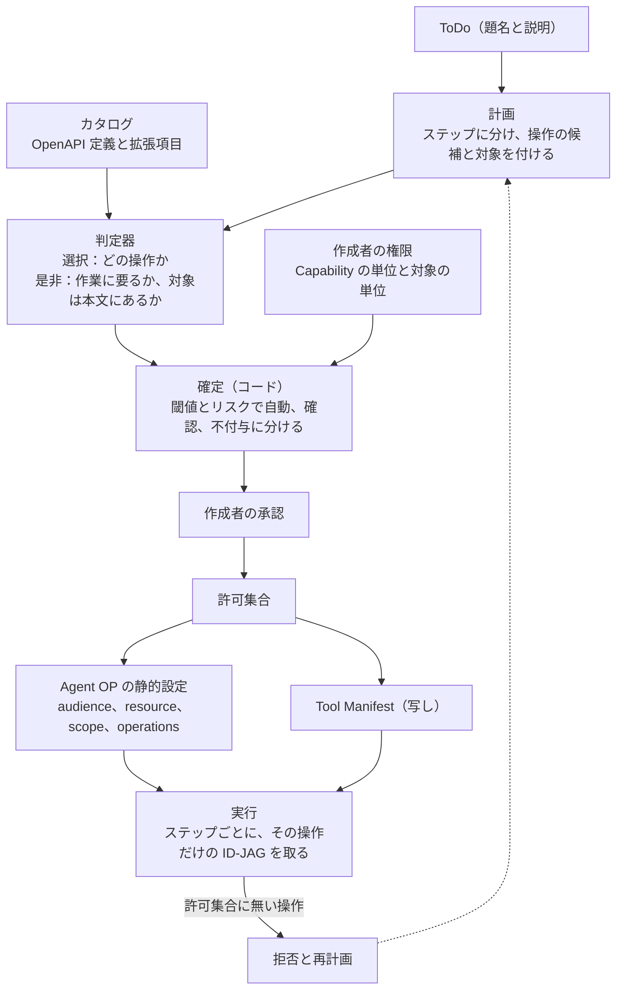
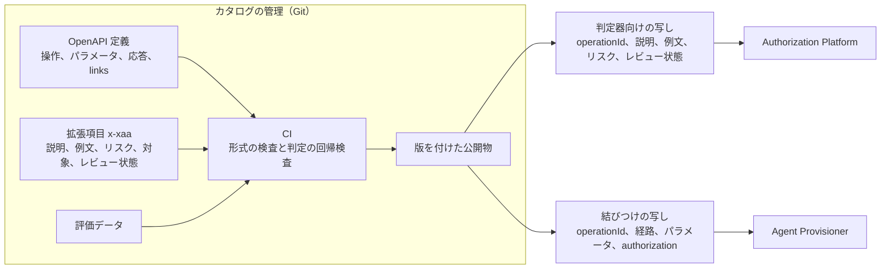
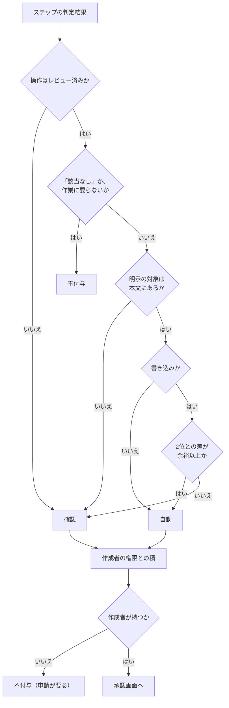
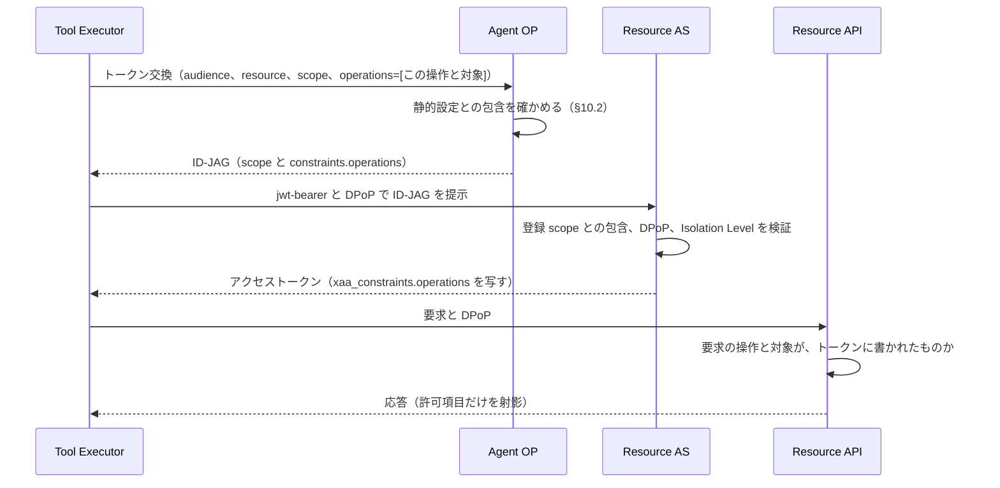
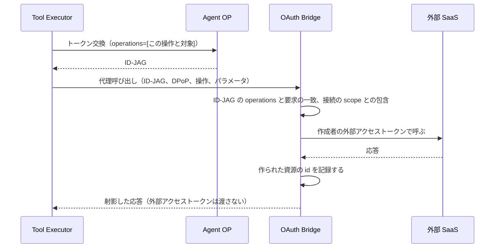

# 12. 作業内容からの権限決定

自然言語で書かれた作業内容から、Agent に許す API の操作と対象の集合を自動で決め、その集合を Cross App Access の発行に載せて強制するための設計である。
[03](./03-authorization.md) が Capability の粒度で決めていた権限を操作と対象の粒度まで細かくし、権限の候補を出す役を、確率を返す判定器に置き換える。
[03. §6](./03-authorization.md#6-policy-engine) の Policy Engine と [04](./04-tool-catalog.md) の Tool / Connector Catalog はそのまま使い、本書は両者のあいだに計画、判定、許可集合の3つを差し込む。

## 1. 目的と範囲

AI Agent に仕事を任せるとき、その仕事に要る権限だけを与えたい。
権限の境界を実行前に推定する問題は、ファイルの読み取り、書き込み、実行を対象に AuthBench[^authbench] が扱っている。
本書はその対象を API に広げる。
ファイルと違い、API の操作には「どの書類を」「どの Issue に」という対象があり、しかも対象の一部は実行中に初めて生まれる。
本書の設計はこの2点を中心に組む。

満たす条件は3つある。

1. 作業を依頼した人（以下、**作成者**）が持つ権限を超えて Agent に与えない。
2. 権限の中身を管理する仕組みと、権限を決める仕組みを疎結合にする。
3. 強制は Cross App Access に集約する。あるステップで何ができるかの判断を、実行系の各所に散らさない。

次の2つは本書の範囲外である。

- 作成者が持っていない権限を申請して登録する手続き。本書は「持っていない」と分かるところまでを扱う。
- 判定器の評価結果。評価の計画は §13 に書くが、数値はまだ無い。

[^authbench]: AuthBench の論文は https://arxiv.org/pdf/2605.14859 にある。

## 2. 前提として決めたこと

本書の設計は、次の8つの決定を前提にしている。
いずれも設計の相談で確定した事項であり、変える場合は本書ごと改める。

| 決定 | 内容 | 理由 |
|---|---|---|
| 作業単位 | 判定器に選ばせる作業単位は Tool と一対一にする。別の名前を作らない | 粒度が2つあると対応表が要り、対応表は保守のたびにずれる |
| 許可の形 | 許可集合の1行は、OpenAPI 定義の操作と、その対象パラメータの値で表す | API の定義を1つの出所にでき、生成も検査も機械にできる |
| scope | Tool ごとの `scope` は作らない。`scope` は今の語彙のままにする | RULE-52 の語彙を Resource AS ごとに広げると、登録と保守が増える |
| 強制の場所 | Agent OP が ID-JAG を発行するときに一度だけ判断し、結果をトークンに書く。Resource 側はトークンに書かれたことを検査するだけで、判断しない | 判断が一箇所なら、食い違いも抜け道もそこだけを見ればよい |
| 契約の形 | 計画に出た操作の和集合を先に許可集合として固め、実行時はステップごとに、その操作だけを載せたトークンを取る。順序は強制しない | 必要な権限は実行者によって変わるので、順序で縛ると実行者を変えるたびに壊れる |
| 承認者 | 承認するのは作成者本人である。二人目の承認者は置かない。足りない権限は別途申請する | 作成者は自分の権限を超えられない。二人目が担うのは上限ではなくリスクであり、リスクは Risk Policy が担っている |
| 実行の身元 | 共有のサービスアカウントで API を呼ばない。常に作成者から委譲された身元で呼ぶ | 実行時に API 側が作成者の上限を強制できる |
| 判定器 | 判定器には Jev[^jev] を使うが、Vertex AI 上のモデルにも切り替えられるようにする。外部への送信は配備単位の設定で切る | 実績の少ない判定器に、退避先と比較対象を用意する |

[^jev]: Jev の説明は https://docs.typesafe.ai/introduction にある。本書は、選択肢から選ぶことと是非を確率で答えることだけができる、という性質だけに依存する。

## 3. 用語

本書で新しく使う語を先に置く。
既存の語は [01. §3](./01-overview.md#3-用語) と[用語辞書](./glossary.md)のとおりである。

- **操作**：Tool と同じもの。OpenAPI 定義の `operationId` で識別し、値は既存の Tool ID をそのまま使う。
- **対象**：操作のパラメータのうち、どの資源に対して行うかを決めるもの。書類の id や Issue の番号がこれに当たる。
- **対象の種類**：**明示**（作業本文に値が書かれている）、**実行中に作ったもの**（同じ Agent が実行中に作った資源）、**任意**（どの資源でもよい）の3つ。
- **計画**：作業をステップに分けたもの。1つのステップは1つの操作の候補と対象を持つ。
- **許可集合**：操作と対象の組の集合。Agent に許す全体であり、Cross App Access の静的設定の元になる。
- **判定器**：選択肢から1つを選ぶことと、問いに是非を確率で答えることだけができる部品。文章や一覧は生成しない。
- **判定プロファイル**：判定の結果を左右する版をすべて束ねた識別子。

## 4. 全体の流れ

作業内容は、計画、判定、確定、承認を経て許可集合になり、許可集合が Agent OP の静的設定になる。
実行中の Agent は、ステップごとにその操作だけを載せた ID-JAG を取り、許可集合に無い操作は Agent OP が拒む。



役割は次のように分ける。
[03. §9](./03-authorization.md#9-責務の分離まとめ) の表を、操作の粒度まで下ろしたものである。

| 担当 | 決めること | 決めないこと |
|---|---|---|
| カタログ（人） | 各操作の説明、対象パラメータ、リスクの事実、レビュー状態 | どの作業に何が要るか |
| 計画（言語モデル） | 作業をステップに分ける。各ステップの操作候補と対象 | 権限の可否 |
| 判定器 | ステップがどの操作に当たるか。作業に要るか。対象が本文にあるか | 付与するかどうか |
| 確定（コード） | 閾値とリスクで自動、確認、不付与に分ける。作成者の権限と積を取る | 判定そのもの |
| 作成者 | 許可集合を承認する | 自分の上限を超えること |
| Agent OP | ステップの要求が許可集合に含まれるか | 作業の中身 |
| Resource AS | ID-JAG に書かれた操作と対象を、アクセストークンに写す | 何が許されるべきか |
| Resource API | 要求がトークンに書かれた操作と対象に一致するか | 何が許されるべきか |

## 5. カタログ

### 5.1 OpenAPI 定義を出所にする

カタログの出所は、API ごとの OpenAPI 定義である。
定義は薄くてよく、要るのは経路、メソッド、`operationId`、一行の説明、`tags`、パラメータ、応答の中の id の項目、そして `links` である。
既存の Tool 定義（[04. §4](./04-tool-catalog.md#4-tool-definition例)）は経路、メソッド、パラメータ、応答の許可項目を既に持っており、小さな OpenAPI 定義と同じ形をしている。
二重に持たず、OpenAPI 定義に寄せる。

社内の Resource API には OpenAPI 定義がまだ無い。
Tool は8つなので一度手で書き、CI（継続的インテグレーション）で実装の経路定義と突き合わせる。
外部 SaaS は公開されている OpenAPI 定義から、要る項目だけを射影して取り込む。
手で写さないのは、API 定義がカタログ全体の土台であり、写し間違いがそのまま権限の誤りになるからである。

`operationId` には既存の Tool ID をそのまま使う。
1つの Agent が複数の API を使うので、`operationId` は API をまたいで一意でなければならず、既存の Tool ID は接続先の名前を前置している。

### 5.2 拡張項目

OpenAPI 定義が持たない、権限のための情報は、操作ごとの拡張項目 `x-xaa` に置く。
1つのファイルに寄せるのは、出所を1つにして CI で形式を検査するためである。

| 項目 | 内容 | 誰が決めるか |
|---|---|---|
| `capability` | その操作が要る Capability。Policy Engine はこの単位で動く | 人 |
| `authorization` | `type`、`audience`、`resource`、`scope`。既存の Tool 定義と同じ | 人 |
| `targets` | 対象パラメータの名前の一覧。ここに無いパラメータは対象ではない | 人 |
| `risk` | リスクの事実。`risk_level` と、既存の characteristics のうち操作が決める3つ（`write_operation`、`external_communication`、`financial_operation`）、副作用のある読み取りを表す `side_effect` | 下書きは生成、確認は人 |
| `review` | `unreviewed` か `reviewed`。レビューした人と日付 | 人 |
| `judge` | 判定器に見せる説明と例文。接続先や経路を含めない | 下書きは生成、確認は人 |
| `response_allowlist` | 応答のうち Agent に見せてよい項目。既存の `response_schema.allowlist` と同じ | 人 |

`side_effect` を別に持つのは、読み取りの形をした操作が状態を変えることがあるからである。
メソッドから決めた初期値をそのまま信じると、その操作のリスクが実態より低く見積もられる。

実行中に生まれる対象は、OpenAPI 定義の `links` で表す。
作成の応答にある id が、更新の対象パラメータに流れる、という対応は `links` の記法そのものである。
カタログを組み立てるとき、この対応から「更新の `id` は作成が作ったものでもよい」という関係を導く。

```yaml
paths:
  /documents:
    post:
      operationId: internal.document.create
      summary: 書類を作る
      tags: [documents]
      responses:
        "201":
          links:
            update:
              operationId: internal.document.update
              parameters: { id: "$response.body#/document_id" }
      x-xaa:
        capability: document.write
        authorization: { type: native_xaa, audience: "${issuer:docs}", resource: "${resource:docs}", scope: docs.write }
        targets: []
        risk: { risk_level: medium, write_operation: true, side_effect: true }
        review: { state: reviewed, by: admin@example.com, at: "2026-09-19" }
        judge:
          description: 新しい書類を1件作る。既にある書類は変えない
          examples: ["今日の日報を作る", "議事録を新しく書く"]
        response_allowlist: [document_id, type, title]
  /documents/{id}:
    patch:
      operationId: internal.document.update
      summary: 書類を更新する
      tags: [documents]
      parameters:
        - { name: id, in: path, required: true, schema: { type: string } }
      x-xaa:
        capability: document.write
        authorization: { type: native_xaa, audience: "${issuer:docs}", resource: "${resource:docs}", scope: docs.write }
        targets: [id]
        risk: { risk_level: medium, write_operation: true, side_effect: true }
        review: { state: reviewed, by: admin@example.com, at: "2026-09-19" }
        judge:
          description: 既にある書類の題名か本文を書き換える
          examples: ["昨日の日報の本文を直す", "議事録の題名を修正する"]
        response_allowlist: [document_id, version, updated_at]
```

### 5.3 レビューと版

カタログは Git で管理し、CI を通ったものだけに版を付けて公開する。
公開物には、判定器向けの写し（`operationId`、説明、例文、リスク、レビュー状態）と、結びつけの写し（`operationId`、経路、パラメータ、`authorization`）の2つがある。
判定器向けの写しは Authorization Platform が読み、結びつけの写しは Agent Provisioner が読む。
Authorization Platform が経路や接続先を持たないのは RULE-16 のとおりで、既存の指示文の検査（接続先を示す語が入ると失敗する）はそのまま効く。

CI は2種類の検査をする。
形式の検査は、`operationId` の一意性、`targets` がパラメータに実在すること、`links` の参照先が実在すること、`judge` に接続先を示す語が無いことを見る。
判定の回帰検査は、§13 の評価データを固定した判定器で流し、正答率と較正が前の版から一定以上落ちていれば失敗にする。
説明や例文を変えると判定器の答えが変わるので、後者の検査が無いと、カタログの版上げがそのまま判定の劣化になる。

登録は少しずつ増やすのではなく、OpenAPI 定義にある操作を最初から全件、`unreviewed` として生成する。
`unreviewed` の操作に当たったステップは §8 で必ず確認に回るので、生成しただけで自動付与されることはない。
レビューは、当たった順に行えばよい。
こうすると「該当なし」は、API に無い操作を計画が求めたときにだけ出る純粋な信号になる。



### 5.4 疎結合の意味

疎結合にするのは管理の仕組みであって、版ではない。
判定側が読むのは版を付けた公開物だけで、Git の中身やレビューの画面には依存しない。
一方で、どの版のカタログで判定したかは §12 の判定プロファイルに必ず残す。
説明文への依存だけは切れないので、版を残して追えるようにする。

## 6. 計画

### 6.1 入力と出力

計画は、ToDo の題名と説明だけを入力にする。
`context` を使わないのは [02. §2.1](./02-automation-design.md#21-todoの項目) と同じ理由で、資料の場所や社内の事情を権限決定の入力にしないためである。
計画を作るのは大規模言語モデル（以下、言語モデル）であり、既存の Work Definition 構造化（[03. §3](./03-authorization.md#3-agent-work-definition)）を、対象を持つステップの一覧へ置き換える。

1つのステップは次を持つ。

| 項目 | 内容 |
|---|---|
| `text` | ステップの説明。判定器の選択にだけ使う |
| `tags` | 対象の API を示す語。カタログの `tags` に合わせて選択肢を絞る |
| `target` | 対象の種類と、明示なら値。§6.2 |
| `conditional` | 条件付きのステップかどうか |

ステップ数には上限を置く。
既存の `operations` の上限（10）を引き継ぐ。

### 6.2 対象の種類

対象は3種類に分ける。

- **明示**：作業本文に値が書かれている。書類の id、Issue の番号など。
- **実行中に作ったもの**：同じ Agent が実行中に作った資源。作成の応答で初めて id が分かる。
- **任意**：どの資源でもよい。一覧や検索がこれに当たる。

書き込みの対象を「任意」にすることは、人が確認したときにだけ許す。
読み取りの「任意」は、Resource API が作成者の資源だけを返すこと（書類の一覧は `owner_subject` で絞られる）に支えられている。

### 6.3 下書きの段階で対象を確定する

対象の曖昧さは、判定のときではなく、ToDo を書く段階で潰す。
ToDo には `DRAFT` の状態があり、Automation Design AI が書き直せる（[02. §2.2](./02-automation-design.md#22-todoの状態)）。
計画は `DRAFT` の段階で走らせ、書き込みの対象が明示でも実行中に作ったものでもないステップがあれば、作成者に「どの書類を」「どの Issue を」と問い返す。
問い返しに答えて本文が直り、`CONFIRMED` になったときには、書き込みの対象は決まっている。
こうすると、§7.3 の「対象が本文にあるか」の問いが否になるのは例外になる。

### 6.4 契約は集合である

計画は、Agent が従う契約として扱う。
ただし契約が縛るのは順序ではなく、操作と対象の集合である。

順序を縛らないのは、必要な権限が実行者によって変わるからである。
同じ作業でも、先に一覧を取るか、直接 id で取るかは実行する側の判断で変わり、順序を固定すると実行する側を変えるたびに契約が壊れる。
集合で縛れば、順序も回数も問わず、集合の外に出たときだけ拒めばよい。

条件分岐もこの形で吸収できる。
「不具合ならラベルを付ける」のようなステップは `conditional` を付けて集合に入れ、§8 で常に確認に回す。
分岐の先が集合に入っているので、実行時に分岐がどちらへ進んでも契約の中にある。

集合で縛ることの裏面も書いておく。
境界は集合全体であって、ステップごとのトークンではない。
これは §10.5 で扱う。

## 7. 判定

### 7.1 判定器の呼び出し口

判定器は、2つの関数だけを持つ呼び出し口の後ろに置く。

| 関数 | 入力 | 出力 |
|---|---|---|
| 選択 | 状況の文と、選択肢の一覧 | 選択肢ごとの確率 |
| 是非判定 | 状況の文と、問い | 是の確率 |

Jev はこの呼び出し口の1つの実装である。
Jev の「選択（Choice）」が前者に、「是非判定（Noul）」が後者に当たる。
同じ呼び出し口を、Vertex AI 上のモデルの構造化出力で満たす実装も用意する。
2つ目の実装は、Jev が使えないときの退避先であると同時に、較正を比べる相手でもある。

配備の設定で実装を選ぶ。
外部への送信を切るとは、この設定を Vertex AI 側にすることである。
送るものは ToDo の題名と説明、ステップの説明、カタログの説明と例文に限る。
`context` は送らず、接続先や経路も、判定器向けの写しに含まれないので送られない。

### 7.2 選択

選択は、ステップがカタログのどの操作に当たるかを答えさせる。
状況の文には、作業本文とステップの `text` を入れる。
選択肢は、ステップの `tags` でカタログを絞ったうえで、操作の説明を並べ、末尾に「該当なし」を必ず置く。

絞り込みを `tags` の一致という決定的な手段にするのは、絞り込みにもう1つモデルを使うと、版を追う対象が増えるからである。
選択肢の数の上限は Jev の仕様に従う（§15）。

「該当なし」を明示の選択肢にしないと、判定器は近い何かを選ぶしかない。
カタログに無い操作を求めたステップは、「該当なし」が最も高いことで分かり、§8 で不付与になる。

### 7.3 是非判定

選択で操作が決まったら、2つの問いを是非判定にかける。

1. この操作は、この作業に要るか。
2. この操作の対象は、作業本文に書かれているか。

問い2は、対象が明示のステップにだけ立てる。
実行中に作ったものと任意は、本文に値が無いことが前提だからである。

2つの問いの状況の文には、ステップの `text` を入れない。
入れるのは、作業本文と、選ばれた操作のカタログ上の説明と、対象である。
付与されるのはカタログが言う操作であって、計画が言ったことではない。
計画の文が穏やかでも操作が広ければ、この問いで否になる。
計画を作る言語モデルが本文の指示に引きずられたときも、その文が問いに入らないので、判定器まで引きずられない。

問い1を選択とは別に立てるのは、AuthBench の分解と同じ効果を狙ったものである。
ただし同じ効果が出るかは仮説であり、§13 で確かめる。

### 7.4 閾値と振り分け

判定の確率は、リスクの事実と操作の種類で分けた閾値にかける。
閾値はすべて仮の値であり、§13 の較正の結果で置き換える。

- 読み取りは、確率が閾値以上の選択肢をすべて許可集合に入れてよい。近い操作が複数あって確率が割れても、読み取りなら広く取る損が小さい。
- 書き込みは、最も高い選択肢が閾値以上で、しかも2位との差が余裕の値以上のときだけ自動にする。差が足りなければ確認に回す。
- 「該当なし」が最も高ければ不付与にする。
- 問い1の確率が閾値未満なら不付与にする。
- 問い2の確率が閾値未満なら確認に回す。

判定の記録には、提示した選択肢の全部と、その並び順と、返った確率をそのまま残す。
閾値を後から変えるとき、判定器を呼び直さずに記録だけで結果を計算し直せるようにするためである。

### 7.5 切り替えと影の実行

判定器の実装を切り替える前に、**影の実行**の期間を置く。
影の実行では両方の実装を呼び、一方だけが決め、他方の確率は記録にだけ残す。
本番の作業で較正を測ってから、決める側を入れ替えられる。

閾値は実装と版の組ごとに較正する。
Jev はエイリアスではなく版の識別子で固定し、版を上げるときは §13 の評価を流し直す。

## 8. 確定と承認

### 8.1 三段階

コードは、ステップごとの判定を次の3つに振り分ける。

- **自動**：承認画面で最初から選ばれた状態で出す。
- **確認**：理由と対象を添えて出し、作成者が明示的に選ぶ。
- **不付与**：理由を添えて出し、選べない。

振り分けの規則は §7.4 の閾値に、次を重ねる。

- `review` が `unreviewed` の操作は、確率にかかわらず確認にする。
- `risk` の事実に、Risk Policy が知らないラベルがあれば確認にする。
- `conditional` の書き込みは確認にする。
- 対象が任意の書き込みは確認にする。
- 再計画（§11）で増えた書き込みは確認にする。



### 8.2 作成者の権限との積

作成者の権限は2つの単位で確かめる。

1つ目は Capability の単位である。
各操作の `capability` について、Human Permission、Delegatable Permission、Organization Policy、Risk Policy との積を、既存の Policy Engine がそのまま取る（RULE-11）。
ここで落ちた操作は、理由を `policy_denied` か `not_held_capability` に分けて記録する。

2つ目は対象の単位である。
Capability を持っていても、その書類や Issue に権限が無いことはある。
対象が明示の操作について、作成者から委譲された経路で API 側の権限確認を呼ぶ。
Platform のサービスアカウントでは呼ばない。
委譲された経路で呼ぶと、答えが得られると同時に、委譲の鎖が実行前に通ることも確かめられる。
API に権限確認の口が無ければ、対象の確認を「未確認」として確認に回す。
対応表を別に作らないのは、表がずれたときに気づく手段が無いからである。

不付与の理由を分けるのは、承認画面で「申請してください」と出せるようにするためである。
申請の手続きは本書の範囲外だが、申請が通って権限が登録されたあとは、保存してある判定結果に積を取り直すだけでよく、判定器を呼び直さない。
Human Permission が変わったときに保存済みの提案を再利用する [07. §7.2](./07-lifecycle.md#72-human-userの権限が変更された場合re-provisioning) と同じ扱いである。

作成者が承認しても、この積は超えられない。
承認画面が見せるのは積を取ったあとの集合であり、積の外にある操作は選べない。

### 8.3 承認画面

承認は、既存の Agent Definition の承認（[02. §4](./02-automation-design.md#4-agent-definition)）の中で行う。
画面は許可集合を操作ごとに1行で出し、行には操作の説明、対象、リスクの事実、振り分けの理由を添える。
確認の行は畳まず、対象を文字どおりに見せる。

作成者だけが承認するので、注入された ToDo を作成者が流し読みで承認する危険は残る。
`/external/todos` から登録された ToDo は下書きまでであり（[02. §6](./02-automation-design.md#6-todo登録api)）、確定と承認は人が押す。
それでも読まずに押せば通るので、確認の行を目立たせることと、Risk Policy が決める Isolation Level（RULE-12）が残ることが、この危険への備えである。

## 9. 許可集合と静的設定

### 9.1 許可集合の形

許可集合の1行は、操作と、対象パラメータごとの許す値である。
形は OpenAPI 定義の操作とパラメータから決まり、値の種類は §6.2 の3つに対応する。

```json
{
  "catalog_version": "2026.09.19-3",
  "operations": [
    { "operation": "internal.document.list", "parameters": {}, "tier": "auto" },
    { "operation": "internal.document.get",
      "parameters": { "id": { "kind": "literal", "values": ["doc_20260918"] } }, "tier": "auto" },
    { "operation": "internal.document.create", "parameters": {}, "tier": "confirm" },
    { "operation": "internal.document.update",
      "parameters": { "id": { "kind": "created_in_run", "by": ["internal.document.create"] } }, "tier": "confirm" }
  ]
}
```

`kind` は `literal`（明示）、`created_in_run`（実行中に作ったもの）、`any`（任意）の3値である。
`by` は、どの操作が作った資源かを示し、カタログの `links` から導く。
`tier` は承認画面の表示に使い、静的設定には写さない。

### 9.2 静的設定への写像

Agent Provisioner は、承認された許可集合から Agent OP の静的設定を作る。
`allowed_audiences`、`resources`、`scopes` は、各操作の `authorization` を集めたものであり、ここは今と同じである（[04. §5](./04-tool-catalog.md#5-provisioning時のtool解決)）。
新しく `operations` を足し、許可集合の各行をそのまま置く。

```yaml
allowed_audiences: ["${issuer:docs}"]
resources: ["${resource:docs}"]
scopes: [docs.read, docs.write]
operations:
  - { operation: internal.document.list, parameters: {} }
  - { operation: internal.document.get, parameters: { id: { kind: literal, values: [doc_20260918] } } }
  - { operation: internal.document.create, parameters: {} }
  - { operation: internal.document.update, parameters: { id: { kind: created_in_run, by: [internal.document.create] } } }
```

`scope` は今の語彙のままである。
`docs.write` は作成と更新の両方を含むが、どちらを許すかは `operations` が決める。
`scope` は Resource AS が登録 scope との包含を確かめる粗い層として残り、細かい層は `operations` が担う。

### 9.3 Tool Manifest は写しである

Agent Runtime に渡す Tool Manifest も、同じ許可集合から作る。
Tool Manifest は、要求を組み立てるための経路とパラメータの型を Tool Executor に与えるものであり、許可の判断ではない。
Tool Executor が Manifest に無い Tool を拒むこと（RULE-17）と、金額の上限を要求の前に確かめることは残るが、どちらも許可集合の写しに対する早い失敗であって、独立した判断ではない。
写しと Agent OP の答えが食い違うことがあれば、それは写しを作る側の欠陥であり、正しいのは常に Agent OP である。

## 10. 実行時の強制

### 10.1 ステップごとの発行

Tool Executor は、ステップを実行するたびに、その操作と対象だけを載せた ID-JAG を取る。
トークン交換（Token Exchange）の本文に、既存の `audience`、`resource`、`scope` に加えて `operations` を付ける。



Agent OP は、要求の `operations` が静的設定に含まれるかだけを確かめ、含まれれば ID-JAG の `constraints.operations` に要求をそのまま書く。
ID-JAG の claim は、既存のライブラリが作る部分の外側に足す。
`isolation_level` を同じ方法で足しているので、ライブラリに手を入れない（DEC-ID-02）。

Resource AS は、ID-JAG の `constraints` をアクセストークンの `xaa_constraints` に写す。
この経路は既にあり、今は支払承認の `max_amount` だけを写している。
`operations` も写すように広げる。

Tool Executor がトークンを使い回すときの鍵は、今の audience、resource、scope の組に `operations` を加える。
加えないと、ある書類向けのトークンを別の書類の更新に流用し、Resource API で拒まれてから取り直すことになる。

### 10.2 包含の規則

Agent OP の判断は、要求の各行が静的設定のどれかの行に含まれるか、である。
同じ操作の行に対して、対象パラメータごとに次の規則で比べる。

| 静的設定の種類 | 要求で許す形 |
|---|---|
| 明示（値の集合） | 明示で、値がその集合の部分集合 |
| 実行中に作ったもの | 同じ種類だけ。明示の値には狭められない |
| 任意 | 任意、または明示 |

「実行中に作ったもの」を明示の値に狭められないのは、Agent OP がその資源を誰が作ったかを知らないからである。
Agent OP は述語をそのままトークンに書き、述語を評価するのは資源を持つ側である。

要求が含まれなければ、Agent OP は今と同じ `invalid_scope` で拒み、記録には `operation_not_allowed` と要求された操作と対象を残す。
発行台帳には `operations` を加え、§12 で和集合と突き合わせられるようにする。

### 10.3 Resource 側の検査

Resource API は、トークンに書かれた操作と対象に、要求が一致するかを検査する。
判断はしない。

検査は既存の保護の中間層に足す。
要求のメソッドと経路を自身の OpenAPI 定義で `operationId` に引き当て、トークンの `operations` に同じ操作の行があるかを見る。
行があれば、対象パラメータごとに次を確かめる。

- 明示：要求の値が、行の値の集合にある。
- 実行中に作ったもの：その資源を作ったのが、トークンの `act.sub` と同じ Agent である。書類には作った Agent を記録する列を足す。
- 任意：確かめない。

「実行中に作ったもの」を Resource API が判定できるのは、資源を作った記録を持っているのが Resource API だけだからである。
Agent は1つの実行に対応し（RULE-04）、作り直された Agent は別の id を持つので、「同じ Agent が作った」は「この実行で作った」と同じ意味になる。

所有者の検査は今のままである。
書類の一覧と取得は作成者の資源に絞られ、支払の承認は Resource API 自身の上限にかかる。
トークンの `operations` は、この上に重なる細かい層であり、所有者の検査を置き換えない。

### 10.4 外部 SaaS の場合

OAuth Bridge の先にある外部 SaaS は、`xaa_constraints` を理解しない。
今の流れでは Bridge が外部のアクセストークンを Agent Runtime に返し、Runtime が SaaS を直接呼ぶ（[06](./06-oauth-bridge.md)）。
この流れのままでは、対象の粒度の許可を強制する場所が無い。

強制を Cross App Access に集約するために、Bridge を**代理呼び出し**の口にする。
Runtime は外部のアクセストークンを受け取らず、ID-JAG と DPoP を添えて、操作とパラメータを Bridge に送る。
Bridge は ID-JAG の `operations` と要求の一致を §10.3 と同じ規則で確かめ、作成者の接続が持つ scope に収まることを確かめてから、作成者の外部トークンで SaaS を呼ぶ。
作成の応答から資源の id を記録するのも Bridge である。



外部トークンを Runtime に渡さない点は、RULE-22 が許す範囲より狭い。
代償は、Bridge が各 SaaS の OpenAPI 定義を持ち、要求を組み立てて往復することである。
既定の配備では Bridge を作らない（DEC-SCOPE-04）ので、この節が要るのは Bridge を有効にしたときに限る。

### 10.5 境界は和集合である

ステップごとのトークンは、そのステップの操作しか載せない。
それでも、乗っ取られた Agent は和集合の中の別の操作のトークンをいつでも取れる。
境界は和集合であり、ステップごとのトークンは封じ込めではない。

ステップごとに取る価値は別のところにある。
1つのトークンが漏れても他の操作には使えないこと、発行台帳にステップの粒度で残ることの2つである。
最小権限を測る単位は和集合であり、§12 の指標もそこを見る。

### 10.6 変更点の一覧

| 部品 | 変更 |
|---|---|
| 契約の共有パッケージ | 許可集合の型と検査、静的設定と Tool Manifest への `operations` の追加、トークン交換の本文に `operations` を加える |
| Authorization Platform | 計画、判定器の呼び出し口と2つの実装、確定の規則、判定の記録 |
| Automation App | 下書きでの問い返し、承認画面の3段階の表示、不付与の理由の表示 |
| Agent Provisioner | 許可集合から静的設定と Tool Manifest を作る。結びつけの写しを読む |
| Agent OP | 静的設定に `operations` を持つ。包含の規則で照合し、ID-JAG に `constraints.operations` を書く。発行台帳に残す |
| Resource AS | `constraints.operations` を `xaa_constraints` に写す |
| Resource API | 操作と対象の検査を保護の中間層に足す。作った Agent を記録する |
| Agent Runtime | トークン交換に `operations` を付ける。使い回しの鍵に加える。拒否を `operation_not_allowed` として報告する |
| OAuth Bridge | 代理呼び出しの口。作られた資源の記録。外部トークンを返さない |

## 11. 逸脱と再計画

実行中に許可集合に無い操作が要ることは起きる。
計画を作った言語モデルと実行する言語モデルが、同じ作業を別の手順で解くことがあるからで、これは §6.4 で順序を縛らなかった理由と同じ知見である。

Agent OP が拒んだとき、Agent Runtime は実行中の Task を `TASK_BLOCKED` で終え、拒まれた操作と対象を報告する。
既存 Agent の権限は増やさない（RULE-13）。
作成者が再計画を選ぶと、元の ToDo に拒まれた操作を添えて §6 から流し直し、新しい Agent を作る。

再計画の判定に入れるのは、元の題名と説明と、拒まれた操作と対象だけである。
Agent が書いた理由や途中経過は入れない。
Agent の文は実行中に読んだ資料の影響を受けており、それを判定の状況の文に入れると、資料に書かれた指示が権限に変わる経路ができる。

再計画で増えた書き込みは、確率にかかわらず確認に回す（§8.1）。
最初の自動付与の根拠は作成者の文章だったが、再計画の引き金は Agent の挙動だからである。

## 12. 記録と版

判定の結果を左右する版は5つある。
判定器の実装と版の識別子、指示文の版、選択肢の描き方の版、カタログの版、閾値の規則の版である。
この5つを束ねて1つの判定プロファイルにし、判定の記録に必ず残す。
閾値は判定器とカタログの版の組ごとに較正し直すものなので、プロファイルが違えば閾値も違う。

1回の判定の記録には次を残す。

- 判定プロファイル。
- 計画の各ステップと、提示した選択肢の全部と並び順と、返った確率。
- 振り分けの結果と理由。
- 積で落ちた操作と理由。
- 承認された許可集合。

実行後には、許可集合と Agent OP の発行台帳を突き合わせる。
許可されたが一度も発行されなかった操作の割合が過剰付与の指標であり、拒否の件数が過少付与の指標である。
この2つと確認に回った割合を、閾値と作業単位の粒度を直す根拠にする。

Security Detection の Baseline（[09. §5.4](./09-security-monitoring.md#54-agent-baseline)）は、Effective Capability からではなく許可集合から作る。
操作と対象の集合の方が、期待される振る舞いを細かく言えるからである。

## 13. 検証の計画

判定器の信頼性は未確認であり、次の順で確かめる。

評価データは、作業本文とステップと正解（操作か「該当なし」と、対象）の組で作る。
出所は2つあり、カタログの例文から取り分けたものと、実際の ToDo に人が正解を付けたものである。
同じ項目を日本語と英語の対で持ち、言語で精度が変わるかを見る。
カタログに無い操作を求める項目を必ず含め、「該当なし」の較正を測れるようにする。

測るのは次である。

- 選択の正答率と、「該当なし」の再現率。
- 返った確率と実際の的中率のずれ。閾値の根拠になる。
- 許可集合と正解との差から求める過剰付与率と過少付与率、そして確認に回った割合。

問い1を別に立てる効果は、3つの構成を同じ評価データで比べて確かめる。
選択だけ、選択と問い1、選択と問い1と問い2の3つである。

評価はカタログの CI と、判定器の版上げの両方で流す。
本番では §7.5 の影の実行で、実際の作業に対する較正を測ってから判定器を入れ替える。

## 14. 既存ルールとの関係

| ルール | 扱い |
|---|---|
| RULE-09 | 保つ。判定器は選ぶだけで、経路も scope も生成しない |
| RULE-10、RULE-11 | 保つ。積は Capability の単位で今のまま取り、対象の単位を重ねる |
| RULE-13、RULE-14 | 保つ。再計画は新しい Agent であり、権限の縮小は再評価が拾う |
| RULE-16 | 保つ。判定器向けの写しに経路と接続先を含めない |
| RULE-17、RULE-18 | 保つ。Tool Manifest は許可集合の写しであり、判断ではない |
| RULE-19、RULE-20 | 保つ。`operations` は静的設定の一部であり、Agent OP は包含を確かめるだけである |
| RULE-22 | 狭める。Bridge の先では外部トークンを Runtime に渡さない |
| RULE-45 | 逸脱を記録する。ID-JAG に `constraints.operations` を載せることと、トークン交換に `operations` を加えることは規格の外である |
| RULE-52 | 変えない。`scope` の語彙は増やさない |

採用時には、次を [rules.json](./rules.json) に登録し、[deviations.md](./deviations.md) に ID-JAG の拡張を足す。
本書の段階では候補として置く。

- 判断は Agent OP の発行時に一度だけ行い、Resource 側はトークンに書かれたことを検査するだけにする。
- 判定器は選択と是非判定だけを行い、権限を生成しない。判定器向けの写しに経路と接続先を含めない。
- 判定の記録には判定プロファイルを必ず残す。

## 15. 未決事項

- Jev の仕様で確かめること。選択肢の数の上限、選択肢に説明文を添えられるか、確率が全選択肢について返るか、同じ入力に対する決定性、入力の大きさの上限、まとめて呼ぶ口の有無と料金、版の識別子の形式と提供期限、送ったデータの保持方針、日本語の対応。
- 回数上限。1つの操作を何回まで許すかは、発行台帳で数えれば Agent OP で縛れるが、トークンの使い回しがある間は発行回数と呼び出し回数が一致しない。書き込みでは使い回しをやめて一致させるか、上限そのものを持たないかを決める。
- 社内の Resource API の OpenAPI 定義を、手で書くか実装の経路定義から生成するか。
- Bridge の代理呼び出しを採るか、外部 SaaS は `scope` の粒度までと割り切るか。
- 閾値と余裕の値。すべて仮であり、§13 の較正で置き換える。
- 承認画面で確認の行をどう目立たせるか。
