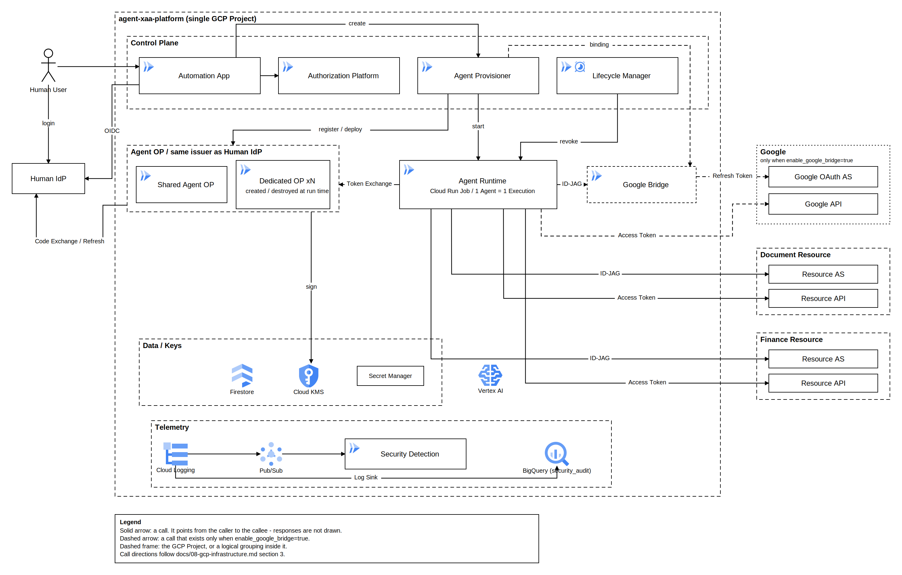

# 自律型AIエージェント × Cross App Access 認証認可基盤

本ディレクトリ配下の統合アーキテクチャ設計ドキュメント（GCP実行基盤を含む）の目次である。
内容は各文書（[01](./01-overview.md)〜[10](./10-design-rules.md)）にあり、本ファイルには要約と構成だけを置く。

## 要約

ユーザーがWeb画面上でAutomation Design AIと対話し、「何を自動化するか」をWork Definitionとして定義する。
Authorization Platform内のAuthorization AI AgentがWork DefinitionをVendor非依存の抽象Capabilityへ変換し、Policy EngineがHuman Permission、Delegatable Permission、Organization Policy、Risk Policyと照合してEffective CapabilityとIsolation Levelを確定する。
Tool / Connector CatalogでCapabilityを具体的なToolとXAA設定へ翻訳し、Agent専用のIdentity（Agent Registration、署名鍵、XAA静的設定）をProvisioningする。
AgentはCloud Run Jobとして最大24時間だけ存在し、Provisioning済みのToolだけを選んで、認証とAPI実行はDeterministic Tool Executorが行う。
Resourceへのアクセスは、Human IdPと共有するissuerが発行するID-JAGをResource Authorization Serverへ提示するCross App Accessで行い、Googleなど非対応SaaSにはOAuth Bridgeを介する。
ID-JAGは委譲元の人間を `sub` に、代理として動くAgentを `act` に載せる。
Human IdPにAgentの文脈を持ち込まないよう、issuerを1つに保ったままAgent OPを別デプロイとして分ける。
通常AgentはShared OPプロセスを共有してコストを抑え、高セキュリティAgentはDedicated OP、専用Service Account、専用鍵、専用Runtimeまで分離する。
期限到達、ユーザーによる停止、異常検知のいずれでもAgent Identity Domain全体を破棄し、Security Detectionが全レイヤーのログから異常を検知する。

## 文書構成

| No | 文書 | 内容 |
|---|---|---|
| 01 | [概要と用語](./01-overview.md) | 目的、基本思想、アプリと機能の区別、3種類のIdentity、用語、全体像 |
| 02 | [自動化定義（Automation App）](./02-automation-design.md) | ユーザー起因の自動化定義、Automation Design AIの責務、Business Work Request、Agent Definition、実行中Agentの操作 |
| 03 | [権限決定（Authorization Platform）](./03-authorization.md) | 権限の種類、Work Definition構造化、Authorization AI Agent、抽象Capability、Policy Engine、Security Profile |
| 04 | [Tool / Connector CatalogとTool Executor](./04-tool-catalog.md) | Catalogの内容、Resourceの2種類、Tool / Connector Definition、Provisioning時のTool解決、Tool Executor |
| 05 | [Identity](./05-identity.md) | Human IdPとDPoP、Agent OP、Agent Registration、Human IdP Connection、Isolation Model、Cross App Access、ID-JAGとactor_token、Tokenの種類 |
| 06 | [OAuth Bridge（Google Bridge）](./06-oauth-bridge.md) | Bridgeの役割、Credential保持方針、Runtime Flow、Google Consent |
| 07 | [AgentのProvisioningとLifecycle](./07-lifecycle.md) | Lifetime、Provisioning、Agent Runtime、Expiration / 緊急停止、権限変更時の扱い |
| 08 | [GCP実行基盤](./08-gcp-infrastructure.md) | Project構成、デプロイ単位と内部機能、アプリ間の呼び出し関係、GCP Service Account、鍵と秘密情報、データストア、ネットワーク |
| 09 | [セキュリティ監視](./09-security-monitoring.md) | ログ収集、正規化と保存、検知の段階、Risk Score、Security AI、Response |
| 10 | [設計ルール](./10-design-rules.md) | 各文書で決めた原則の一覧 |
| 11 | [アクティビティタイムライン](./11-activity-timeline.md) | 人間向けの可視化画面。Activity Event、配信経路、画面表示、侵害を見せるデモの作り方 |

## 実装タスク

本ディレクトリの設計を実装するためのタスクは [tasks/](../tasks/README.md) にある。
docs 01 から 11 までの記述から要件を421件抽出し、13領域374件のタスクへ分解した。
制約（単一 GCP プロジェクト、IaC 優先、maronn-openid-connect の利用、低コスト）のもとで docs のルールから外れた判断は [tasks/00-decisions.md](../tasks/00-decisions.md) にまとめてある。

## 全体構成図

| ファイル | 用途 |
|---|---|
| [architecture.png](./diagrams/architecture.png) | Markdown表示用の画像 |
| [architecture.svg](./diagrams/architecture.svg) | 拡大しても劣化しないベクター版 |
| [architecture.drawio](./diagrams/architecture.drawio) | draw.ioで編集する場合の元データ |
| [generate.py](./diagrams/generate.py) | 上記3ファイルの生成スクリプト |

図を変更するときは `generate.py` のレイアウト定義を編集し、`python3 docs/diagrams/generate.py` で3ファイルをまとめて再生成する。
draw.ioで直接編集した場合は、PNGとSVGが古いままになる点に注意する。

## 変更履歴

- 2026-08-30：単一ファイルだった設計メモを内容ごとに `01`〜`10` へ分割し、レビュー指摘（`.review/SPEC.md.review.json`）を反映した。
- 2026-08-30：Control Plane API（Authorization Platform、Agent Provisioner、Lifecycle Manager）のHuman Access Token検証を明文化した。`human_subject` は Access Token の `sub` を正とし（RULE-43）、DPoP検証では `cnf.jkt` と Proof の鍵の一致を確認する（RULE-44）。
- 2026-08-30：Cross App Accessを `draft-ietf-oauth-identity-assertion-authz-grant` へ準拠させた（RULE-45〜RULE-53）。ID-JAGの発行者をHuman IdPと共有するissuerへ移し、`sub` を委譲元の人間、`act` を代理のAgentとした。Agent Runtimeが `subject_token` として人間のID Tokenを持ち、その供給源であるRefresh Tokenは Human IdP Connection としてAgent OPが保持する。Agentごとのクライアント登録は作らず、Agent個体は `cnf.jkt` と `act` で識別する。
- 2026-08-30：ルートにあった目次ファイル `SPEC.md` の内容を本ファイル（`docs/README.md`）に統合し、`SPEC.md` を削除した。
- 2026-08-30：人間向けの可視化画面として[11. アクティビティタイムライン](./11-activity-timeline.md)を追加した。Security Detection（09）とは別に、ログイン・権限決定・Agent実行・遮断を時系列で見せるActivity Eventを新設し、Automation App内の機能として位置づけた（RULE-54〜RULE-58）。
- 2026-08-30：11のイベント配信を、実行中に逐次配信する方式から、Task（`provisioning` / `task-{n}` / `lifecycle`）が完了してからまとめて再生する方式へ改めた（RULE-59）。再生は文字の一覧だけでなく、呼び出しの経路をアニメーションで示し、遮断はその経路が途中で止まる動きで表す。
- 2026-08-30：11の画面仕様（5章）は、Task選択後の再生の中身や表示のルールを含め元の記述のまま残した。Activity Eventの記録は通常利用かデモかを区別せず常時行うことを追記した（RULE-60）。
- 2026-08-30：docs の内容を実装するためのタスクファイルを `tasks/` へ追加した。要件421件を374タスクへ分解し、制約と docs が食い違う箇所の判断を `tasks/00-decisions.md` に、識別子と成果物の所有者を `tasks/00b-conventions.md` に確定させた。
