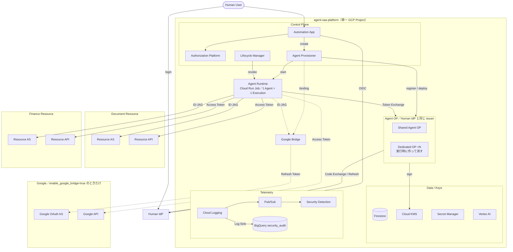
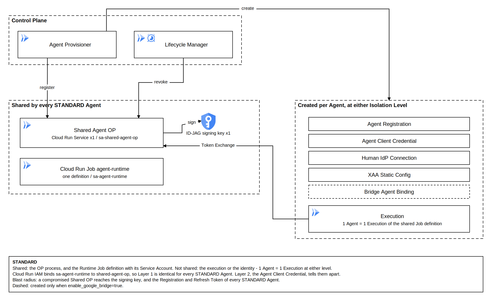
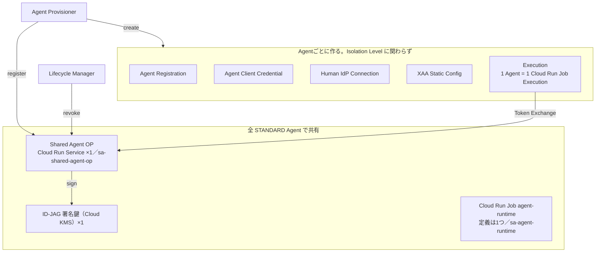
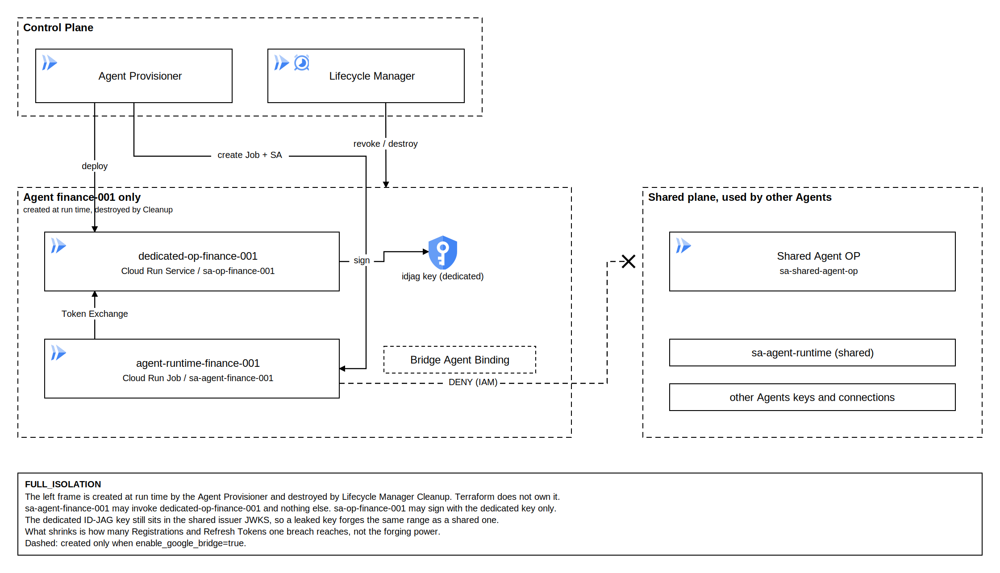
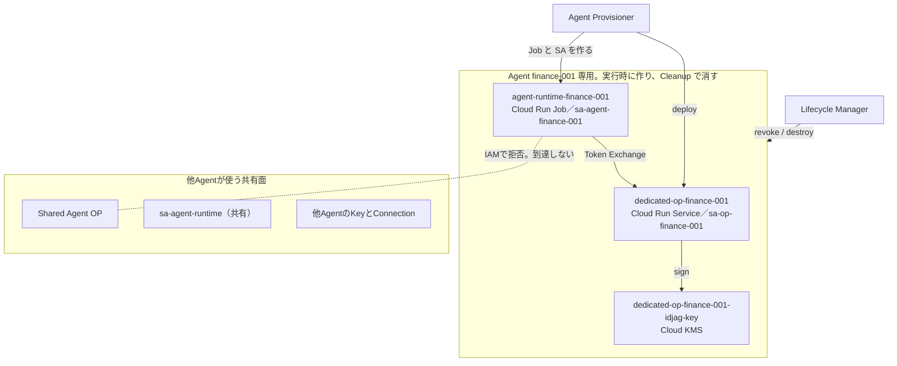

# 構成図

本ディレクトリには、GCP実行基盤の構成図を3枚置いている。
どれも [generate.py](./generate.py) が同じレイアウト定義から生成したもので、`.drawio` と `.svg` と `.png` はその出力である。

| 図 | 内容 | draw.io のページ |
|---|---|---|
| [architecture.png](./architecture.png) | 全体構成。アプリの配置と主要な呼び出し | Architecture |
| [architecture-standard.png](./architecture-standard.png) | Isolation Level が `STANDARD` のときに何が共有され、何がAgentごとに作られるか | STANDARD |
| [architecture-full-isolation.png](./architecture-full-isolation.png) | Isolation Level が `FULL_ISOLATION` のときにAgent専用で作られるものと、届かない範囲 | FULL_ISOLATION |

編集用の元データは3ページとも [architecture.drawio](./architecture.drawio) の中にある。

## 図を直す

図を直すときは [generate.py](./generate.py) のページ定義（`MAIN_NODES` / `MAIN_EDGES` など、`PAGES` が並べる7組）を編集し、`pnpm gen:diagrams` を実行する。
`.drawio` と `.svg` を直接編集しない。
CI の `diagrams` ジョブが定義と生成物の一致を検査するため、手で直した図は落ちる。

図の中の文字は英語と識別子だけにしている。
日本語のフォントが入っていない環境で `.svg` を開いても図が壊れないようにするためで、日本語の説明は本ファイルに置く。

## 矢印の読み方

| 表現 | 意味 |
|---|---|
| 実線の矢印 | 常設の呼び出し。**呼び出す側から呼び出される側へ**向く |
| 破線の矢印 | `enable_google_bridge=true` のときだけ通る呼び出し |
| 破線の枠 | GCP Project と、その中の論理的なまとまり |
| ✕ で終わる線 | IAMで拒否されていて到達しない |

矢印は呼び出しの向きだけを表し、応答は描かない。
Agent OPが発行するID-JAGも、Human IdPが返す `subject_token` も、図の矢印とは逆に流れる。
要求と応答の対は [05. §7](../05-identity.md#7-native-xaa-runtime-flow)、[06. §4](../06-oauth-bridge.md#4-runtime-flow)、[07. §3.3](../07-lifecycle.md#33-end-to-end-provisioning-flow) のシーケンス図にある。

矢印のラベルは、その呼び出しで送るものか、その呼び出しでやることである。
`ID-JAG` と `Access Token` は提示するTokenを、`register / deploy` や `sign` は操作を指す。

呼び出しの向きの正本は [08. §3](../08-gcp-infrastructure.md#3-アプリ間の呼び出し関係) である。
全体構成図は配置を優先しているため、Lifecycle Managerから Agent OP と Google Bridge へのRevoke、Security Detection から Lifecycle Manager への Quarantine 要求など、§3 が挙げる呼び出しの一部は描いていない。

## 1. 全体構成


同じ内容をMermaidでも置く。



Automation App から Human IdP への矢印は、ログイン後のAuthorization Code交換である。
ユーザーがブラウザで `/authorize` へ行くのは `Human User → Human IdP` の矢印であり、そこで得たcodeをTokenへ換えるのはAutomation Appからの呼び出しである。
Agent OP から Human IdP への矢印も同じ形で、Agent OPは `agent-platform` クライアントとしてcode交換とRefresh Tokenのgrantを行い、その戻りが `subject_token` になる（[05. §4.1](../05-identity.md#41-human-idp-connection)）。

## 2. Isolation Level = STANDARD





共有するのは**OPのプロセス**と、**RuntimeのJob定義とGCP Service Account**の2つだけである。
Agentの実行そのものも身元も共有しない。

Agent RuntimeがAgent OPを呼ぶときの認証は2層になっていて、STANDARDではLayer 1が全Agentで同じになる。

| 層 | 何を確認するか | STANDARD での状態 |
|---|---|---|
| Layer 1：Cloud Run IAM | このワークロードはAgent OPを呼んでよいか | `sa-agent-runtime` → `shared-agent-op` の1本。全Agentで同じ |
| Layer 2：Agent Client Credential | このAgentはこのRegistrationの持ち主か | Agentごとの鍵による `private_key_jwt`。ここでAgentが区別される |

許容するリスクは、Shared OPプロセスの侵害が複数Agentへ波及しうることである。
侵害されたときに届く範囲は、ID-JAG署名鍵と、全STANDARD AgentのRegistrationとRefresh Tokenである（[05. §5](../05-identity.md#5-isolation-model)）。

## 3. Isolation Level = FULL_ISOLATION





`financial_operation` を含むCapabilityなど、Shared OPの波及を許容できないAgentがこのLevelになる。
決めるのはPolicy Engineであり、Authorization AI Agentではない（[03. §7](../03-authorization.md#7-security-profile)）。

専用で作るのは次の6接頭辞の資源で、Terraformではなく Agent Provisioner が実行時に作り、Lifecycle Manager の Cleanup が消す。

```text
dedicated-op-<short>    専用 Agent OP（Cloud Run Service）
sa-op-<short>           専用 OP の Service Account
idjag-<short>           専用 ID-JAG 署名鍵（Cloud KMS）
idpconn-<short>         専用 OP が持つ Human IdP Connection
agent-runtime-<short>   専用 Cloud Run Job 定義
sa-agent-<short>        専用 Runtime の Service Account
```

STANDARDとの差は、Layer 1のIAM Bindingまで分けるところにある。
`sa-agent-<short>` は `dedicated-op-<short>` しか呼べず、`sa-op-<short>` は自分の鍵でしか署名できない。
Dedicated OPだけを作ってRuntimeのSAを共有したままだと、他Agentの侵害されたRuntimeからDedicated OPを呼べてしまうため、この2つは同時に分ける（[05. §5](../05-identity.md#5-isolation-model)）。

縮まらない範囲がある。
専用OPのID-JAG署名鍵も共有issuerのJWKSに載るため、鍵が漏れたときに偽造できるID-JAGの範囲はShared OPの鍵と変わらない。
FULL_ISOLATIONが縮めるのは、1つの侵害で到達できるRegistrationとRefresh Tokenの数である。

同時に存在できるFULL_ISOLATION Agentの数には上限があり、変数 `max_full_isolation_agents`（既定 5）を超える要求は `full_isolation_capacity_reached` と 503 で返る。

## 4. 2つのLevelの比較

| | `STANDARD` | `FULL_ISOLATION` |
|---|---|---|
| 対象 | 通常Agent | financial、admin、sensitive write など |
| Agent OP プロセス | Shared Agent OP（共有） | `dedicated-op-<short>`（専用） |
| ID-JAG署名鍵 | Shared OPに1つ | 専用OPごとに1つ |
| Agent Runtime | 共有のJob定義とSAで1 Execution | 専用のJob定義と専用SAで1 Execution |
| Layer 1（Cloud Run IAM） | 共有 | Agent専用 |
| Layer 2（Client Credential） | Agentごと | Agentごと |
| Agent Registration / XAA Config / Human IdP Connection | Agentごと | Agentごと |
| 作る主体 | Terraform（共有部分）+ Provisioner（Agentごと） | Provisionerが実行時に全部 |
| Blast Radius（OP侵害時） | 全STANDARD Agent | そのAgentだけ |

表の正本は [05. §5](../05-identity.md#5-isolation-model) である。

## 5. 他の図の場所

構成図は「何がどこにあるか」だけを扱う。
時系列と分岐は各文書のシーケンス図にある。

| 知りたいこと | 図 |
|---|---|
| アプリと、その中の機能の対応 | [08. §2](../08-gcp-infrastructure.md#2-デプロイ単位と内部機能) |
| どのアプリがどのアプリを呼ぶか（全量） | [08. §3](../08-gcp-infrastructure.md#3-アプリ間の呼び出し関係) |
| Agent作成の時系列 | [07. §3.3](../07-lifecycle.md#33-end-to-end-provisioning-flow) |
| Isolation Levelによる Provisioning の分岐 | [05. §5](../05-identity.md#5-isolation-model) |
| ResourceへアクセスするときのToken交換 | [05. §7](../05-identity.md#7-native-xaa-runtime-flow) |
| Google Bridge経由のアクセス | [06. §4](../06-oauth-bridge.md#4-runtime-flow) |
| 停止と破棄 | [07. §6](../07-lifecycle.md#6-expiration--緊急停止) |
| ログの流れと検知 | [09. §1](../09-security-monitoring.md#1-基本方針) |
